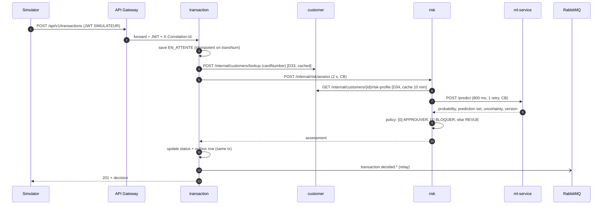
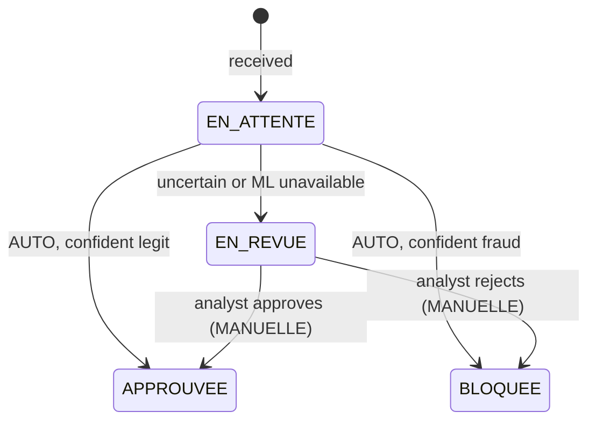

# Architecture overview

Short working summary. The reference is [`specs/Architecture_Plateforme_FinTech_MLOps_1.pdf`](specs/Architecture_Plateforme_FinTech_MLOps_1.pdf) (74 pages, decisions D1–D32). New decisions go to [`decisions.md`](decisions.md). API contracts live in [`../contracts/`](../contracts/).

## Three planes

| Plane | Components |
|---|---|
| Application | React, Traefik Ingress, Spring Cloud Gateway, 6 Spring Boot services, PostgreSQL, RabbitMQ |
| ML | Training pipeline, MLflow (tracking + registry), FastAPI ml-service |
| Platform | kind (HPA, probes), GitHub Actions, Argo CD, Prometheus, Grafana, Alertmanager, Loki |

## Services

| Service | Port | Schema | Publishes | Consumes |
|---|---|---|---|---|
| api-gateway | 8080 | – | – | – |
| auth-service | 8081 | `auth` | `auth.login.*` | – |
| customer-service | 8082 | `customer` | – | – |
| transaction-service | 8083 | `transaction` | `transaction.decided.*` | `review.completed` |
| risk-service | 8084 | `risk` | `review.completed` | – |
| notification-service | 8085 | `notification` | – | `transaction.decided.review`, `.blocked` |
| audit-service | 8086 | `audit` | – | all (`#`) |
| ml-service (FastAPI) | 8000 | – | – | – |

## Main flow: assessing a transaction

**Fail-safe:** ml-service down → REVUE (`ML_INDISPONIBLE`). risk down → `EN_ATTENTE` + `202`, re-evaluated every 30 s. **Never auto-approve without the model.**

## Transaction lifecycle

## Resilience settings (§3.6)

| Call | Timeout | Retry | Circuit breaker | On failure |
|---|---|---|---|---|
| Gateway → services | 3 s | no | no | `503` Problem Details |
| transaction → risk | 2 s | no | yes | `EN_ATTENTE` + `202`, job every 30 s |
| risk → customer | 500 ms | 1 (GET) | yes | cache, otherwise REVUE |
| risk → ml-service | 800 ms | 1 (connection error) | yes | REVUE `ML_INDISPONIBLE` |

Circuit breaker: opens at 50 % failures over the last 20 calls, stays open 30 s. HTTP pools: max connection lifetime 30 s.

## Health rules (§6.7)
- Liveness never checks a dependency (a DB outage would restart every pod in a loop).
- Readiness checks the DB only. Never ml-service (risk has a fallback), never RabbitMQ (the outbox buffers).
