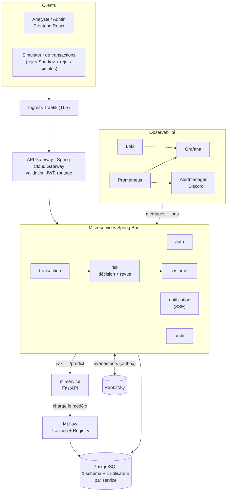
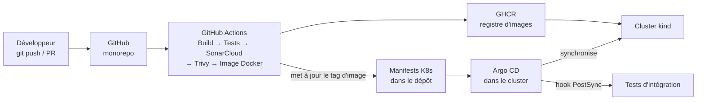
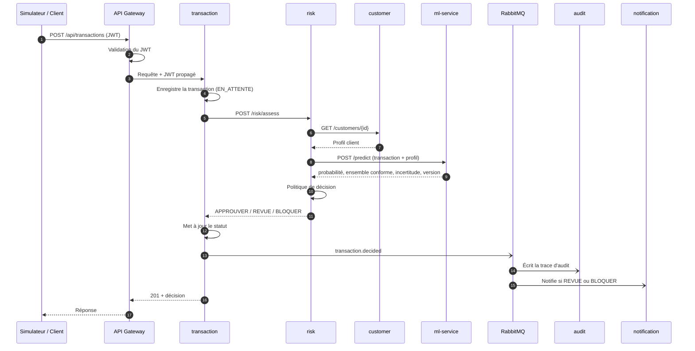
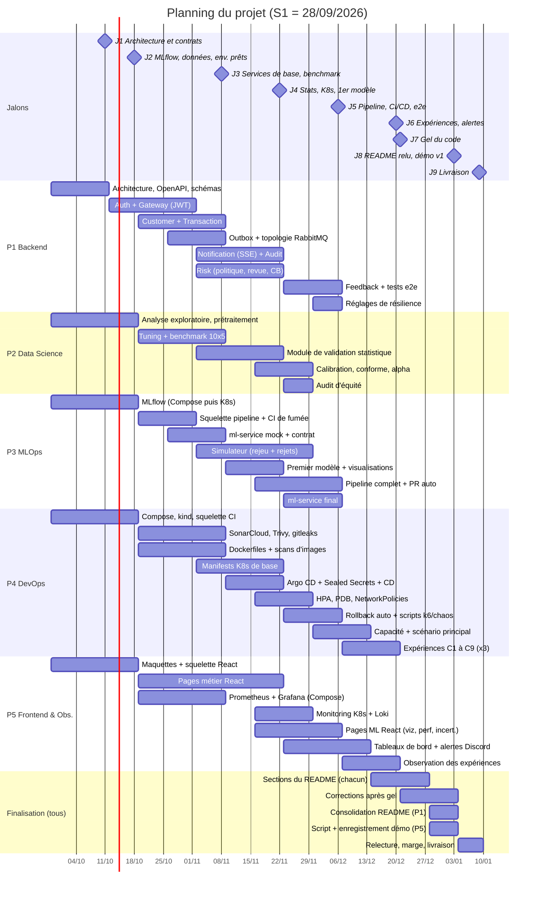

# Document commun à toute l'équipe

> Extrait du **document d'architecture v1.0** (plateforme FinTech MLOps haute disponibilité).
> **À lire par tous avant le document de son rôle.** Les numéros de section renvoient au document d'architecture complet (PDF).

Fichiers par rôle :

| Rôle | Fichier |
|---|---|
| P1 : Architecte backend et chef de projet | `P1_Backend_Chef_de_projet.md` |
| P2 : Data Scientist (ML, statistiques, incertitude) | `P2_Data_Scientist.md` |
| P3 : Ingénieur MLOps et serving du modèle | `P3_MLOps_Serving.md` |
| P4 : Ingénieur DevOps (Docker, Kubernetes, CI/CD, haute disponibilité) | `P4_DevOps.md` |
| P5 : Développeur frontend et observabilité | `P5_Frontend_Observabilite.md` |

## 1. Présentation du projet et objectifs

### 1.1 Contexte

Une institution financière traite en continu des paiements par carte. Une petite fraction de ces paiements est frauduleuse, et chaque fraude non détectée coûte de l'argent. À l'inverse, bloquer un paiement légitime dégrade l'expérience client.

La plateforme doit donc prendre une **décision de risque en temps réel** sur chaque transaction. Cette décision doit être **fiable, traçable et supervisée**. Lorsque le modèle n'est pas sûr de lui, la décision revient à un **analyste humain** au lieu de déclencher automatiquement une action à fort impact.

### 1.2 Double objectif

Le projet est évalué sur deux axes de poids égal.

| Axe | Ce qu'il faut démontrer |
|---|---|
| **Rigueur ML** | Benchmark de 5 algorithmes, preuve statistique que le modèle retenu est significativement meilleur, quantification de l'incertitude de chaque prédiction |
| **Qualité de production** | Architecture microservices, déploiement Kubernetes scalable et auto-réparateur, CI/CD sécurisée, supervision complète avec alertes, résilience prouvée sous charge et en cas de panne |

### 1.3 Périmètre fonctionnel

1. **Authentification** des utilisateurs, avec deux rôles :
   - `ADMIN` : administration de la plateforme,
   - `ANALYSTE` : revue humaine des transactions incertaines.
2. **Gestion des clients** (porteurs de carte).
3. **Réception des transactions**, envoyées par un **simulateur** qui rejoue le jeu de test Sparkov dans l'ordre chronologique. Le simulateur envoie aussi, avec un délai, la **vraie étiquette** de chaque transaction (rejet de paiement simulé). Cela permet de mesurer la performance réelle du modèle en production.
4. **Évaluation du risque** de chaque transaction par le modèle ML.
5. **Décision à trois issues** :
   - `APPROUVER` : le modèle est confiant que la transaction est légitime,
   - `REVUE HUMAINE` : le modèle est incertain,
   - `BLOQUER` : le modèle est confiant que la transaction est une fraude.
6. **File de revue humaine** : l'analyste consulte, valide ou rejette les transactions incertaines.
7. **Notifications en application** lors d'un blocage ou d'une mise en revue, enregistrées et affichées en temps réel dans le tableau de bord (pas d'email ni de SMS).
8. **Journal d'audit** complet et non modifiable de chaque décision (qui, quoi, quand, version du modèle).
9. **Tableau de bord React** : transactions, décisions, file de revue, visualisations des données (PCA, t-SNE, UMAP), performance et incertitude du modèle.

### 1.4 Exigences non fonctionnelles (cibles proposées)

| Exigence | Cible | Mesurée par |
|---|---|---|
| Latence de bout en bout (p95), charge normale | < 500 ms | k6 + Prometheus |
| Latence de bout en bout (p95), charge élevée | < 2 s (seuil d'alerte du sujet) | k6 + Prometheus |
| Taux d'erreur, charge normale | < 1 % | k6 + Prometheus |
| Taux d'erreur, surcharge | < 5 % (seuil d'alerte du sujet) | k6 + Prometheus |
| Temps d'inférence ML (p95) | < 50 ms | Métrique FastAPI |
| Récupération après suppression d'un pod | < 60 s, sans interruption du service | Expérience de chaos |
| Délai de mise à l'échelle (HPA) | < 2 min après dépassement du seuil CPU | Métriques HPA |
| Traçabilité | 100 % des décisions auditées avec la version du modèle | Service d'audit |
| Reproductibilité | Tout résultat ML reproductible depuis MLflow (seed, paramètres, données, code) | MLflow |

Ces cibles sont des engagements mesurables. Les expériences de charge (section 9) les valident ou les invalident, et le README présente les résultats obtenus.

### 1.5 Contraintes

- **Équipe et délai :** 5 étudiants, 15 semaines, livraison le 10/01/2027 (dépôt visé le 09/01).
- **Infrastructure locale :** cluster Kubernetes local (kind) sur un portable de 16 Go de RAM, d'où des choix sobres en ressources.
- **Données :** jeu de données synthétique uniquement. Aucune donnée bancaire réelle n'est utilisée.
- **Démo :** 5 minutes maximum pour présenter l'ensemble.

### 1.6 Hors périmètre

- Paiements réels et intégration à un réseau de cartes.
- Déploiement cloud (possible ultérieurement, les manifests restant portables).
- Réentraînement automatique en continu. Le réentraînement est déclenché manuellement ou par la CI.

## 2. Vue d'ensemble de l'architecture

### 2.1 Les trois plans de la plateforme

L'architecture s'organise en trois plans qui communiquent entre eux.

| Plan | Rôle | Composants |
|---|---|---|
| **Plan applicatif** | Servir les utilisateurs et prendre les décisions | React, Ingress, API Gateway, 6 microservices Spring Boot, PostgreSQL, RabbitMQ |
| **Plan ML** | Entraîner, valider, versionner et servir le modèle | Pipeline d'entraînement, MLflow (tracking + registry), service FastAPI |
| **Plan plateforme** | Déployer, faire évoluer, superviser | Kubernetes (HPA, probes), GitHub Actions, Argo CD, Prometheus, Grafana, Alertmanager |

### 2.2 Schéma global (exécution)

### 2.3 Schéma global (livraison)

Argo CD **tire** les changements depuis Git. Le cluster local n'a donc pas besoin d'être accessible depuis Internet. Un rollback se fait par un `git revert` ou depuis l'interface d'Argo CD.

### 2.4 Composants

| Composant | Technologie | Rôle | Responsable |
|---|---|---|---|
| frontend | React | Interface analyste/admin, visualisations, file de revue | P5 |
| api-gateway | Spring Cloud Gateway | Point d'entrée unique, routage, validation JWT, limitation de débit | P1 |
| auth-service | Spring Boot + Spring Security | Connexion, émission des JWT, gestion des rôles | P1 |
| customer-service | Spring Boot | Données des porteurs de carte | P1 |
| transaction-service | Spring Boot | Réception et cycle de vie des transactions | P1 |
| risk-service | Spring Boot + Resilience4j | Appel au modèle, politique de décision, file de revue humaine | P1 |
| notification-service | Spring Boot | Notifications en application, diffusion temps réel (SSE) vers React | P1 |
| audit-service | Spring Boot | Journal d'audit en ajout seul | P1 |
| ml-service | FastAPI | Prédiction, probabilité, incertitude, version du modèle | P3 |
| mlflow | MLflow | Suivi des expériences, artefacts, Model Registry | P3 |
| postgres | PostgreSQL | Une instance, un schéma et un utilisateur par service | P1 (schémas), P4 (déploiement) |
| rabbitmq | RabbitMQ | Événements asynchrones vers Notification, Audit et Transaction | P1 (topologie), P4 (déploiement) |
| prometheus, grafana, alertmanager | kube-prometheus-stack | Collecte des métriques, tableaux de bord, alertes | P5 |
| argocd | Argo CD | Déploiement GitOps | P4 |

### 2.5 Flux principal : évaluation d'une transaction

**Politique de décision.** Elle repose sur la prédiction conforme (MAPIE) appliquée à un modèle calibré. Pour chaque transaction, le modèle renvoie un **ensemble de prédiction** qui contient la vraie classe avec une probabilité garantie de 1 − α.

| Ensemble conforme | Interprétation | Décision |
|---|---|---|
| {légitime} | Confiant : transaction légitime | **APPROUVER** |
| {fraude} | Confiant : transaction frauduleuse | **BLOQUER** |
| {légitime, fraude} ou ensemble vide | Incertain | **REVUE HUMAINE** |

La valeur de α est fixée par P2 à partir des résultats expérimentaux (section 4).

**Dégradation contrôlée.** Si le ml-service est indisponible ou dépasse son délai, le circuit breaker (Resilience4j) s'ouvre. La transaction part alors en **REVUE HUMAINE**. Elle n'est jamais approuvée automatiquement sans avis du modèle. Ce choix « fail-safe » est adapté à la finance.

**Synchrone ou asynchrone.** La décision est **synchrone**, car le client attend une réponse. La notification et l'audit sont **asynchrones** via RabbitMQ : une panne de ces services ne bloque pas les paiements, et les messages sont traités à leur redémarrage.

**Fiabilité des événements (outbox transactionnel).** Un service n'envoie pas directement ses événements à RabbitMQ. Il les écrit dans une table `outbox_events` **dans la même transaction** que ses données métier. Un relais les publie ensuite. Même si un pod est tué entre l'enregistrement et la publication, aucun événement n'est perdu (détail en section 3.5).

### 2.6 Décisions d'architecture

| # | Décision | Alternatives écartées | Justification |
|---|---|---|---|
| D1 | Jeu de données **Sparkov** (fraude carte synthétique) | ULB, PaySim, IEEE-CIS | Contient clients, marchands et catégories, ce qui correspond directement aux services Customer et Transaction. Scores non triviaux, donc des tests statistiques pertinents. Découpage temporel déjà fourni. |
| D2 | **Monorepo** GitHub | Un dépôt par service | Plus simple pour 5 personnes et pour Argo CD. Une seule PR peut modifier un contrat et ses deux côtés. |
| D3 | Cluster **local kind** | Cloud managé | Gratuit et suffisant pour démontrer replicas, HPA, probes et rollback. Manifests portables vers le cloud. |
| D4 | **REST** synchrone + **RabbitMQ** pour Notification et Audit | REST seul, Kafka | Découple les services non critiques du chemin de paiement. Plus léger que Kafka sur 16 Go. |
| D5 | **Une instance PostgreSQL**, un schéma et un utilisateur par service | Une base par service | Isolation logique conservée (droits limités au schéma, migrations Flyway séparées) pour environ 1 Go de RAM économisé. |
| D6 | **JWT** validé à la Gateway et propagé aux services | Jetons service-à-service, mTLS | Suffisant pour le périmètre. Chaque service revalide la signature (défense en profondeur). |
| D7 | Découverte de services **native Kubernetes** | Eureka | Le DNS et les Services Kubernetes suffisent. Un composant de moins. |
| D8 | **GitHub Actions** (CI) + **Argo CD** (CD GitOps) | Runner auto-hébergé, déploiement manuel | Le cluster local n'a pas à être exposé. Rollback par Git. |
| D9 | Pipeline ML orchestré par **GitHub Actions + MLflow** | Prefect | Un outil de moins à apprendre et à déployer. |
| D10 | **SonarCloud** | SonarQube auto-hébergé | Gratuit pour les dépôts publics et ne consomme pas la RAM du portable. |
| D11 | **Calibration + prédiction conforme (MAPIE)** | Ensembles, bootstrap | Garantie statistique de couverture, ce qui rend la décision de revue humaine justifiable. |
| D12 | Décision à **trois issues** | Deux issues (sans blocage auto) | Reproduit la pratique réelle : les cas certains sont automatisés, les cas incertains sont délégués à l'humain. |
| D13 | **Prétraitement dans le pipeline du modèle** : le ml-service reçoit les champs bruts | Calcul des features dans risk-service (Java) | Le même code transforme les données à l'entraînement et en production. Aucun écart entraînement/production possible. |
| D14 | Notifications **en application uniquement** (stockées + SSE vers React) | Email via MailHog, logs seuls | Léger, visible pendant la démo, sans composant supplémentaire. |
| D15 | **Outbox transactionnel** pour la publication des événements | Publication après commit | Aucune perte d'événement lors des expériences de suppression de pods. |
| D16 | Services **Notification et Audit confiés à P1** | Confiés à P4 | Choix de l'équipe : tout le code Spring Boot est sous une même responsabilité, ce qui garantit la cohérence des conventions. |
| D17 | **Pas de features d'historique client** : modèle sans état | Agrégats sur 24 h calculés par transaction-service | Plus simple, sans stockage d'historique. Sparkov est déjà bien séparable avec les features propres à chaque transaction. |
| D18 | **Genre et âge conservés** comme features, avec un audit d'équité | Exclure le genre, exclure les deux | Données synthétiques, cas de détection de fraude. L'audit par groupe rend le choix transparent. |
| D19 | **Rejets de paiement simulés** : le simulateur envoie les vraies étiquettes avec un délai | Étiquettes issues de la revue humaine uniquement | Mesure réelle de la précision, du rappel et de la couverture conforme en production, y compris sur les décisions automatiques. |
| D20 | **Version du modèle épinglée dans Git**, promue par PR fusionnée automatiquement si la CI est verte (paramètre `AUTO_MERGE`) | PR fusionnée manuellement, alias MLflow + rechargement automatique | Automatique tout en gardant Git comme source de vérité unique, le rollback Kubernetes et une trace d'audit complète. |
| D21 | Contrôleur Ingress **Traefik** avec ressources `Ingress` standard | Ingress NGINX (retiré en mars 2026), Gateway API + Envoy Gateway | Maintenu, léger, et conforme à l'exigence « Ingress » du sujet. |
| D22 | **Sealed Secrets** : secrets chiffrés committés dans Git | Secrets créés par script hors Git | Tout est déployé depuis Git par Argo CD, sans jamais exposer un secret en clair. |
| D23 | Cluster kind à **3 nœuds** (1 control-plane + 2 workers) | Nœud unique | Répartition des replicas sur deux nœuds et test de panne d'un nœud complet. |
| D24 | **Rollback automatique par Git** : tests de bout en bout après déploiement, revert en cas d'échec | Argo Rollouts (canary + analyse Prometheus) | Simple, cohérent avec D20, sans outil ni RAM supplémentaires. |
| D25 | **Bonus de sécurité reportés** (cosign, OWASP ZAP) | Les planifier dès maintenant | Ajoutés seulement s'il reste du temps après S12. Priorité aux exigences du sujet. |
| D26 | Alertes envoyées sur **Discord** (webhook) | Slack, notifications en application, Grafana seul | Gratuit, reçu sur téléphone, très visible pendant la démo. |
| D27 | **Logs centralisés avec Loki** + Grafana Alloy | Logs via kubectl uniquement | Recherche par `correlationId` et passage direct d'une métrique aux logs. Coût : ~0,6 Go de RAM. |
| D28 | **k6 exécuté depuis un second portable** du même réseau local | k6 sur la machine du cluster | Mesures non faussées par le partage du processeur, et RAM libérée sur la machine du cluster. |
| D29 | **3 exécutions par expérience**, médiane et étendue | Une seule exécution | Résultats robustes, dans le même esprit que la validation statistique de la partie ML. |
| D30 | **Spring Boot 4.1 + Java 21** | Spring Boot 3.5, Java 25 | La branche 3.x ne reçoit plus de correctifs open source depuis juin 2026. Java 21 est une version LTS familière à l'équipe. |
| D31 | **Spring Cloud Gateway réactif (WebFlux)** | Spring Cloud Gateway Server MVC | La variante la plus documentée, adaptée au flux SSE, configurée surtout en YAML. |
| D32 | **Contrats OpenAPI écrits d'abord** (contract-first) | Contrats générés depuis le code | Débloque P3, P4 et P5 dès S2. La CI vérifie que le code respecte le contrat. |

### 2.7 Traçabilité avec le sujet

| Tâche du sujet | Où dans l'architecture | Section |
|---|---|---|
| T1 Microservices | Gateway, 6 services, RabbitMQ, PostgreSQL | 3 |
| T2 Benchmark ML | Pipeline d'entraînement, MLflow | 4 |
| T3 Validation statistique | Étape de validation du pipeline | 4 |
| T4 Incertitude | MAPIE, politique de décision du risk-service, file de revue | 4, 2.5 |
| T5 MLflow & MLOps | Tracking, Registry, pipeline reproductible | 5 |
| T6 Serving FastAPI | ml-service, intégration avec risk-service | 5 |
| T7 Visualisation | Étape du pipeline, pages React | 4, 5 |
| T8 Docker & Kubernetes | Déploiements, Ingress, HPA, probes | 6 |
| T9 Charge & haute disponibilité | k6, expériences de chaos | 9 |
| T10 Monitoring | Prometheus, Grafana, Alertmanager | 8 |
| T11 CI/CD & DevSecOps | GitHub Actions, SonarCloud, Trivy, Argo CD | 7 |

## 10. Répartition des rôles et planning (version corrigée)

Cette section reprend le document de répartition initial de l'équipe. Elle intègre les correctifs de la revue et toutes les décisions prises pendant la conception (D1 à D32).

**Dates clés :**
- **Début :** lundi 28/09/2026 (S1).
- **Gel du code :** lundi 21/12/2026 (S13).
- **Dépôt visé :** samedi 09/01/2027.
- **Date limite officielle :** dimanche **10/01/2027**.

### 10.1 Rôles

| Membre | Rôle | Tâches du sujet | Périmètre principal |
|---|---|---|---|
| **P1** | Architecte backend et chef de projet | T1, intégration T6, décision T4 | Les **7 services Spring Boot** (Gateway, Auth, Customer, Transaction, Risk, **Notification, Audit**, décision D16), outbox, topologie RabbitMQ, contrats OpenAPI, tests de bout en bout, coordination, consolidation du README |
| **P2** | Data Scientist | T2, T3, T4 | Données Sparkov, benchmark des 5 modèles, validation statistique, calibration et prédiction conforme, choix de α, audit d'équité |
| **P3** | Ingénieur MLOps et serving | T5, T6, T7 | MLflow, pipeline automatisé avec portes de qualité, ml-service FastAPI, visualisations, simulateur (rejeu et rejets de paiement), **suppléant de P1** |
| **P4** | Ingénieur DevOps | T8, T9, T11 | Images Docker, cluster kind, manifests, Argo CD, Sealed Secrets, CI/CD et DevSecOps, tests de charge et de panne |
| **P5** | Frontend et observabilité | Intégration T7, T10, interface T4 | Application React, Prometheus, Grafana, Loki, alertes Discord, runbooks, script et enregistrement de la démo |

**Changements par rapport au document initial :**

| Changement | Raison |
|---|---|
| Notification et Audit passent de P4 à P1 | Décision de l'équipe (D16) : tout le code Spring Boot sous une même responsabilité |
| **P3 devient suppléant officiel de P1** | P1 porte désormais la charge la plus lourde de l'équipe. P3 a du temps disponible en S1–S5 et peut reprendre un service (par exemple customer-service) si P1 prend du retard |
| Le simulateur est confié à P3 | Il rejoue les données Sparkov et envoie les rejets de paiement simulés (D19), ce qui est proche du travail de P3 |
| Les contrôles de sécurité de la CI sont avancés à S4–S6 | Correctif 3 de la revue : lisser la charge de P4 |
| Un premier vrai modèle est en production dès S8 | Correctif 4 de la revue : les tests de charge ne dépendent plus du modèle final |
| Le jeu de données est choisi en S1 | Correctif 2 de la revue : les contrats OpenAPI en dépendent |

### 10.2 Couverture des tâches du sujet

| Tâche | Responsable | Support | Section |
|---|---|---|---|
| T1 Architecture microservices | P1 | P3 (suppléant) | 3 |
| T2 Benchmark ML | P2 | P3 (MLflow) | 4 |
| T3 Validation statistique | P2 | P3 (intégration au pipeline) | 4 |
| T4 Quantification de l'incertitude | P2 | P1 (politique de décision), P5 (file de revue dans React) | 4, 2.5 |
| T5 MLflow et MLOps | P3 | P2 (code ML), P4 (image du pipeline) | 5 |
| T6 Serving FastAPI | P3 | P1 (intégration risk-service) | 5 |
| T7 Visualisation | P3 | P5 (pages React) | 4.11, 5 |
| T8 Docker et Kubernetes | P4 | P1, P3 (probes, métriques) | 6 |
| T9 Charge et haute disponibilité | P4 | P5 (observation), P1 (réglages) | 9 |
| T10 Supervision | P5 | P1, P3 (métriques), P4 (installation) | 8 |
| T11 CI/CD et DevSecOps | P4 | P1 (tests de bout en bout), P3 (CI du code ML) | 7 |

### 10.3 Charge de travail par période

| Membre | S1–S3 (fondations) | S4–S8 (développement) | S9–S12 (industrialisation et expériences) | S13–S15 (finalisation) |
|---|---|---|---|---|
| P1 | 🔴 Contrats, schémas, dépôt | 🔴 7 services, outbox | 🟠 Feedback, tests e2e, réglages | 🟠 README consolidé |
| P2 | 🟠 Analyse exploratoire, prétraitement | 🔴 Benchmark, statistiques | 🟠 Incertitude, α, équité | 🟢 Section README |
| P3 | 🟢 MLflow (+ **suppléance P1**) | 🟠 Mock, simulateur, premier modèle | 🔴 Pipeline, portes, PR auto | 🟢 Section README |
| P4 | 🟠 Compose, kind, CI | 🟠 Sécurité CI, images, manifests | 🔴 Argo CD, HPA, expériences | 🟢 Section README |
| P5 | 🟢 Maquettes, squelette React | 🟠 Pages React, Prometheus local | 🔴 Tableaux de bord, alertes, Loki | 🔴 Démo |

🔴 charge forte · 🟠 charge moyenne · 🟢 charge légère

Chaque membre a au plus deux périodes de charge forte. **P1 reste le point de vigilance.** Son avancement est vérifié à chaque réunion hebdomadaire, et P3 intervient dès qu'un jalon de P1 glisse d'une semaine.

### 10.4 Planning (S1 à S15)

**Période des fêtes (S13–S14).** Aucune tâche de développement n'est planifiée après le gel du code. S13 et S14 sont réservées aux corrections, à la documentation et à la démo, qui peuvent se faire en travail allégé.

### 10.5 Chaîne des livrables transmis

| # | Livrable | De | Vers | Fin |
|---|---|---|---|---|
| 1 | Choix du jeu de données (fait : Sparkov, D1) | Équipe | Tous | S1 |
| 2 | Contrats OpenAPI, schémas de base, schéma d'architecture | P1 | P3, P4, P5 | S2 |
| 3 | Serveur MLflow opérationnel + script de suivi type | P3 | P2 | S3 |
| 4 | Données prétraitées, liste des features, format de transaction | P2 | P1, P3 | S3 |
| 5 | Docker Compose, cluster kind, squelette CI | P4 | Tous | S3 |
| 6 | Contrat `/predict` + ml-service en mode mock | P3 | P1 | S6 |
| 7 | Services de base + endpoints REST stables | P1 | P4, P5 | S6 |
| 8 | Résultats du benchmark (meilleur modèle provisoire) | P2 | P3 | S6 |
| 9 | Module de validation statistique | P2 | P3 | S7 |
| 10 | Premier vrai modèle en production + visualisations | P3 | P1, P5 | S8 |
| 11 | Cluster avec manifests, Argo CD, cibles de supervision | P4 | P5 | S8 |
| 12 | Modèle final, α, seuils, rapport statistique | P2 | P3, P1 | S9 |
| 13 | Pipeline complet + ml-service final | P3 | P4 | S10 |
| 14 | Tests e2e intégrés au déploiement | P1 | P4 | S10 |
| 15 | Tableaux de bord et alertes | P5 | P4 | S11 |
| 16 | Résultats des expériences + vidéos | P4, P5 | Tous | S12 |
| 17 | README consolidé + démo | P1, P5 | Tous (relecture) | S14 |

**Règle de passage (conservée du document initial).** Un livrable n'est considéré comme transmis que s'il est **documenté, testé et démontré** à l'équipe.

### 10.6 Jalons de contrôle

| Jalon | Date | Critère de validation |
|---|---|---|
| J1 | 11/10/2026 | Architecture validée (ce document), dépôt et ruleset en place, contrats OpenAPI v1 |
| J2 | 18/10/2026 | MLflow prêt, données prétraitées, Docker Compose et CI opérationnels |
| J3 | 08/11/2026 | Services de base fonctionnels, benchmark terminé, ml-service mock livré, contrôles de sécurité actifs en CI |
| J4 | 22/11/2026 | Validation statistique terminée, plateforme déployée par Argo CD, **premier vrai modèle en production**, Prometheus installé |
| J5 | 06/12/2026 | Modèle final, pipeline avec portes de qualité, CI/CD complète, tests e2e et rollback automatique fonctionnels |
| J6 | 20/12/2026 | Toutes les expériences réalisées 3 fois, tableaux de bord et alertes validés, vidéos enregistrées |
| J7 | 21/12/2026 | **Gel du code** : plus de nouvelle fonctionnalité, uniquement des corrections |
| J8 | 03/01/2027 | README complet relu par tous, démo enregistrée en première version |
| J9 | 09/01/2027 | **Livraison** : dépôt GitHub, README, démo de 5 min maximum (un jour de marge avant le 10/01) |

### 10.7 Organisation de l'équipe

| Pratique | Mise en œuvre |
|---|---|
| Suivi des tâches | **GitHub Projects** : une carte par tâche, liée à ses PR |
| Réunion hebdomadaire | 30 min chaque dimanche : avancement, blocages, jalon de la semaine |
| Point de synchronisation | Message court sur Discord chaque jour : fait, à faire, blocage |
| Revue de code | Chaque PR relue par un autre membre, qui est aussi celui qui reçoit le livrable (CODEOWNERS) |
| Décisions | Toute nouvelle décision d'architecture est ajoutée au tableau de la section 2.6 |

### 10.8 Risques et mesures

| Risque | Probabilité | Impact | Mesure |
|---|---|---|---|
| **Surcharge de P1** (7 services + coordination) | Élevée | Élevé | P3 suppléant officiel, suivi hebdomadaire, services simples (Notification, Audit) livrables en version minimale |
| Mémoire insuffisante (16 Go) | Moyenne | Élevé | Budget mesuré en S8, maximums HPA réduits si besoin, k6 sur un autre portable (D28), démo sur la machine la plus puissante de l'équipe |
| Bot CI bloqué par la protection de `main` | Moyenne | Moyen | Mécanisme validé par P4 dès S2 (section 7.6) |
| NetworkPolicies non appliquées par kindnet | Faible | Moyen | Test en S2, passage à Calico sinon (section 6.2) |
| Retard du modèle final | Moyenne | Moyen | Premier vrai modèle en production dès S8, les expériences n'en dépendent pas |
| Calculs ML trop longs (SVM, MLP, 50 entraînements chacun) | Moyenne | Moyen | Sous-échantillonnage (4.4), approximation de noyau pour le SVM, exécution de nuit si nécessaire |
| Panne ou perte de la machine du cluster | Faible | Élevé | Tout est dans Git : `make cluster` recrée l'environnement sur une autre machine en moins d'une heure |
| Réseau local instable pendant les expériences | Moyenne | Moyen | Câble Ethernet, mesure de la latence de base à chaque session |
| Période des fêtes (S13–S14) | Certaine | Moyen | Développement terminé en S12, gel du code en S13, un jour de marge avant la date limite |
| Démo trop longue (> 5 min) | Moyenne | Élevé | Script minuté par P5, séquences vidéo des expériences enregistrées en S12, répétition complète en S14 |
