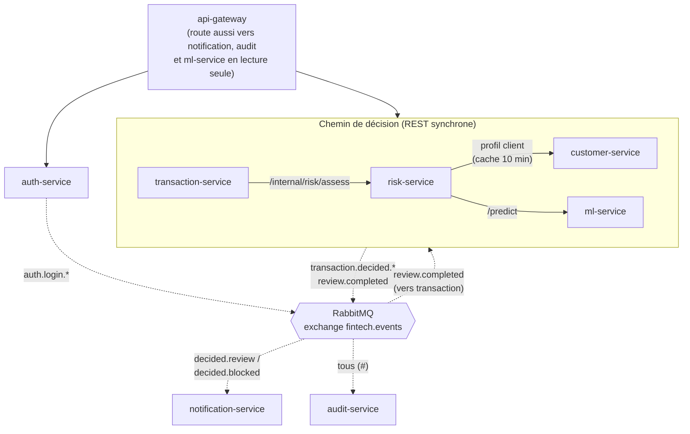
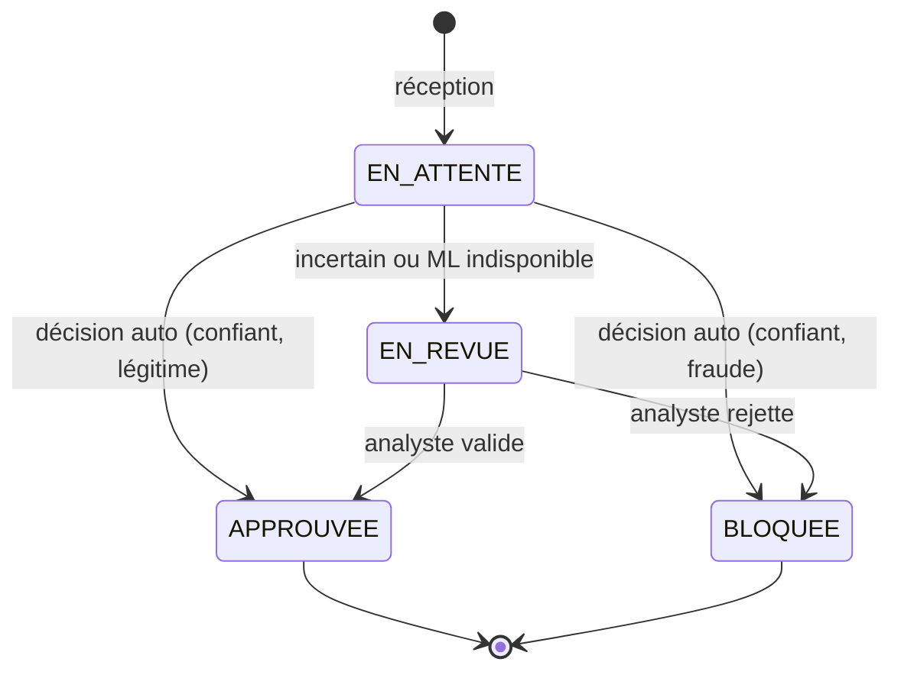
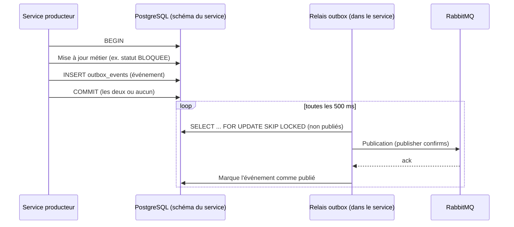
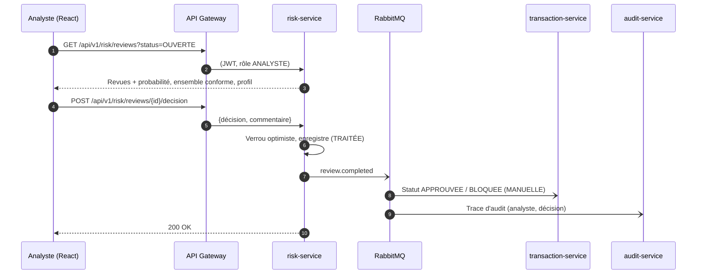
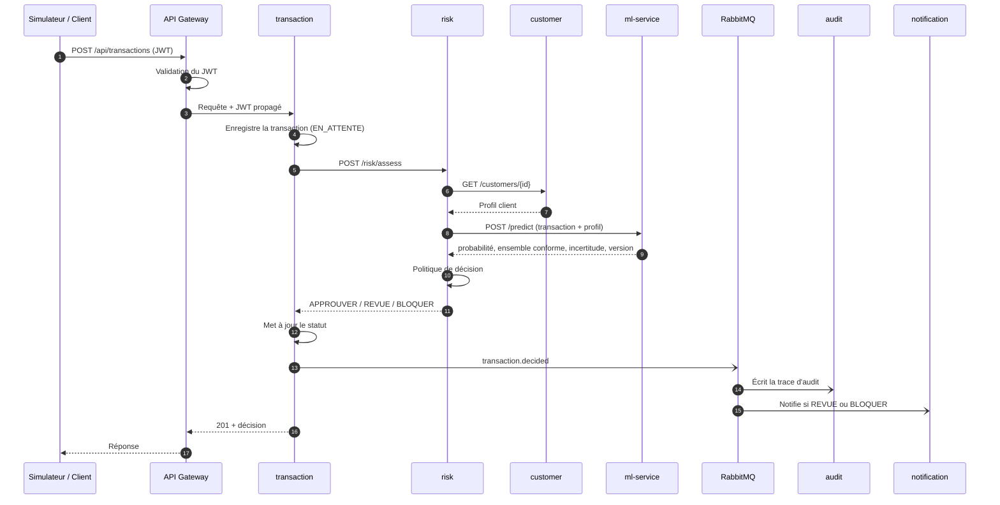
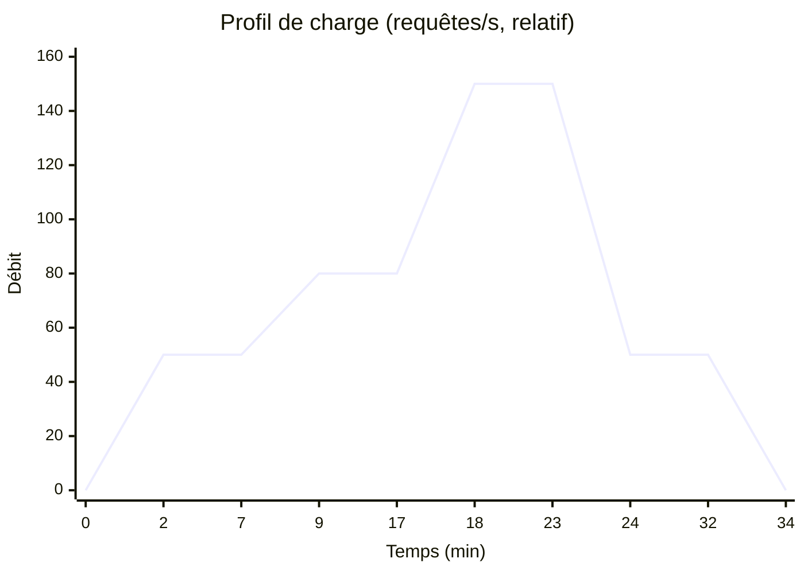

# P1 : Architecte backend et chef de projet

> Extrait du **document d'architecture v1.0** (plateforme FinTech MLOps haute disponibilité).
> Lire d'abord **`00_Commun.md`** (objectifs, vue d'ensemble, décisions D1 à D32, planning global).
> Les numéros de section renvoient au document d'architecture complet (PDF).

## Mission

- **Tâches du sujet :** T1, intégration T6, décision T4
- **Périmètre :** Les **7 services Spring Boot** (Gateway, Auth, Customer, Transaction, Risk, **Notification, Audit**, décision D16), outbox, topologie RabbitMQ, contrats OpenAPI, tests de bout en bout, coordination, consolidation du README

## Points de vigilance

1. **Charge la plus lourde de l'équipe.** Prévenir P3 (suppléant officiel) dès qu'un jalon glisse d'une semaine. Livrer d'abord Notification et Audit en version minimale.
2. **Les contrats OpenAPI (fin S2) bloquent tout le monde** : P3, P4 et P5 en dépendent.
3. Mettre en place **l'outbox et l'idempotence des consommateurs dès le premier événement**, pas à la fin.
4. `POST /api/v1/transactions` doit être **idempotent par `trans_num`** : la relance Traefik (9.6) et les tests de charge en dépendent.
5. Chaque service expose `/actuator/health/liveness`, `/actuator/health/readiness` et `/actuator/prometheus`, avec l'étiquette `application=<service>` et les histogrammes de latence (8.2).
6. La **liveness ne vérifie jamais la base** ; la readiness de risk-service ne dépend pas du ml-service (6.7).
7. Arrêt propre : `server.shutdown=graceful` + `preStop` de 5 s (6.8). Pools HTTP avec **durée de vie max de 30 s** (6.11). Files d'attente bornées pour la surcharge (9.5).
8. Développer risk-service contre le **ml-service en mode mock** (S6), qui permet de provoquer les trois décisions.

## Planning personnel

| Tâche | Semaines | Début |
|---|---|---|
| Architecture, OpenAPI, schémas | S1–S2 | 28/09/2026 |
| Auth + Gateway (JWT) | S3–S5 | 12/10/2026 |
| Customer + Transaction | S4–S6 | 19/10/2026 |
| Outbox + topologie RabbitMQ | S5–S6 | 26/10/2026 |
| Notification (SSE) + Audit | S6–S8 | 02/11/2026 |
| Risk (politique, revue, CB) | S6–S8 | 02/11/2026 |
| Feedback + tests e2e | S9–S10 | 23/11/2026 |
| Réglages de résilience | S10 | 30/11/2026 |

## Livrables reçus

| # | Livrable | De | Fin |
|---|---|---|---|
| 1 | Choix du jeu de données (fait : Sparkov, D1) | Équipe | S1 |
| 4 | Données prétraitées, liste des features, format de transaction | P2 | S3 |
| 5 | Docker Compose, cluster kind, squelette CI | P4 | S3 |
| 6 | Contrat `/predict` + ml-service en mode mock | P3 | S6 |
| 10 | Premier vrai modèle en production + visualisations | P3 | S8 |
| 12 | Modèle final, α, seuils, rapport statistique | P2 | S9 |
| 16 | Résultats des expériences + vidéos | P4, P5 | S12 |

## Livrables transmis

| # | Livrable | Vers | Fin |
|---|---|---|---|
| 2 | Contrats OpenAPI, schémas de base, schéma d'architecture | P3, P4, P5 | S2 |
| 7 | Services de base + endpoints REST stables | P4, P5 | S6 |
| 14 | Tests e2e intégrés au déploiement | P4 | S10 |
| 17 | README consolidé + démo | Tous (relecture) | S14 |

Règle de passage : un livrable n'est considéré comme transmis que s'il est **documenté, testé et démontré** à l'équipe.

## Jalons de l'équipe

| Jalon | Date | Critère de validation |
|---|---|---|
| J1 | 11/10/2026 | Architecture validée (ce document), dépôt et ruleset en place, contrats OpenAPI v1 |
| J2 | 18/10/2026 | MLflow prêt, données prétraitées, Docker Compose et CI opérationnels |
| J3 | 08/11/2026 | Services de base fonctionnels, benchmark terminé, ml-service mock livré, contrôles de sécurité actifs en CI |
| J4 | 22/11/2026 | Validation statistique terminée, plateforme déployée par Argo CD, **premier vrai modèle en production**, Prometheus installé |
| J5 | 06/12/2026 | Modèle final, pipeline avec portes de qualité, CI/CD complète, tests e2e et rollback automatique fonctionnels |
| J6 | 20/12/2026 | Toutes les expériences réalisées 3 fois, tableaux de bord et alertes validés, vidéos enregistrées |
| J7 | 21/12/2026 | **Gel du code** : plus de nouvelle fonctionnalité, uniquement des corrections |
| J8 | 03/01/2027 | README complet relu par tous, démo enregistrée en première version |
| J9 | 09/01/2027 | **Livraison** : dépôt GitHub, README, démo de 5 min maximum (un jour de marge avant le 10/01) |

---

# Architecture de votre périmètre

## 3. Architecture microservices

### 3.1 Découpage en services

Chaque service possède **un seul domaine métier** et **ses propres données**. Aucun service ne lit directement les tables d'un autre : l'accès aux données d'un autre domaine passe par son API REST ou par ses événements.

| Service | Responsabilité | Schéma PostgreSQL | Port | Publie | Consomme |
|---|---|---|---|---|---|
| api-gateway | Point d'entrée unique, routage, validation JWT, CORS, identifiant de corrélation | aucun | 8080 | – | – |
| auth-service | Utilisateurs, rôles, émission et rafraîchissement des JWT, clé publique (JWKS) | `auth` | 8081 | `auth.login.*` | – |
| customer-service | Porteurs de carte (profil, adresse, localisation) | `customer` | 8082 | – | – |
| transaction-service | Réception des transactions et cycle de vie de leur statut | `transaction` | 8083 | `transaction.decided.*` | `review.completed` |
| risk-service | Appel au modèle, politique de décision, file de revue humaine | `risk` | 8084 | `review.completed` | – |
| notification-service | Notifications en application, diffusion en temps réel (SSE) | `notification` | 8085 | – | `transaction.decided.review`, `transaction.decided.blocked` |
| audit-service | Journal d'audit en ajout seul | `audit` | 8086 | – | tous les événements |
| ml-service (FastAPI) | Prédiction, probabilité, ensemble conforme, incertitude, version | aucun | 8000 | – | – |

**Socle technique commun (décision D30) :** Java 21, **Spring Boot 4.1**, Spring Cloud Gateway **réactif (WebFlux)** pour la Gateway (D31), Spring MVC pour les autres services, Spring Security 7 (resource server), Spring Data JPA, Flyway, Spring AMQP, Resilience4j, Micrometer et springdoc-openapi.

**Pourquoi Spring Boot 4.1.** Toutes les versions 3.x ne reçoivent plus de correctifs open source depuis juin 2026, et la 4.0 n'en reçoit que jusqu'à fin décembre 2026. Avec une version non maintenue, l'analyse Trivy de la CI (section 7.5) signalerait des vulnérabilités impossibles à corriger.

**Bibliothèque partagée.** Un module Maven `common` regroupe ce qui est identique dans les 7 services : identifiant de corrélation, format d'erreur, configuration de sécurité, enveloppe des événements, outbox, consommateur idempotent, configuration RabbitMQ et étiquettes de métriques.

### 3.2 Vue des composants et des échanges



Flèches pleines : appels REST synchrones. Flèches pointillées : événements RabbitMQ.

### 3.3 Cycle de vie d'une transaction



Chaque transaction enregistre aussi la **source de la décision** : `AUTO` (le modèle) ou `MANUELLE` (un analyste).

### 3.4 Détail des services

#### api-gateway
- **Routage.** Préfixe `/api/v1/{domaine}/**` vers le service correspondant. Les chemins `/internal/**` ne sont **jamais** routés : ils restent accessibles uniquement à l'intérieur du cluster.
- **Sécurité.** Validation de la signature et de l'expiration du JWT à partir des clés publiques d'auth-service (JWKS). Le jeton est ensuite propagé au service cible.
- **Corrélation.** Génère un en-tête `X-Correlation-Id` s'il est absent. Cet identifiant est propagé dans tous les appels, les logs et les événements, ce qui permet de suivre une transaction de bout en bout.
- **Limitation de débit.** Uniquement sur `/api/v1/auth/login` (protection contre la force brute), en mémoire, sans Redis. Elle n'est **pas appliquée** aux transactions, pour ne pas fausser les tests de charge.
- **Routage WebSocket/SSE** vers notification-service pour le flux temps réel.

#### auth-service
- **Endpoints :**
  - `POST /api/v1/auth/login`
  - `POST /api/v1/auth/refresh`
  - `GET /api/v1/auth/me`
  - CRUD des utilisateurs (ADMIN)
  - `GET /.well-known/jwks.json`
- **Jetons.** JWT signés en **RS256** : seul auth-service détient la clé privée, et les autres services vérifient avec la clé publique, sans secret partagé. Jeton d'accès de 15 min, jeton de rafraîchissement de 7 jours.
- **Rôles :**
  - `ADMIN`,
  - `ANALYSTE`,
  - `SIMULATEUR` : compte technique utilisé par le simulateur de transactions et par les tests de charge.
- **Données.** Mots de passe hachés avec **BCrypt**. Tables `users` et `refresh_tokens`.
- **Événements.** Publie `auth.login.succeeded` et `auth.login.failed` pour l'audit.

#### customer-service
- **Endpoints :**
  - `GET /api/v1/customers` (paginé, avec filtres)
  - `GET /api/v1/customers/{id}`
  - `POST /api/v1/customers`
  - `PUT /api/v1/customers/{id}`
- **Données.** Champs issus de Sparkov : nom, genre, date de naissance, profession, adresse, ville, population de la ville, latitude et longitude.
- **Numéro de carte.** Il n'est **jamais stocké en clair**. On conserve une empreinte HMAC-SHA256, qui sert d'identifiant de carte, et les 4 derniers chiffres pour l'affichage. C'est une bonne pratique inspirée de PCI-DSS.
- **Initialisation.** Les clients uniques du jeu Sparkov sont chargés par une migration de données au démarrage.

#### transaction-service
- **Endpoints :**
  - `POST /api/v1/transactions`
  - `GET /api/v1/transactions` (filtres : statut, client, période, montant)
  - `GET /api/v1/transactions/{id}`
- **Idempotence.** Le `trans_num` de Sparkov sert de clé d'idempotence. Si une transaction est renvoyée (par exemple lors d'un retry), elle n'est pas créée deux fois : la réponse initiale est renvoyée.
- **Données.** Client, marchand, catégorie, montant, date et heure, localisation du marchand, statut, source de la décision, dates de création et de mise à jour.
- **Événements publiés.** Après chaque décision, `transaction.decided.approved`, `transaction.decided.review` ou `transaction.decided.blocked`.
- **Événements consommés.** `review.completed`, qui fait passer la transaction de `EN_REVUE` à `APPROUVEE` ou `BLOQUEE` (source `MANUELLE`).

#### risk-service
- **Endpoints :**
  - `POST /internal/risk/assess` (interne uniquement)
  - `GET /api/v1/risk/assessments/{transactionId}`
  - `GET /api/v1/risk/reviews?status=OUVERTE` (ANALYSTE)
  - `POST /api/v1/risk/reviews/{id}/decision` (ANALYSTE)
  - `GET /api/v1/risk/stats` (taux d'approbation, de revue et de blocage)
  - `POST /api/v1/risk/feedback` (SIMULATEUR) : vraie étiquette reçue en différé (rejet de paiement simulé)
  - `GET /internal/risk/labels`
- **Table `assessments`.** Probabilité, ensemble conforme, score d'incertitude, nom et version du modèle, décision, latence de l'appel ML, raison.
- **Table `reviews`.** Statut, analyste, décision finale, commentaire, dates d'ouverture et de clôture.
- **Concurrence.** Un **verrou optimiste** (`@Version`) empêche deux analystes de traiter la même revue en même temps. Le second reçoit une erreur `409 Conflict`.
- **Cache.** Le profil client est mis en cache localement (Caffeine, 10 min), ce qui évite un appel à customer-service pour chaque transaction.
- **Boucle de retour.** Deux sources de vraies étiquettes en production :
  - les **décisions des analystes**, sur les transactions revues ;
  - les **rejets de paiement simulés** envoyés par le simulateur, sur **toutes** les transactions, y compris les décisions automatiques.

  risk-service rapproche chaque étiquette de la décision prise. Il expose des compteurs Prometheus (matrice de confusion, couverture conforme) et `/internal/risk/labels` pour le pipeline ML (section 5.9).

#### notification-service
- **Endpoints :**
  - `GET /api/v1/notifications`
  - `PATCH /api/v1/notifications/{id}/read`
  - `GET /api/v1/notifications/stream` (flux **SSE**, temps réel)
- **Types de notification.** `BLOCAGE` et `REVUE`, chacune liée à sa transaction.
- **Plusieurs replicas.** Le navigateur est connecté en SSE à **un seul** replica. Pour que chaque navigateur reçoive toutes les notifications :
  1. La queue durable `notification.alerts` est partagée entre les replicas : chaque message est enregistré une seule fois.
  2. Après l'enregistrement, le service publie sur un exchange `fanout` `notifications.live`.
  3. Chaque replica y possède sa propre queue temporaire et pousse le message à ses clients SSE.

#### audit-service
- **Endpoints :** `GET /api/v1/audit` (ADMIN), avec filtres par type, acteur, identifiant et période.
- **Table `audit_events`.** Identifiant de l'événement (unique), type, entité concernée, acteur, version du modèle, charge utile (JSONB), date de l'événement, date de réception.
- **Ajout seul, garanti par la base.** L'utilisateur PostgreSQL `audit_user` n'a que les droits `INSERT` et `SELECT`. Même un bug applicatif ne peut pas modifier ni supprimer une trace.

### 3.5 Communication asynchrone (RabbitMQ)

**Topologie.** Un exchange `topic` principal, `fintech.events`, et un exchange `fanout`, `notifications.live`, pour la diffusion temps réel.

| Clé de routage | Producteur | Consommateurs (queue) |
|---|---|---|
| `transaction.decided.approved` | transaction-service | audit (`audit.all`) |
| `transaction.decided.review` | transaction-service | audit, notification (`notification.alerts`) |
| `transaction.decided.blocked` | transaction-service | audit, notification |
| `review.completed` | risk-service | audit, transaction (`transaction.review-results`) |
| `auth.login.succeeded` / `.failed` | auth-service | audit |

**Enveloppe commune des événements :**

```json
{
  "eventId": "uuid",
  "type": "transaction.decided.blocked",
  "version": 1,
  "occurredAt": "2026-11-20T14:03:12Z",
  "correlationId": "uuid",
  "producer": "transaction-service",
  "payload": { "transactionId": "...", "decision": "BLOQUEE", "modelVersion": "fraud-xgb:4" }
}
```

**Outbox transactionnel (côté producteurs : auth, transaction, risk).**



- **Atomicité.** La donnée métier et l'événement sont écrits dans la **même transaction**. Soit les deux existent, soit aucun.
- **Plusieurs replicas.** Si un pod meurt après le commit, un autre replica, ou le même après redémarrage, publie l'événement. `SKIP LOCKED` empêche deux replicas de publier le même événement en même temps.
- **Doublons.** En cas de crash entre la publication et le marquage, l'événement peut être publié deux fois. Les consommateurs idempotents l'ignorent.
- **Nettoyage.** Les événements publiés depuis plus de 7 jours sont purgés par un job planifié.
- **Supervision.** Le nombre d'événements en attente (`outbox_pending`) est exposé à Prometheus. S'il monte, c'est que RabbitMQ est en difficulté : une alerte se déclenche.

**Garanties de livraison :**
- **Au moins une fois.** Les messages et les queues sont durables, et l'acquittement est manuel après traitement.
- **Consommateurs idempotents.** Un message déjà traité (même `eventId`) est ignoré.
- **Échecs.** Après 3 tentatives, le message part dans une **dead-letter queue** (DLQ) par queue, supervisée dans Grafana.

### 3.6 Communication synchrone et résilience

| Appel | Délai max | Retry | Circuit breaker | Comportement en cas d'échec |
|---|---|---|---|---|
| Gateway → services | 3 s | non | non | `503` au format Problem Details |
| transaction → risk | 2 s | non | oui | Transaction laissée `EN_ATTENTE` et réponse `202 Accepted`. Un job planifié la réévalue toutes les 30 s |
| risk → customer | 500 ms | 1 (GET) | oui | Utilise le cache. Sans cache, `REVUE HUMAINE` |
| risk → ml-service | 800 ms | 1 (erreur de connexion) | oui | **REVUE HUMAINE**, raison `ML_INDISPONIBLE` (fail-safe) |

**Principe.** Aucune panne ne conduit à approuver automatiquement une transaction. Au pire, elle attend ou elle part en revue humaine.

**Réglage des circuit breakers.** Le circuit s'ouvre à 50 % d'échecs sur les 20 derniers appels et reste ouvert 30 s. Son état est exposé à Prometheus et visible dans Grafana.

### 3.7 Flux de revue humaine



### 3.8 Sécurité

**Matrice des droits :**

| Ressource | ADMIN | ANALYSTE | SIMULATEUR |
|---|---|---|---|
| Utilisateurs (CRUD) | ✔ | – | – |
| Clients (lecture) | ✔ | ✔ | – |
| Clients (écriture) | ✔ | – | – |
| Transactions (création) | – | – | ✔ |
| Retour d'étiquettes (feedback) | – | – | ✔ |
| Transactions (lecture) | ✔ | ✔ | – |
| File de revue et décision | – | ✔ | – |
| Notifications | ✔ | ✔ | – |
| Journal d'audit | ✔ | – | – |
| Visualisations ML, infos modèle | ✔ | ✔ | – |

**Mesures :**
- **Défense en profondeur.** La Gateway valide le JWT, et chaque service le **revalide** en tant que resource server Spring Security.
- **Endpoints internes.** Les chemins `/internal/**` ne sont pas routés par la Gateway. Ils seront aussi protégés par des **NetworkPolicies** Kubernetes (section 6).
- **HTTPS.** TLS est terminé à l'Ingress avec un certificat local (mkcert).
- **Secrets.** Mots de passe de base de données, clé privée JWT et identifiants RabbitMQ sont stockés dans des Secrets Kubernetes, jamais dans le dépôt.
- **Données personnelles.** Le numéro de carte n'est jamais stocké en clair, et les données personnelles sont masquées dans les logs.

### 3.9 Données (PostgreSQL)

| Schéma | Utilisateur | Service | Tables principales | Droits |
|---|---|---|---|---|
| `auth` | `auth_user` | auth-service | users, refresh_tokens, outbox_events | complets sur son schéma |
| `customer` | `customer_user` | customer-service | customers | complets sur son schéma |
| `transaction` | `transaction_user` | transaction-service | transactions, outbox_events, processed_events | complets sur son schéma |
| `risk` | `risk_user` | risk-service | assessments, reviews, feedback, outbox_events, processed_events | complets sur son schéma |
| `notification` | `notification_user` | notification-service | notifications, processed_events | complets sur son schéma |
| `audit` | `audit_user` | audit-service | audit_events | **INSERT + SELECT uniquement** |
| `mlflow` | `mlflow_user` | MLflow | tables internes de MLflow | complets sur son schéma |

- **Aucun droit croisé.** Chaque utilisateur n'a **aucun droit** sur les autres schémas.
- **Migrations.** Chaque service gère son schéma avec ses propres migrations **Flyway**, versionnées avec son code.
- **Idempotence.** Les tables `processed_events` mémorisent les `eventId` déjà traités.
- **Outbox.** Les tables `outbox_events` contiennent les événements à publier (section 3.5).

### 3.10 Conventions transverses

| Sujet | Convention |
|---|---|
| Versionnement des API | Préfixe `/api/v1`. **Contrats écrits d'abord** (décision D32) : les fichiers OpenAPI YAML sont rédigés en S1–S2 et versionnés dans `contracts/`, puis le code les implémente. springdoc génère le contrat depuis le code, et la CI vérifie qu'il correspond au fichier versionné (section 7.4) |
| Format des erreurs | **Problem Details (RFC 7807)**, natif dans Spring Boot |
| Pagination | `?page=&size=&sort=`, réponse avec métadonnées de page |
| Santé | `/actuator/health/liveness` et `/actuator/health/readiness`, utilisés par les probes Kubernetes |
| Métriques | `/actuator/prometheus` (Micrometer) : requêtes, latence, erreurs, JVM, pool de connexions, circuit breakers, RabbitMQ |
| Logs | Format JSON sur la sortie standard, avec `correlationId` et nom du service |
| Tests | Tests unitaires avec JUnit 5 et Mockito. Tests d'intégration avec **Testcontainers** (PostgreSQL, RabbitMQ), exécutés en CI |

---

# Extraits utiles d'autres sections

Ces parties appartiennent au périmètre d'un autre membre, mais votre travail en dépend ou les alimente.

### 2.5 Flux principal : évaluation d'une transaction



**Politique de décision.** Elle repose sur la prédiction conforme (MAPIE) appliquée à un modèle calibré. Pour chaque transaction, le modèle renvoie un **ensemble de prédiction** qui contient la vraie classe avec une probabilité garantie de 1 − α.

| Ensemble conforme | Interprétation | Décision |
|---|---|---|
| {légitime} | Confiant : transaction légitime | **APPROUVER** |
| {fraude} | Confiant : transaction frauduleuse | **BLOQUER** |
| {légitime, fraude} ou ensemble vide | Incertain | **REVUE HUMAINE** |

La valeur de α est fixée par P2 à partir des résultats expérimentaux (section 4).

**Dégradation contrôlée.** Si le ml-service est indisponible ou dépasse son délai, le circuit breaker (Resilience4j) s'ouvre. La transaction part alors en **REVUE HUMAINE**. Elle n'est jamais approuvée automatiquement sans avis du modèle. Ce choix « fail-safe » est adapté à la finance.

**Synchrone ou asynchrone.** La décision est **synchrone**, car le client attend une réponse. La notification et l'audit sont **asynchrones** via RabbitMQ : une panne de ces services ne bloque pas les paiements, et les messages sont traités à leur redémarrage.

**Fiabilité des événements (outbox transactionnel).** Un service n'envoie pas directement ses événements à RabbitMQ. Il les écrit dans une table `outbox_events` **dans la même transaction** que ses données métier. Un relais les publie ensuite. Même si un pod est tué entre l'enregistrement et la publication, aucun événement n'est perdu (détail en section 3.5).

### 5.7 Service FastAPI (ml-service)

#### Endpoints

| Endpoint | Accès | Rôle |
|---|---|---|
| `POST /predict` | **Interne** (risk-service), non routé par la Gateway | Prédiction d'une transaction |
| `GET /health/live` | Kubernetes | Le processus répond |
| `GET /health/ready` | Kubernetes | Le modèle est chargé et le test de préchauffage a réussi |
| `GET /metrics` | Prometheus | Métriques techniques et ML |
| `GET /api/v1/ml/model` | Gateway (ADMIN, ANALYSTE) | Nom, version, date d'entraînement, α, algorithme, commit Git |
| `GET /api/v1/ml/performance` | Gateway | Métriques hors ligne : benchmark, résultats statistiques, test final avec IC, audit d'équité |
| `GET /api/v1/ml/viz/{method}?view=` | Gateway | Visualisations. `method` : `pca`, `tsne` ou `umap`. `view` : `class`, `cluster`, `outlier`, `error` ou `uncertainty` |

#### Contrat de `/predict`

**Requête :**

```json
{
  "transaction_id": "7f3c9a1e-2b4d-4c8e-9f1a-0d5e6b7c8a9f",
  "trans_datetime": "2020-07-14T02:13:45",
  "amount": 842.17,
  "category": "shopping_net",
  "merch_lat": 40.71,
  "merch_long": -74.01,
  "customer": {
    "dob": "1962-05-18",
    "gender": "F",
    "city_pop": 1577385,
    "lat": 40.65,
    "long": -73.95,
    "state": "NY"
  }
}
```

**Réponse :**

```json
{
  "transaction_id": "7f3c9a1e-2b4d-4c8e-9f1a-0d5e6b7c8a9f",
  "prediction": 1,
  "fraud_probability": 0.87,
  "prediction_set": [1],
  "uncertainty": 0.56,
  "uncertainty_level": "FAIBLE",
  "alpha": 0.05,
  "model": { "name": "fraud-detector", "version": "8" },
  "inference_ms": 4.2
}
```

**Validation des entrées.** Le modèle Pydantic vérifie :
- montant strictement positif ;
- catégorie parmi les 14 connues ;
- latitude et longitude dans leurs bornes ;
- dates cohérentes.

Une entrée invalide renvoie `422`, et un compteur Prometheus est incrémenté.

**Séparation des responsabilités.** Le ml-service **ne décide pas**. Il fournit la prédiction et son incertitude, et risk-service applique la politique de décision (section 2.5). La politique peut donc évoluer sans redéployer le modèle, et inversement.

**Mode mock (livré en S6).** La même image, lancée avec `MODEL_MODE=mock`, renvoie des réponses déterministes qui respectent exactement le contrat. Par exemple, montant > 500 donne `[1]`, montant entre 200 et 500 donne `[0,1]`. P1 développe et teste risk-service sans attendre le vrai modèle, et peut provoquer volontairement les trois décisions.

#### Choix d'implémentation

- **Un processus Uvicorn par pod.** La mise à l'échelle se fait par le nombre de pods (HPA), et non par des workers dans un pod. Kubernetes mesure ainsi correctement le CPU de chaque instance.
- **Endpoint `/predict` synchrone** (`def` et non `async def`). La prédiction sollicite le CPU : FastAPI l'exécute dans son pool de threads, ce qui ne bloque pas la boucle d'événements.
- **XGBoost limité à `n_jobs=1`**, pour respecter la limite CPU du pod et éviter la sur-souscription.
- **Chargement au démarrage.** Le modèle est chargé dans le `lifespan` de FastAPI, puis une prédiction de préchauffage est exécutée. La readiness ne passe à OK qu'après ces deux étapes.
- **Cache local du modèle.** Le modèle téléchargé est stocké sur le disque du nœud (volume `hostPath`, un cache par nœud), indexé par version. Un volume persistant classique ne peut pas être partagé entre des pods placés sur des nœuds différents (section 6.10). Un pod qui redémarre recharge depuis le cache sans dépendre de MLflow. Une panne de MLflow **n'empêche donc pas** les pods de redémarrer, tant que la version est en cache.

### 5.9 Suivi de la performance en production (décision D19)

**Problème.** Pour mesurer la performance réelle du modèle, il faut connaître la vérité sur chaque transaction. Or, en production, on ne la connaît que pour les transactions **revues par un analyste**, qui sont justement les cas incertains. On n'a aucune vérité sur les décisions automatiques.

**Solution proposée : les rejets de paiement simulés.** Dans la réalité, une fraude non détectée finit par être signalée par le client, plusieurs jours plus tard : c'est un *chargeback*. Le simulateur connaît la vraie étiquette `is_fraud` de chaque transaction Sparkov. Il l'envoie donc **avec un délai** (par exemple 2 minutes en accéléré), via `POST /api/v1/risk/feedback` (rôle SIMULATEUR).

risk-service rapproche chaque étiquette de la décision prise et expose des compteurs :

| Métrique | Ce qu'elle permet de calculer dans Grafana |
|---|---|
| `risk_feedback_total{decision, truth}` | Matrice de confusion **en production**, puis précision, rappel et taux de faux positifs par fenêtre de temps |
| `risk_conformal_covered_total{truth}` et `risk_feedback_total{truth}` | **Couverture conforme réelle** par classe. Une chute signale une dérive et déclenche une alerte |
| `risk_review_agreement_total{analyst_decision, truth}` | Qualité des décisions humaines |

Ce mécanisme alimente directement les tableaux de bord « Performance du modèle » et « Incertitude » demandés par le sujet. Il ne demande que quelques lignes dans le simulateur et un endpoint dans risk-service.

### 5.11 Intégration avec risk-service

| Point | Mise en œuvre |
|---|---|
| Contrat | Le schéma OpenAPI généré par FastAPI (`/openapi.json`) est **versionné dans le dépôt**. La CI échoue si le code et le contrat divergent |
| Développement de P1 | Mode mock du ml-service (S6) dans Docker Compose, et stubs WireMock générés depuis les exemples du contrat pour les tests Java |
| Résilience | Délai max de 800 ms, 1 retry, circuit breaker et repli en REVUE HUMAINE (section 3.6) |
| Traçabilité | `model.version` est enregistré dans `assessments`, puis propagé dans l'événement `transaction.decided.*` et dans l'audit |
| Corrélation | L'en-tête `X-Correlation-Id` est lu par FastAPI et ajouté à ses logs JSON |

### 6.7 Sondes de santé (probes)

| Composant | startupProbe | livenessProbe | readinessProbe |
|---|---|---|---|
| Spring Boot | `/actuator/health/liveness`, toutes les 5 s, jusqu'à 30 échecs (2 min 30 max) | `/actuator/health/liveness`, toutes les 10 s, 3 échecs | `/actuator/health/readiness`, toutes les 5 s, 3 échecs |
| ml-service | `/health/live`, jusqu'à 2 min (chargement du modèle) | `/health/live` | `/health/ready` (modèle chargé et préchauffé) |
| postgres | – | `pg_isready` | `pg_isready` |
| rabbitmq | – | `rabbitmq-diagnostics ping` | `rabbitmq-diagnostics check_port_connectivity` |

**Règles de conception :**
- **La liveness ne vérifie jamais une dépendance externe.** Si elle vérifiait PostgreSQL, une panne de la base ferait redémarrer en boucle tous les services : une panne en cascade.
- **La readiness vérifie uniquement les dépendances indispensables.**
  - La base de données, oui, pour les services qui en ont besoin.
  - Le ml-service, non, pour risk-service : il dispose d'un repli (REVUE HUMAINE).
  - RabbitMQ, non : l'outbox met les événements en attente.
- **La startupProbe** protège les démarrages lents (JVM, chargement du modèle) sans rendre la liveness trop tolérante ensuite.

### 6.8 Mises à jour progressives et rollback

**Rolling update sans interruption :**

| Paramètre | Valeur | Effet |
|---|---|---|
| `maxSurge` / `maxUnavailable` | 1 / 0 | Un nouveau pod doit être prêt avant qu'un ancien ne soit arrêté |
| `minReadySeconds` | 10 | Le pod doit rester prêt 10 s avant d'être compté comme disponible |
| `progressDeadlineSeconds` | 120 | Au-delà, le déploiement est déclaré en échec : Argo CD passe en `Degraded` et une alerte se déclenche |
| `revisionHistoryLimit` | 5 | Anciennes versions conservées |

**Arrêt propre (graceful shutdown) :**
- Spring Boot est configuré avec `server.shutdown=graceful`, et Uvicorn termine les requêtes en cours.
- Un `preStop` de 5 s laisse à Kubernetes le temps de retirer le pod des Services **avant** l'arrêt du processus. Sans ce délai, quelques requêtes échouent à chaque déploiement.
- `terminationGracePeriodSeconds` est fixé à 30.

**Disponibilité pendant les opérations :**
- **PodDisruptionBudget** `minAvailable: 1` pour chaque composant répliqué. Une opération de maintenance (drain d'un nœud) ne peut pas arrêter tous les replicas à la fois.
- **topologySpreadConstraints** répartissent les replicas sur les 2 workers, de sorte que la panne d'un nœud n'emporte pas tous les replicas d'un service.

**Rollback.**
- Argo CD est configuré en synchronisation automatique avec `selfHeal`. Un `kubectl rollout undo` manuel serait donc **annulé** par Argo CD, qui rétablit l'état décrit dans Git.
- **Le rollback se fait donc par Git** : `git revert`, puis Argo CD redéploie la version précédente par rolling update.
- Pour la démo, on peut aussi utiliser la fonction « History and Rollback » de l'interface Argo CD.

### 6.11 Ingress et équilibrage de charge

| Hôte | Chemin | Destination |
|---|---|---|
| `fintech.local` | `/` | frontend |
| `fintech.local` | `/api` | api-gateway |
| `mlflow.fintech.local` | `/` | mlflow |
| `grafana.fintech.local` | `/` | grafana |
| `argocd.fintech.local` | `/` | argocd-server |

- **TLS** terminé par Traefik avec le certificat mkcert.
- **Accès depuis la machine hôte.** Les noms d'hôte sont ajoutés au fichier `hosts` de la machine. Les ports 80 et 443 sont exposés par la configuration kind (`extraPortMappings`).
- **SSE (notifications).** Délai d'inactivité long sur la route `/api/v1/notifications/stream`, sans mise en tampon.

**Deux niveaux d'équilibrage de charge :**
1. **Traefik** répartit les requêtes entrantes entre les pods du frontend et de la Gateway.
2. **Les Services Kubernetes** (ClusterIP) répartissent les appels internes entre les pods de chaque service.

**Point technique important pour les tests de charge.** Un Service Kubernetes répartit les **connexions**, pas les requêtes. La Gateway et risk-service réutilisent leurs connexions HTTP (keep-alive). Après une montée en charge, les **nouveaux pods risquent donc de ne presque rien recevoir**, puisque les connexions existantes restent ouvertes vers les anciens pods.

**Correction.** Une **durée de vie maximale de 30 s** est fixée pour les connexions des pools HTTP (Gateway, transaction → risk, risk → ml-service). Les connexions sont renouvelées régulièrement et les nouveaux pods reçoivent du trafic en quelques secondes. Cet effet sera mis en évidence dans Grafana lors des expériences (section 9).

### 7.2 Workflow Git

| Règle | Mise en œuvre |
|---|---|
| Branches | **Trunk-based** : `main` + branches courtes `feat/...`, `fix/...` (quelques jours au plus) |
| Protection de `main` | Ruleset GitHub : PR obligatoire, **1 approbation**, vérifications CI obligatoires, historique linéaire |
| Commits | Convention *Conventional Commits* (`feat:`, `fix:`, `ci:`...) pour un historique lisible |
| Taille des PR | Petites et ciblées : une PR = un changement cohérent |
| Exception | Seul le bot de la CI peut écrire directement sur `main`, et uniquement dans le **fichier des tags d'images** (7.6). Le pipeline ML, lui, passe par une PR soumise aux mêmes vérifications (section 5.5) |

### 7.7 Tests de bout en bout et rollback automatique

**Tests exécutés après chaque déploiement** par un Job Kubernetes (hook PostSync d'Argo CD, image `e2e-tests:sha`) :

| # | Scénario | Vérification |
|---|---|---|
| 1 | Santé | Tous les Deployments sont disponibles, et `/actuator/health` et `/health/ready` sont OK |
| 2 | Authentification | Connexion ANALYSTE → JWT valide. Un accès sans jeton est refusé (`401`) |
| 3 | Transaction complète | `POST /api/v1/transactions` → réponse avec une décision parmi `APPROUVEE`, `EN_REVUE`, `BLOQUEE` et la version du modèle |
| 4 | Version du modèle | `/api/v1/ml/model` renvoie **la version attendue** (celle de la ConfigMap) |
| 5 | Chaîne asynchrone | L'événement de la transaction du scénario 3 apparaît dans l'audit en moins de 15 s (outbox → RabbitMQ → audit) |
| 6 | Revue humaine | Une transaction mise en revue peut être traitée par l'analyste, et son statut final est mis à jour |
| 7 | Sécurité réseau | `/predict` n'est **pas** accessible via l'Ingress (`404`) |

**Mode mock pour les tests.** Le scénario 6 a besoin d'une transaction qui part à coup sûr en revue. Le ml-service mock rend cela déterministe dans la CI. Dans le cluster, le Job choisit une transaction de référence connue pour être incertaine, identifiée lors de l'évaluation du modèle.

**Rollback automatique.**
1. En cas d'échec, le Job e2e envoie un événement `repository_dispatch` à GitHub, avec le jeton limité déjà utilisé par le pipeline ML.
2. Le workflow `rollback.yml` fait un `git revert` du dernier commit de tag.
3. Argo CD redéploie automatiquement la version précédente.
4. Une issue GitHub est créée avec les logs du test en échec.

Tout se fait **par Git**, ce qui est cohérent avec la décision D20 et avec le fonctionnement de `selfHeal` (section 6.8).

**Rollback manuel.** Un `git revert` de n'importe quel commit de déploiement, ou « History and Rollback » dans l'interface Argo CD.

### 8.2 Couverture des sources demandées par le sujet

| Exigence du sujet | Source | Exemples de métriques |
|---|---|---|
| Nœuds et pods Kubernetes | node-exporter, cAdvisor, kube-state-metrics | `node_cpu_seconds_total`, `kube_pod_status_ready`, `kube_pod_container_status_restarts_total` |
| Microservices Spring Boot | Micrometer | `http_server_requests_seconds_*`, `jvm_memory_used_bytes`, `hikaricp_connections_active`, `resilience4j_circuitbreaker_state` |
| FastAPI | prometheus-fastapi-instrumentator + métriques ML (section 5.8) | `http_request_duration_seconds_*`, `ml_inference_duration_seconds_*` |
| Bases de données | postgres-exporter | Connexions, transactions/s, taille des schémas, requêtes lentes |
| CPU, mémoire, réseau | cAdvisor, node-exporter | `container_cpu_usage_seconds_total`, `container_memory_working_set_bytes`, `container_network_*` |
| Débit des requêtes | Micrometer, Traefik | `rate(http_server_requests_seconds_count[1m])` |
| Latence des réponses | Histogrammes Micrometer et FastAPI | p50, p95, p99 via `histogram_quantile` |
| Erreurs HTTP | Micrometer, Traefik | Proportion de réponses `5xx` et `4xx` |
| Nombre de replicas | kube-state-metrics | `kube_deployment_status_replicas_available` |
| Activité de l'HPA | kube-state-metrics | `kube_horizontalpodautoscaler_status_current_replicas`, `..._desired_replicas` |
| Temps d'inférence ML | ml-service | `ml_inference_duration_seconds` |

**Métriques supplémentaires de la plateforme :**
- RabbitMQ : profondeur des queues, messages en DLQ, débit de consommation ;
- outbox : `outbox_pending` ;
- état des circuit breakers ;
- performance du modèle en production : rejets de paiement simulés, D19 ;
- état des applications Argo CD ;
- disponibilité vue de l'extérieur (sondes blackbox).

**Conventions de métriques :**
- **Étiquettes communes.** Tous les services Spring Boot ajoutent l'étiquette `application=<nom-du-service>`.
- **Histogrammes de latence.** Les **histogrammes de latence** sont activés avec des bornes alignées sur les objectifs : 0,05 · 0,1 · 0,25 · 0,5 · 1 · 2 · 5 s. Le p95 est calculable et le seuil de 2 s du sujet correspond exactement à une borne.

### 9.5 Scénario principal : Normal → High → Overload → Recovery



| Phase | Durée | Débit | Ce qu'on observe |
|---|---|---|---|
| Montée | 2 min | 0 → normal | Préchauffage (JVM, caches, connexions) |
| **Normal** | 5 min | normal | Référence : latence, erreurs, CPU (H1) |
| Rampe | 2 min | normal → élevé | Dépassement de la cible CPU de 70 % |
| **High** | 8 min | élevé | Réaction de l'HPA, arrivée des nouveaux pods, répartition du trafic (H2) |
| Rampe | 1 min | élevé → surcharge | – |
| **Overload** | 5 min | surcharge | HPA au maximum, alertes CPU / latence / erreurs, dégradation contrôlée (H3) |
| **Recovery** | 8 min | retour au niveau normal | Retour aux objectifs, puis réduction progressive des replicas (H4) |
| Descente | 2 min | → 0 | – |

**Comportement attendu en surcharge (dégradation contrôlée) :**
- **Files d'attente bornées.** Le nombre de threads et la file d'attente de chaque service Spring Boot sont limités. Au-delà, le service répond immédiatement `503` au lieu d'accumuler des requêtes jusqu'à manquer de mémoire.
- **Délais maximums** (section 3.6) : aucune requête n'attend indéfiniment.
- **Circuit breakers** : si le ml-service sature, risk-service arrête de l'appeler temporairement, et les transactions partent en REVUE. Elles ne sont jamais approuvées sans modèle.
- **Résultat attendu :** le taux d'erreur **dépasse** 5 % pendant la surcharge. L'alerte doit se déclencher, c'est le but. Mais aucun pod ne plante, et tout revient à la normale seul (H4).

### 9.6 Expériences de panne (chaos)

Chaque expérience se déroule sous **charge normale constante**, pour mesurer l'impact sur un trafic réel.

| # | Panne injectée | Commande | Hypothèse | Mesures clés |
|---|---|---|---|---|
| C1 | Suppression d'un pod risk-service | `kubectl delete pod` | H5 | Erreurs pendant l'incident, délai jusqu'au nouveau pod prêt |
| C2 | Suppression d'un pod ml-service | `kubectl delete pod` | H5 | Idem, et chargement du modèle depuis le cache |
| C3 | Suppression d'un pod api-gateway | `kubectl delete pod` | H5 | Erreurs vues par k6 (Traefik relance la requête sur l'autre pod) |
| C4 | **Panne totale du ml-service** | `kubectl scale --replicas=0` puis retour | H8 | Part des transactions en REVUE, état du circuit breaker, **0 approbation**, délai de retour à la normale |
| C5 | **Arrêt d'un nœud** (worker-2) | `docker stop fintech-worker2` | H6 | Disponibilité externe, délai de détection, délai de replacement des pods |
| C6 | Suppression du pod RabbitMQ | `kubectl delete pod` | H7 | `outbox_pending` qui monte puis redescend, **nombre d'événements d'audit = nombre de transactions** |
| C7 | Suppression du pod PostgreSQL | `kubectl delete pod` | H9 | Durée d'interruption, erreurs, nombre de transactions avant / après |
| C8 | Panne de MLflow | `kubectl scale --replicas=0` | – | Aucun impact attendu sur les prédictions (cache du modèle) |
| C9 | **Déploiement défectueux** | Image qui échoue sa readiness probe | H10 | 0 erreur utilisateur, rolling update bloqué, rollback automatique |

**Deux réglages indispensables, issus de ces expériences :**

1. **Détection rapide d'un nœud en panne (C5).** Par défaut, Kubernetes attend **5 minutes** avant de déplacer les pods d'un nœud injoignable. Pour les Deployments sans état, cette tolérance est réduite à **30 s** (`tolerationSeconds` sur `node.kubernetes.io/unreachable` et `not-ready`). Sans ce réglage, H6 échouerait.
2. **Relance par Traefik (C3).** Un middleware `retry` (2 tentatives) relance une requête qui échoue parce que son pod vient de disparaître. C'est sans risque ici : `POST /api/v1/transactions` est **idempotent** grâce au `trans_num` (section 3.4), donc une requête relancée ne crée jamais de doublon.
