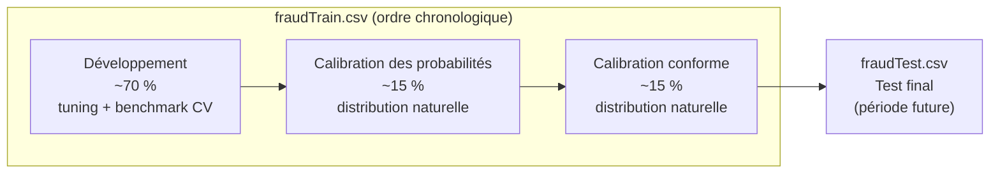
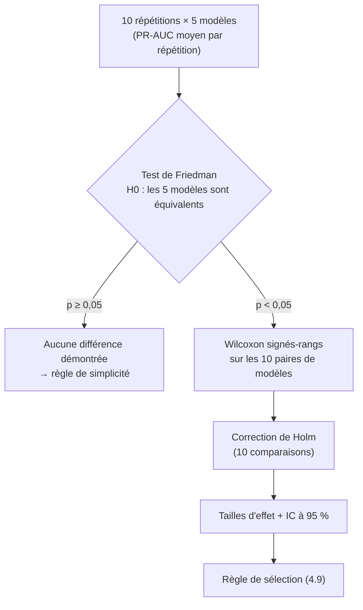
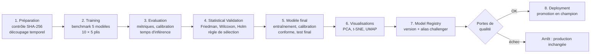
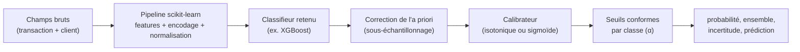

# P2 : Data Scientist (ML, statistiques, incertitude)

> Extrait du **document d'architecture v1.0** (plateforme FinTech MLOps haute disponibilité).
> Lire d'abord **`00_Commun.md`** (objectifs, vue d'ensemble, décisions D1 à D32, planning global).
> Les numéros de section renvoient au document d'architecture complet (PDF).

## Mission

- **Tâches du sujet :** T2, T3, T4
- **Périmètre :** Données Sparkov, benchmark des 5 modèles, validation statistique, calibration et prédiction conforme, choix de α, audit d'équité

## Points de vigilance

1. **Le protocole est figé avant les expériences** : découpage, métrique principale (PR-AUC), tests et règle de sélection (4.9).
2. **`fraudTest.csv` n'est utilisé qu'une seule fois**, pour l'évaluation finale.
3. Le sous-échantillonnage s'applique **uniquement aux plis d'entraînement** ; validation, calibration et test restent à la distribution naturelle.
4. **L'unité statistique est la répétition** (n = 10), pas le pli : ne pas traiter les 50 scores comme indépendants.
5. Le code statistique est un **module Python réutilisable** (`ml/stats/validate.py`), livré à P3 en S7, et non un simple notebook.
6. Transmettre à P3 **le meilleur modèle provisoire dès S6**, pour qu'un premier vrai modèle soit en production en S8.
7. Tout résultat officiel provient du **Job de pipeline** dans le cluster ; les notebooks servent à l'exploration.
8. Genre et âge sont conservés : l'**audit d'équité** (S9) est obligatoire.

## Planning personnel

| Tâche | Semaines | Début |
|---|---|---|
| Analyse exploratoire, prétraitement | S1–S3 | 28/09/2026 |
| Tuning + benchmark 10x5 | S4–S6 | 19/10/2026 |
| Module de validation statistique | S6–S8 | 02/11/2026 |
| Calibration, conforme, alpha | S8–S9 | 16/11/2026 |
| Audit d'équité | S9 | 23/11/2026 |

## Livrables reçus

| # | Livrable | De | Fin |
|---|---|---|---|
| 1 | Choix du jeu de données (fait : Sparkov, D1) | Équipe | S1 |
| 3 | Serveur MLflow opérationnel + script de suivi type | P3 | S3 |
| 5 | Docker Compose, cluster kind, squelette CI | P4 | S3 |
| 16 | Résultats des expériences + vidéos | P4, P5 | S12 |
| 17 | README consolidé + démo | P1, P5 | S14 |

## Livrables transmis

| # | Livrable | Vers | Fin |
|---|---|---|---|
| 4 | Données prétraitées, liste des features, format de transaction | P1, P3 | S3 |
| 8 | Résultats du benchmark (meilleur modèle provisoire) | P3 | S6 |
| 9 | Module de validation statistique | P3 | S7 |
| 12 | Modèle final, α, seuils, rapport statistique | P3, P1 | S9 |

Règle de passage : un livrable n'est considéré comme transmis que s'il est **documenté, testé et démontré** à l'équipe.

## Jalons de l'équipe

| Jalon | Date | Critère de validation |
|---|---|---|
| J1 | 11/10/2026 | Architecture validée (ce document), dépôt et ruleset en place, contrats OpenAPI v1 |
| J2 | 18/10/2026 | MLflow prêt, données prétraitées, Docker Compose et CI opérationnels |
| J3 | 08/11/2026 | Services de base fonctionnels, benchmark terminé, ml-service mock livré, contrôles de sécurité actifs en CI |
| J4 | 22/11/2026 | Validation statistique terminée, plateforme déployée par Argo CD, **premier vrai modèle en production**, Prometheus installé |
| J5 | 06/12/2026 | Modèle final, pipeline avec portes de qualité, CI/CD complète, tests e2e et rollback automatique fonctionnels |
| J6 | 20/12/2026 | Toutes les expériences réalisées 3 fois, tableaux de bord et alertes validés, vidéos enregistrées |
| J7 | 21/12/2026 | **Gel du code** : plus de nouvelle fonctionnalité, uniquement des corrections |
| J8 | 03/01/2027 | README complet relu par tous, démo enregistrée en première version |
| J9 | 09/01/2027 | **Livraison** : dépôt GitHub, README, démo de 5 min maximum (un jour de marge avant le 10/01) |

---

# Architecture de votre périmètre

## 4. Architecture ML : données, benchmark, validation statistique et incertitude

**Responsable :** P2 (Data Scientist). **Support :** P3 (intégration au pipeline et à MLflow).

Principe directeur : **le protocole expérimental est fixé avant de lancer les expériences**. Les découpages, la métrique principale, les tests et la règle de sélection du modèle sont décrits ici, puis appliqués sans modification. Cela évite d'ajuster la méthode après avoir vu les résultats.

### 4.1 Jeu de données : Sparkov

Jeu synthétique de transactions par carte bancaire, fourni en deux fichiers déjà découpés dans le temps :

| Fichier | Contenu | Usage |
|---|---|---|
| `fraudTrain.csv` | Période la plus ancienne (~1,3 M transactions) | Entraînement, benchmark, calibration |
| `fraudTest.csv` | Période suivante (~0,56 M transactions) | **Test final uniquement**, jamais utilisé avant l'évaluation finale |

Le taux de fraude est **inférieur à 1 %**, ce qui en fait un problème fortement déséquilibré. Les chiffres exacts seront confirmés par P2 lors de l'analyse exploratoire.

**Colonnes et usage :**

| Catégorie | Colonnes | Usage |
|---|---|---|
| Identifiants | `trans_num`, `cc_num`, `unix_time` | Exclus du modèle. `trans_num` sert de clé d'idempotence, `cc_num` est haché par customer-service |
| Données personnelles | `first`, `last`, `street`, `zip` | Exclues : aucune valeur prédictive légitime |
| Transaction | `trans_date_trans_time`, `amt`, `category`, `merchant`, `merch_lat`, `merch_long` | Features |
| Client | `dob`, `gender`, `job`, `city`, `state`, `city_pop`, `lat`, `long` | Features (voir 4.3 pour les attributs sensibles) |
| Cible | `is_fraud` | Étiquette |

### 4.2 Découpage des données

Le découpage respecte **l'ordre chronologique**, pour reproduire la réalité : on apprend sur le passé et on prédit le futur.

| Partie | Rôle | Règle |
|---|---|---|
| Développement | Réglage des hyperparamètres et benchmark par validation croisée | Seule partie utilisée pour comparer les 5 algorithmes |
| Calibration des probabilités | Ajuste les probabilités du modèle final (isotonique ou sigmoïde) | Jamais vue pendant l'entraînement |
| Calibration conforme | Calcule les seuils de la prédiction conforme | Jamais vue pendant l'entraînement ni la calibration des probabilités |
| Test final | Mesure unique et définitive de la performance, de la couverture et du taux de revue | Utilisé **une seule fois** |

Les deux calibrations utilisent des données différentes, pour que l'une ne fausse pas les garanties de l'autre.

### 4.3 Features et prétraitement

Tout le prétraitement est dans un **`Pipeline` scikit-learn** (décision D13). Le même objet transforme les données à l'entraînement et en production, dans le ml-service.

| Feature dérivée | Calcul |
|---|---|
| `amount_log` | log(1 + montant) |
| `hour`, `day_of_week`, `is_weekend`, `is_night` | Extraits de la date et de l'heure de la transaction |
| `age` | Âge du client à la date de la transaction |
| `gender` | Encodage binaire |
| `distance_km` | Distance haversine entre le client et le marchand |
| `category` | Encodage one-hot (14 catégories) |
| `city_pop_log` | log(population de la ville) |
| `state` | Encodage fréquentiel ou one-hot, selon l'analyse exploratoire |

**Exclus :**
- **`merchant` et `job`** : forte cardinalité et risque de sur-apprentissage. Ils pourront être réintroduits avec un encodage par la cible si l'analyse exploratoire le justifie.
- **Features d'historique** (nombre de transactions du client sur les dernières 24 h, montant moyen, etc.) : **non incluses** (décision D17). Le ml-service reste sans état et ne connaît qu'une transaction à la fois. Sparkov est déjà bien séparable avec les features propres à chaque transaction, donc le gain attendu ne justifie pas la complexité d'un stockage d'historique. C'est documenté comme une limite.

**Attributs sensibles.** Le **genre** et l'**âge** sont **conservés** (décision D18). Les données sont synthétiques et il s'agit de détection de fraude, pas d'octroi de crédit. En contrepartie, un **audit d'équité** est réalisé sur le test final : rappel, taux de faux positifs et taux de revue sont comparés par genre et par tranche d'âge. Tout écart important est rapporté dans le README comme une limite éthique.

**Normalisation.** `StandardScaler` pour les modèles sensibles à l'échelle : régression logistique, SVM et MLP.

### 4.4 Gestion du déséquilibre des classes

Stratégie **identique pour tous les modèles**, pour une comparaison équitable :

1. **Sous-échantillonnage** de la classe majoritaire **dans les plis d'entraînement uniquement**. Le ratio de départ est de 1 fraude pour 10 légitimes, ajustable lors du tuning. Les plis de validation, la calibration et le test restent **à la distribution naturelle**.
2. **Correction de l'a priori** (Dal Pozzolo et al., 2015). Le sous-échantillonnage gonfle artificiellement les probabilités de fraude. Elles sont corrigées par la formule p = β·pₛ / (β·pₛ − pₛ + 1), où β est le taux d'échantillonnage de la classe majoritaire.

Deux avantages :
- les probabilités restent interprétables ;
- les modèles coûteux (SVM, MLP) deviennent entraînables en un temps raisonnable, puisque chaque entraînement porte sur quelques dizaines de milliers de lignes au lieu d'un million.

### 4.5 Modèles comparés

| Modèle | Implémentation | Remarque |
|---|---|---|
| Régression logistique | scikit-learn | Référence simple et interprétable |
| Random Forest | scikit-learn | – |
| Gradient Boosting | **XGBoost** | Candidat attendu comme le plus performant |
| SVM | Approximation de noyau (Nystroem) + `LinearSVC` | Un SVC à noyau RBF exact serait trop lent sur ce volume. L'approximation garde un comportement non linéaire. Les scores sont convertis en probabilités par la calibration |
| MLP | scikit-learn `MLPClassifier` | Arrêt anticipé (early stopping) activé |

**Réglage des hyperparamètres.**
- Recherche aléatoire avec Optuna, avec **le même budget pour chaque modèle** (par exemple 30 essais), sur une partie temporelle distincte au début de la zone de développement.
- Les configurations retenues sont **figées** avant le benchmark.
- Le réglage n'est pas refait dans chaque pli : une validation croisée imbriquée serait trop coûteuse. C'est documenté comme une limite.

### 4.6 Métriques

| Métrique | Pourquoi | Rôle |
|---|---|---|
| **PR-AUC** (average precision) | La plus informative pour une classe rare : elle ignore les nombreux vrais négatifs | **Métrique principale** (tests confirmatoires) |
| ROC-AUC | Capacité de classement globale | Secondaire |
| MCC | Résumé équilibré de la matrice de confusion, robuste au déséquilibre | Secondaire |
| Précision, rappel, F1 | Lecture métier : fausses alertes et fraudes manquées | Secondaires |
| Accuracy | Demandée par le sujet. Trompeuse ici : un modèle qui prédit toujours « légitime » dépasse 99 % | Rapportée avec cet avertissement |
| **Calibration** : Brier score, ECE, diagrammes de fiabilité | La décision et l'incertitude reposent sur des probabilités fiables | Critère de sélection secondaire |
| **Temps d'inférence** | Contrainte de production (< 50 ms, section 1.4) | p50 et p95 sur 1 000 appels d'une seule ligne, pipeline complet, CPU, 1 thread, même machine pour tous les modèles |

**Seuil des métriques dépendantes d'un seuil** (précision, rappel, F1, MCC) : il est choisi en maximisant le F1 sur une validation interne du pli d'entraînement, puis appliqué au pli de validation. Le seuil n'est donc jamais optimisé sur les données qui servent à la mesure.

**Métrique métier (bonus).** Coût total = montant des fraudes manquées + coût fixe par fausse alerte. Elle permet de traduire les résultats en impact financier.

### 4.7 Protocole de benchmark

- **Validation croisée stratifiée à 5 plis, répétée 10 fois** avec 10 seeds différentes : 50 mesures par modèle et par métrique.
- **Unité statistique : la répétition.** Les 5 plis d'une même répétition partagent des données d'entraînement, donc leurs scores ne sont pas indépendants. On utilise la **moyenne des 5 plis de chaque répétition**, soit **n = 10 blocs** par modèle. Cela évite de gonfler artificiellement la significativité.
- **Traçabilité.** Chaque pli est journalisé dans MLflow : seed, pli, hyperparamètres, métriques et durée d'entraînement.

### 4.8 Validation statistique

| Élément | Méthode |
|---|---|
| Test global | **Friedman** sur les rangs des 5 modèles dans les 10 blocs. Taille d'effet : **W de Kendall** |
| Comparaisons par paires | **Wilcoxon signés-rangs** appariés sur les 10 blocs, pour les 10 paires |
| Correction des comparaisons multiples | **Holm-Bonferroni**, contrôle du risque global à 5 % |
| Tailles d'effet par paire | **Corrélation rang-bisériale** (associée au Wilcoxon) et différence moyenne de PR-AUC |
| Intervalles de confiance | IC à 95 % par bootstrap (10 000 rééchantillonnages) sur les 10 moyennes de répétition, pour chaque modèle et chaque différence |
| Test de sensibilité | **Test t corrigé de Nadeau et Bengio** pour les paires clés. Il tient compte du chevauchement des données de la validation croisée et confirme ou nuance les conclusions |
| Visualisation | Diagramme de différence critique, avec les modèles classés par rang moyen |
| Test final | IC à 95 % par bootstrap sur `fraudTest` (rééchantillonnage des transactions) pour toutes les métriques du modèle retenu |

**Portée des conclusions.**
- Les tests sur la **PR-AUC** sont **confirmatoires** : ils répondent à la question posée à l'avance.
- Les mêmes tests appliqués aux métriques secondaires sont rapportés comme **exploratoires**, pour ne pas multiplier les tests jusqu'à trouver un résultat significatif.

**Limites documentées :**
- Un seul jeu de données : les conclusions valent pour Sparkov et ne se généralisent pas automatiquement.
- Avec n = 10 blocs, la plus petite valeur p possible du Wilcoxon est d'environ 0,002. La correction de Holm reste franchissable, mais seulement pour des écarts très réguliers.
- La validation croisée est stratifiée et non temporelle. Le réalisme temporel est vérifié sur le test final.

### 4.9 Règle de sélection du modèle final

Cette règle est fixée **avant** les expériences :

1. Classer les modèles par PR-AUC moyenne.
2. Si le premier est **significativement meilleur** que le deuxième (p ajusté par Holm < 0,05, avec une taille d'effet non négligeable), **il est retenu**.
3. Sinon, parmi les modèles statistiquement équivalents au premier, choisir celui qui a **la meilleure calibration** (Brier score), puis, en cas d'égalité, **le temps d'inférence le plus court**.

Cette règle garantit que le modèle retenu est défendable, même si les différences sont faibles.

### 4.10 Calibration et quantification de l'incertitude

**Étape 1 : calibration des probabilités.** Le modèle final est entraîné sur la zone de développement, puis calibré sur la zone de calibration des probabilités. On compare **isotonique** et **sigmoïde (Platt)**, et on retient la méthode au meilleur Brier score. Les diagrammes de fiabilité avant et après calibration sont journalisés dans MLflow.

**Étape 2 : prédiction conforme (MAPIE).** Elle est calculée sur la zone de calibration conforme.

- La prédiction conforme renvoie un **ensemble de prédiction** qui contient la vraie classe avec une probabilité garantie d'au moins 1 − α, à condition que les données futures ressemblent aux données de calibration.
- **Conforme conditionnel à la classe (Mondrian).** Avec 99 % de transactions légitimes, une garantie globale pourrait être respectée tout en couvrant mal la classe fraude. On calibre donc **un seuil par classe**, pour garantir la couverture **aussi sur les fraudes**. Si la version de MAPIE utilisée ne le propose pas directement, le calcul se fait en quelques lignes (quantile des scores de non-conformité par classe).

**Étape 3 : choix de α.** On évalue α ∈ {0,01 ; 0,05 ; 0,10}. Pour chaque valeur, on mesure :

| Mesure | Signification |
|---|---|
| Couverture par classe | Vérifie la garantie 1 − α, pour les légitimes et pour les fraudes |
| **Taux de revue** | Part des transactions envoyées à un analyste (ensemble {0,1} ou vide) |
| Taux d'automatisation | Part des décisions prises sans humain |
| **Taux d'erreur des décisions automatiques** | Erreurs parmi les transactions approuvées ou bloquées automatiquement |

Le α retenu est **le plus petit qui maintient le taux de revue sous une capacité d'analyse réaliste**, par exemple ≤ 2 % des transactions. Le compromis est présenté sous forme de courbe dans le README.

**Preuve attendue.** Sur le test final, montrer que les erreurs du modèle se **concentrent dans les transactions envoyées en revue**, et que les décisions automatiques sont nettement plus fiables. C'est la démonstration que la revue humaine sert réellement à quelque chose.

**Ce que le modèle renvoie** (contrat détaillé en section 5) :

| Champ | Contenu |
|---|---|
| `fraud_probability` | Probabilité calibrée de fraude |
| `prediction_set` | `[0]`, `[1]`, `[0, 1]` ou `[]` |
| `uncertainty` | Score continu entre 0 et 1 (entropie binaire normalisée de la probabilité calibrée), affiché dans le tableau de bord |
| `uncertainty_level` | `FAIBLE` (ensemble à un élément) ou `ELEVEE` (sinon), qui pilote la décision |
| `alpha` | Niveau de risque utilisé |
| `model_version` | Nom et version dans le Model Registry |

**Suivi en production.** La garantie conforme suppose que les données ne dérivent pas. La couverture réelle est donc surveillée à partir des étiquettes fournies par les analystes (section 3.4). Une baisse de couverture déclenche une alerte (section 8).

### 4.11 Visualisation des données (PCA, t-SNE, UMAP)

| Élément | Choix |
|---|---|
| Échantillon | ~20 000 transactions de la zone de test : **toutes les fraudes** et un échantillon aléatoire de légitimes, avec des poids pour ne pas fausser la lecture |
| Entrée | Features après prétraitement (sortie du `Pipeline`) |
| Méthodes | **PCA** (linéaire, variance expliquée), **t-SNE** (structure locale), **UMAP** (structure locale et globale, plus rapide) |
| Vues produites | Coloration par classe, par clusters (k-means ou HDBSCAN), par score d'anomalie (Isolation Forest), par **type d'erreur** du modèle (vrai positif, faux positif, faux négatif), par **niveau d'incertitude** |
| Format de sortie | JSON (coordonnées et attributs de chaque point) + PNG, servis par le ml-service et affichés dans React |
| Régénération | Étape du pipeline ML : les vues sont recalculées **à chaque nouvelle version du modèle** |

**Avertissement affiché dans le tableau de bord.** Avec t-SNE et UMAP, les distances entre les groupes et la taille des groupes n'ont pas de signification quantitative. Seule la proximité locale est interprétable.

### 4.12 Reproductibilité

- **Seeds fixées et journalisées.** 10 seeds pour le benchmark et une seed pour le modèle final.
- **Version des données.** L'empreinte SHA-256 de chaque fichier CSV est enregistrée dans chaque run MLflow.
- **Environnement.** Dépendances Python figées (`requirements.lock`) et même image Docker pour l'entraînement en CI.
- **Code des tests statistiques.** Il est écrit sous forme de **module Python réutilisable** (`ml/stats/validate.py`, exécutable en ligne de commande) et non uniquement dans un notebook. P3 peut ainsi l'intégrer au pipeline automatisé (section 5).
- **Rapport statistique.** Il est généré automatiquement (Markdown + figures) et stocké comme artefact MLflow du run de validation.

### 4.13 Livrables de la section

| Livrable | Responsable | Semaine |
|---|---|---|
| Analyse exploratoire + pipeline de prétraitement | P2 | S3 |
| Benchmark des 5 modèles (10 × 5 plis) | P2 | S6 |
| Module de validation statistique + rapport | P2 | S7–S8 |
| Modèle final calibré + conforme + choix de α | P2 | S8–S9 |
| Audit d'équité (genre, tranches d'âge) | P2 | S9 |
| Script de visualisation (étape du pipeline) | P3 | S8 |
| Intégration dans le pipeline MLflow | P3 | S8–S10 |

---

# Extraits utiles d'autres sections

Ces parties appartiennent au périmètre d'un autre membre, mais votre travail en dépend ou les alimente.

### 5.1 Cycle de vie du modèle

Le sujet impose la chaîne **Training → Evaluation → Statistical Validation → Model Registry → Deployment**. Chaque étape est automatisée et journalisée dans MLflow. Le passage d'une étape à la suivante est contrôlé par des **portes de qualité** : si une porte échoue, le pipeline s'arrête et le modèle en production reste inchangé.

**Deux modes d'exécution :**

| Mode | Étapes | Usage | Durée estimée |
|---|---|---|---|
| `full` | 1 → 8 | Première exécution, ou changement de features ou d'algorithmes | 30 à 90 min |
| `retrain` | 1, 5 → 8 | Réentraînement de l'algorithme déjà sélectionné (nouvelles données, nouveau α) | 5 à 15 min |

### 5.2 Serveur MLflow

| Élément | Choix |
|---|---|
| Déploiement | Deployment Kubernetes (1 replica), namespace `ml` |
| Backend store (runs, métriques, registry) | PostgreSQL, schéma `mlflow` (décision D5) |
| Artefacts (modèles, figures, rapports) | Volume persistant (PVC), servi par MLflow lui-même (`--serve-artifacts`). Pas de MinIO, pour économiser la RAM |
| Accès | `https://mlflow.fintech.local` via l'Ingress, réservé à l'équipe |
| Registry | Modèle enregistré `fraud-detector`, avec des **alias** `champion` (production) et `challenger` (candidat). Les « stages » sont obsolètes depuis MLflow 2.9 |

**Organisation des runs.** Chaque exécution du pipeline crée un **run parent**, et chaque étape un **run enfant**. Chaque pli du benchmark est aussi un run enfant de l'étape Training. Tout est ainsi consultable dans l'interface, de l'exécution globale jusqu'au pli individuel.

**Ce qui est journalisé :**

| Type | Contenu |
|---|---|
| Paramètres | Hyperparamètres, seed, pli, ratio de sous-échantillonnage, α, méthode de calibration |
| Métriques | Toutes les métriques de la section 4.6, par pli, par répétition et agrégées |
| Tags | Commit Git, empreinte SHA-256 des données, mode du pipeline, image Docker utilisée |
| Artefacts | Modèle packagé, diagrammes de fiabilité, courbes PR et ROC, diagramme de différence critique, rapport statistique (Markdown), courbe α / taux de revue, audit d'équité, visualisations JSON et PNG |

### 5.3 Packaging du modèle

Le modèle est enregistré comme un **modèle MLflow `pyfunc` personnalisé** qui regroupe tout ce qui est nécessaire à une prédiction :

- **Un seul artefact, un seul appel.** Le ml-service charge un seul objet et appelle `predict`. Il ne connaît aucun détail du modèle.
- **Signature MLflow.** Le schéma des champs d'entrée est enregistré avec le modèle, ce qui permet de détecter une incompatibilité dès le chargement.
- **Visualisations liées au modèle.** Les fichiers de visualisation et le résumé des métriques sont attachés à la **même version**. Le tableau de bord affiche donc toujours des vues cohérentes avec le modèle en production.
- **Traçabilité complète.** Chaque version porte les tags `git_commit`, `data_sha256`, `pipeline_run_id` et `alpha`. On peut remonter d'une décision de l'audit jusqu'au code et aux données d'entraînement.

### 5.4 Portes de qualité avant promotion

| Porte | Condition | Pourquoi |
|---|---|---|
| Non-régression | PR-AUC du candidat sur le test ≥ PR-AUC du champion − 0,01 | Ne jamais déployer un modèle moins bon |
| Couverture conforme | Couverture par classe ≥ (1 − α) − 0,02 sur le test | La garantie d'incertitude doit tenir |
| Charge de revue | Taux de revue ≤ 2 % | Capacité réaliste des analystes |
| Latence | Inférence p95 < 50 ms (pipeline complet, 1 thread) | Exigence non fonctionnelle (section 1.4) |
| Test de fumée | Le modèle se charge depuis le registry et prédit correctement 100 transactions de référence | Détecte un artefact corrompu ou une signature incompatible |

À la première exécution, sans champion, la porte de non-régression est remplacée par un minimum absolu : PR-AUC ≥ celle de la régression logistique.

### 5.6 Où et quand le pipeline s'exécute

GitHub Actions tourne dans le cloud et ne peut pas joindre le MLflow du cluster local. L'exécution est donc répartie ainsi :

| Contexte | Où | Ce qui est exécuté |
|---|---|---|
| **CI (chaque PR)** | GitHub Actions | Lint, tests unitaires du prétraitement et du module statistique, puis **pipeline de fumée** sur un échantillon de 1 % avec un MLflow local au runner. Cela prouve que le pipeline fonctionne de bout en bout |
| **Exécution officielle** | **Job Kubernetes** dans le cluster, image `ml-pipeline:<sha>` construite par la CI | Pipeline complet, journalisé dans le MLflow du cluster |
| **Exploration** | Machine de P2 | Notebooks et essais. Les résultats officiels proviennent toujours du Job, ce qui prouve la reproductibilité |

- **Déclenchement du Job.** Un CronJob **suspendu** sert de modèle. `make pipeline MODE=full` lance `kubectl create job --from=cronjob/ml-pipeline`.
- **Ressources.** Requête de 2 CPU et 4 Gi. Le Job n'est pas lancé pendant les tests de charge.
