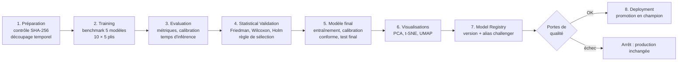
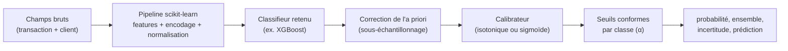
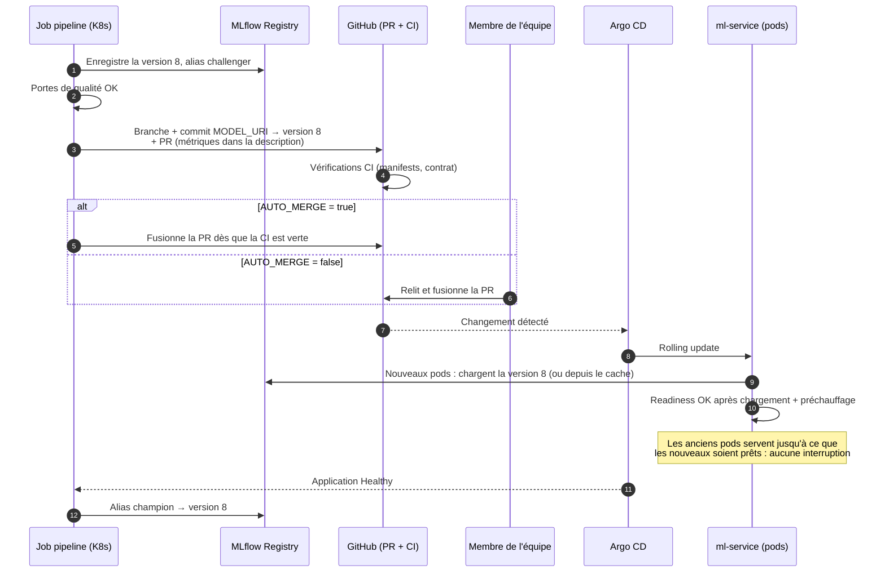
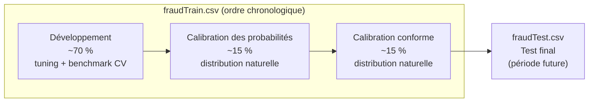

# P3 : Ingénieur MLOps et serving du modèle

> Extrait du **document d'architecture v1.0** (plateforme FinTech MLOps haute disponibilité).
> Lire d'abord **`00_Commun.md`** (objectifs, vue d'ensemble, décisions D1 à D32, planning global).
> Les numéros de section renvoient au document d'architecture complet (PDF).

## Mission

- **Tâches du sujet :** T5, T6, T7
- **Périmètre :** MLflow, pipeline automatisé avec portes de qualité, ml-service FastAPI, visualisations, simulateur (rejeu et rejets de paiement), **suppléant de P1**

## Points de vigilance

1. **MLflow opérationnel fin S3** : P2 en dépend pour journaliser ses expériences.
2. **Mode mock du ml-service livré en S6**, déterministe et conforme au contrat : P1 en dépend.
3. **Premier vrai modèle en production en S8** (meilleur modèle du benchmark), sans attendre la validation statistique : les tests de charge en dépendent.
4. GitHub Actions **ne peut pas joindre** le MLflow du cluster local : la CI exécute un pipeline de fumée, le pipeline officiel tourne en Job Kubernetes (5.6).
5. ml-service : un processus Uvicorn par pod, `/predict` synchrone (`def`), XGBoost `n_jobs=1`, readiness seulement après chargement + préchauffage, cache du modèle en `hostPath` par nœud.
6. **Simulateur** : un `trans_num` unique par transaction envoyée, et envoi différé de la vraie étiquette (rejets de paiement simulés, D19).
7. Promotion du modèle par PR avec `AUTO_MERGE` (D20) : jeton GitHub limité, stocké dans un SealedSecret.
8. **Suppléant officiel de P1** : garder du temps en S1–S5 pour reprendre un service si besoin.

## Planning personnel

| Tâche | Semaines | Début |
|---|---|---|
| MLflow (Compose puis K8s) | S1–S3 | 28/09/2026 |
| Squelette pipeline + CI de fumée | S4–S5 | 19/10/2026 |
| ml-service mock + contrat | S5–S6 | 26/10/2026 |
| Simulateur (rejeu + rejets) | S6–S9 | 02/11/2026 |
| Premier modèle + visualisations | S7–S8 | 09/11/2026 |
| Pipeline complet + PR auto | S8–S10 | 16/11/2026 |
| ml-service final | S9–S10 | 23/11/2026 |

## Livrables reçus

| # | Livrable | De | Fin |
|---|---|---|---|
| 1 | Choix du jeu de données (fait : Sparkov, D1) | Équipe | S1 |
| 2 | Contrats OpenAPI, schémas de base, schéma d'architecture | P1 | S2 |
| 4 | Données prétraitées, liste des features, format de transaction | P2 | S3 |
| 5 | Docker Compose, cluster kind, squelette CI | P4 | S3 |
| 8 | Résultats du benchmark (meilleur modèle provisoire) | P2 | S6 |
| 9 | Module de validation statistique | P2 | S7 |
| 12 | Modèle final, α, seuils, rapport statistique | P2 | S9 |
| 16 | Résultats des expériences + vidéos | P4, P5 | S12 |
| 17 | README consolidé + démo | P1, P5 | S14 |

## Livrables transmis

| # | Livrable | Vers | Fin |
|---|---|---|---|
| 3 | Serveur MLflow opérationnel + script de suivi type | P2 | S3 |
| 6 | Contrat `/predict` + ml-service en mode mock | P1 | S6 |
| 10 | Premier vrai modèle en production + visualisations | P1, P5 | S8 |
| 13 | Pipeline complet + ml-service final | P4 | S10 |

Règle de passage : un livrable n'est considéré comme transmis que s'il est **documenté, testé et démontré** à l'équipe.

## Jalons de l'équipe

| Jalon | Date | Critère de validation |
|---|---|---|
| J1 | 11/10/2026 | Architecture validée (ce document), dépôt et ruleset en place, contrats OpenAPI v1 |
| J2 | 18/10/2026 | MLflow prêt, données prétraitées, Docker Compose et CI opérationnels |
| J3 | 08/11/2026 | Services de base fonctionnels, benchmark terminé, ml-service mock livré, contrôles de sécurité actifs en CI |
| J4 | 22/11/2026 | Validation statistique terminée, plateforme déployée par Argo CD, **premier vrai modèle en production**, Prometheus installé |
| J5 | 06/12/2026 | Modèle final, pipeline avec portes de qualité, CI/CD complète, tests e2e et rollback automatique fonctionnels |
| J6 | 20/12/2026 | Toutes les expériences réalisées 3 fois, tableaux de bord et alertes validés, vidéos enregistrées |
| J7 | 21/12/2026 | **Gel du code** : plus de nouvelle fonctionnalité, uniquement des corrections |
| J8 | 03/01/2027 | README complet relu par tous, démo enregistrée en première version |
| J9 | 09/01/2027 | **Livraison** : dépôt GitHub, README, démo de 5 min maximum (un jour de marge avant le 10/01) |

---

# Architecture de votre périmètre

## 5. Architecture MLOps et serving du modèle

**Responsable :** P3 (Ingénieur MLOps). **Support :** P2 (code ML et statistique), P1 (intégration avec risk-service), P4 (CI et déploiement).


### 5.1 Cycle de vie du modèle

Le sujet impose la chaîne **Training → Evaluation → Statistical Validation → Model Registry → Deployment**. Chaque étape est automatisée et journalisée dans MLflow. Le passage d'une étape à la suivante est contrôlé par des **portes de qualité** : si une porte échoue, le pipeline s'arrête et le modèle en production reste inchangé.



**Deux modes d'exécution :**

| Mode | Étapes | Usage | Durée estimée |
|---|---|---|---|
| `full` | 1 → 8 | Première exécution, ou changement de features ou d'algorithmes | 30 à 90 min |
| `retrain` | 1, 5 → 8 | Réentraînement de l'algorithme déjà sélectionné (nouvelles données, nouveau α) | 5 à 15 min |

### 5.2 Serveur MLflow

| Élément | Choix |
|---|---|
| Déploiement | Deployment Kubernetes (1 replica), namespace `ml` |
| Backend store (runs, métriques, registry) | PostgreSQL, schéma `mlflow` (décision D5) |
| Artefacts (modèles, figures, rapports) | Volume persistant (PVC), servi par MLflow lui-même (`--serve-artifacts`). Pas de MinIO, pour économiser la RAM |
| Accès | `https://mlflow.fintech.local` via l'Ingress, réservé à l'équipe |
| Registry | Modèle enregistré `fraud-detector`, avec des **alias** `champion` (production) et `challenger` (candidat). Les « stages » sont obsolètes depuis MLflow 2.9 |

**Organisation des runs.** Chaque exécution du pipeline crée un **run parent**, et chaque étape un **run enfant**. Chaque pli du benchmark est aussi un run enfant de l'étape Training. Tout est ainsi consultable dans l'interface, de l'exécution globale jusqu'au pli individuel.

**Ce qui est journalisé :**

| Type | Contenu |
|---|---|
| Paramètres | Hyperparamètres, seed, pli, ratio de sous-échantillonnage, α, méthode de calibration |
| Métriques | Toutes les métriques de la section 4.6, par pli, par répétition et agrégées |
| Tags | Commit Git, empreinte SHA-256 des données, mode du pipeline, image Docker utilisée |
| Artefacts | Modèle packagé, diagrammes de fiabilité, courbes PR et ROC, diagramme de différence critique, rapport statistique (Markdown), courbe α / taux de revue, audit d'équité, visualisations JSON et PNG |

### 5.3 Packaging du modèle

Le modèle est enregistré comme un **modèle MLflow `pyfunc` personnalisé** qui regroupe tout ce qui est nécessaire à une prédiction :



- **Un seul artefact, un seul appel.** Le ml-service charge un seul objet et appelle `predict`. Il ne connaît aucun détail du modèle.
- **Signature MLflow.** Le schéma des champs d'entrée est enregistré avec le modèle, ce qui permet de détecter une incompatibilité dès le chargement.
- **Visualisations liées au modèle.** Les fichiers de visualisation et le résumé des métriques sont attachés à la **même version**. Le tableau de bord affiche donc toujours des vues cohérentes avec le modèle en production.
- **Traçabilité complète.** Chaque version porte les tags `git_commit`, `data_sha256`, `pipeline_run_id` et `alpha`. On peut remonter d'une décision de l'audit jusqu'au code et aux données d'entraînement.

### 5.4 Portes de qualité avant promotion

| Porte | Condition | Pourquoi |
|---|---|---|
| Non-régression | PR-AUC du candidat sur le test ≥ PR-AUC du champion − 0,01 | Ne jamais déployer un modèle moins bon |
| Couverture conforme | Couverture par classe ≥ (1 − α) − 0,02 sur le test | La garantie d'incertitude doit tenir |
| Charge de revue | Taux de revue ≤ 2 % | Capacité réaliste des analystes |
| Latence | Inférence p95 < 50 ms (pipeline complet, 1 thread) | Exigence non fonctionnelle (section 1.4) |
| Test de fumée | Le modèle se charge depuis le registry et prédit correctement 100 transactions de référence | Détecte un artefact corrompu ou une signature incompatible |

À la première exécution, sans champion, la porte de non-régression est remplacée par un minimum absolu : PR-AUC ≥ celle de la régression logistique.

### 5.5 Déploiement d'une nouvelle version du modèle (décision D20)

**Principe : la version du modèle en production est écrite dans Git.** La ConfigMap du ml-service contient `MODEL_URI=models:/fraud-detector/<version>`, une version **exacte** et non un alias. Argo CD déploie donc le modèle exactement comme il déploie le code.

**Promotion par PR, fusionnée automatiquement si tout est vert.**
- Le pipeline ouvre une PR qui change la version.
- Les vérifications de la CI s'exécutent sur cette PR.
- Selon le paramètre `AUTO_MERGE`, le pipeline fusionne lui-même la PR, ou un membre de l'équipe la valide.



| `AUTO_MERGE` | Usage | Argument |
|---|---|---|
| `true` | Développement et démo | Déploiement entièrement automatique, conforme à l'exigence « automated deployment » du sujet |
| `false` | Mode « production » documenté | Validation à quatre yeux, une bonne pratique en finance |

**Avantages :**
- **Un seul mécanisme de déploiement** (Argo CD) pour le code, la configuration et le modèle, et une seule source de vérité : Git.
- **Rollback du modèle = `git revert`** de la PR. Argo CD redéploie l'ancienne version par rolling update.
- **Historique complet.** Chaque déploiement de modèle est un commit daté, avec ses métriques et, en mode manuel, son approbateur.
- **Sécurité du rolling update.** Si le nouveau modèle ne se charge pas, la readiness probe échoue et le rolling update se bloque. Les anciens pods continuent de servir, Argo CD passe l'application en `Degraded`, et le Job **ne déplace pas** l'alias `champion`.

**Automatisation.** Le Job utilise l'API GitHub avec un jeton stocké dans un Secret Kubernetes, limité à ce dépôt et aux droits de PR.

### 5.6 Où et quand le pipeline s'exécute

GitHub Actions tourne dans le cloud et ne peut pas joindre le MLflow du cluster local. L'exécution est donc répartie ainsi :

| Contexte | Où | Ce qui est exécuté |
|---|---|---|
| **CI (chaque PR)** | GitHub Actions | Lint, tests unitaires du prétraitement et du module statistique, puis **pipeline de fumée** sur un échantillon de 1 % avec un MLflow local au runner. Cela prouve que le pipeline fonctionne de bout en bout |
| **Exécution officielle** | **Job Kubernetes** dans le cluster, image `ml-pipeline:<sha>` construite par la CI | Pipeline complet, journalisé dans le MLflow du cluster |
| **Exploration** | Machine de P2 | Notebooks et essais. Les résultats officiels proviennent toujours du Job, ce qui prouve la reproductibilité |

- **Déclenchement du Job.** Un CronJob **suspendu** sert de modèle. `make pipeline MODE=full` lance `kubectl create job --from=cronjob/ml-pipeline`.
- **Ressources.** Requête de 2 CPU et 4 Gi. Le Job n'est pas lancé pendant les tests de charge.

### 5.7 Service FastAPI (ml-service)

#### Endpoints

| Endpoint | Accès | Rôle |
|---|---|---|
| `POST /predict` | **Interne** (risk-service), non routé par la Gateway | Prédiction d'une transaction |
| `GET /health/live` | Kubernetes | Le processus répond |
| `GET /health/ready` | Kubernetes | Le modèle est chargé et le test de préchauffage a réussi |
| `GET /metrics` | Prometheus | Métriques techniques et ML |
| `GET /api/v1/ml/model` | Gateway (ADMIN, ANALYSTE) | Nom, version, date d'entraînement, α, algorithme, commit Git |
| `GET /api/v1/ml/performance` | Gateway | Métriques hors ligne : benchmark, résultats statistiques, test final avec IC, audit d'équité |
| `GET /api/v1/ml/viz/{method}?view=` | Gateway | Visualisations. `method` : `pca`, `tsne` ou `umap`. `view` : `class`, `cluster`, `outlier`, `error` ou `uncertainty` |

#### Contrat de `/predict`

**Requête :**

```json
{
  "transaction_id": "7f3c9a1e-2b4d-4c8e-9f1a-0d5e6b7c8a9f",
  "trans_datetime": "2020-07-14T02:13:45",
  "amount": 842.17,
  "category": "shopping_net",
  "merch_lat": 40.71,
  "merch_long": -74.01,
  "customer": {
    "dob": "1962-05-18",
    "gender": "F",
    "city_pop": 1577385,
    "lat": 40.65,
    "long": -73.95,
    "state": "NY"
  }
}
```

**Réponse :**

```json
{
  "transaction_id": "7f3c9a1e-2b4d-4c8e-9f1a-0d5e6b7c8a9f",
  "prediction": 1,
  "fraud_probability": 0.87,
  "prediction_set": [1],
  "uncertainty": 0.56,
  "uncertainty_level": "FAIBLE",
  "alpha": 0.05,
  "model": { "name": "fraud-detector", "version": "8" },
  "inference_ms": 4.2
}
```

**Validation des entrées.** Le modèle Pydantic vérifie :
- montant strictement positif ;
- catégorie parmi les 14 connues ;
- latitude et longitude dans leurs bornes ;
- dates cohérentes.

Une entrée invalide renvoie `422`, et un compteur Prometheus est incrémenté.

**Séparation des responsabilités.** Le ml-service **ne décide pas**. Il fournit la prédiction et son incertitude, et risk-service applique la politique de décision (section 2.5). La politique peut donc évoluer sans redéployer le modèle, et inversement.

**Mode mock (livré en S6).** La même image, lancée avec `MODEL_MODE=mock`, renvoie des réponses déterministes qui respectent exactement le contrat. Par exemple, montant > 500 donne `[1]`, montant entre 200 et 500 donne `[0,1]`. P1 développe et teste risk-service sans attendre le vrai modèle, et peut provoquer volontairement les trois décisions.

#### Choix d'implémentation

- **Un processus Uvicorn par pod.** La mise à l'échelle se fait par le nombre de pods (HPA), et non par des workers dans un pod. Kubernetes mesure ainsi correctement le CPU de chaque instance.
- **Endpoint `/predict` synchrone** (`def` et non `async def`). La prédiction sollicite le CPU : FastAPI l'exécute dans son pool de threads, ce qui ne bloque pas la boucle d'événements.
- **XGBoost limité à `n_jobs=1`**, pour respecter la limite CPU du pod et éviter la sur-souscription.
- **Chargement au démarrage.** Le modèle est chargé dans le `lifespan` de FastAPI, puis une prédiction de préchauffage est exécutée. La readiness ne passe à OK qu'après ces deux étapes.
- **Cache local du modèle.** Le modèle téléchargé est stocké sur le disque du nœud (volume `hostPath`, un cache par nœud), indexé par version. Un volume persistant classique ne peut pas être partagé entre des pods placés sur des nœuds différents (section 6.10). Un pod qui redémarre recharge depuis le cache sans dépendre de MLflow. Une panne de MLflow **n'empêche donc pas** les pods de redémarrer, tant que la version est en cache.

### 5.8 Métriques exposées par le ml-service

| Métrique Prometheus | Type | Usage |
|---|---|---|
| `http_requests_total`, `http_request_duration_seconds` | Compteur, histogramme | Débit, latence, erreurs HTTP |
| `ml_inference_duration_seconds{model_version}` | Histogramme | Temps d'inférence p50 et p95 |
| `ml_predictions_total{model_version, prediction_set}` | Compteur | Répartition `0`, `1`, `01`, `vide`, soit les taux d'automatisation et de revue |
| `ml_fraud_probability` | Histogramme | Distribution des scores : un changement signale une **dérive** |
| `ml_uncertainty` | Histogramme | Distribution de l'incertitude |
| `ml_input_validation_errors_total` | Compteur | Entrées invalides |
| `ml_model_info{name, version}` | Jauge (= 1) | Version en production, visible dans Grafana |
| `ml_model_loaded_timestamp_seconds` | Jauge | Date du dernier chargement |

### 5.9 Suivi de la performance en production (décision D19)

**Problème.** Pour mesurer la performance réelle du modèle, il faut connaître la vérité sur chaque transaction. Or, en production, on ne la connaît que pour les transactions **revues par un analyste**, qui sont justement les cas incertains. On n'a aucune vérité sur les décisions automatiques.

**Solution proposée : les rejets de paiement simulés.** Dans la réalité, une fraude non détectée finit par être signalée par le client, plusieurs jours plus tard : c'est un *chargeback*. Le simulateur connaît la vraie étiquette `is_fraud` de chaque transaction Sparkov. Il l'envoie donc **avec un délai** (par exemple 2 minutes en accéléré), via `POST /api/v1/risk/feedback` (rôle SIMULATEUR).

risk-service rapproche chaque étiquette de la décision prise et expose des compteurs :

| Métrique | Ce qu'elle permet de calculer dans Grafana |
|---|---|
| `risk_feedback_total{decision, truth}` | Matrice de confusion **en production**, puis précision, rappel et taux de faux positifs par fenêtre de temps |
| `risk_conformal_covered_total{truth}` et `risk_feedback_total{truth}` | **Couverture conforme réelle** par classe. Une chute signale une dérive et déclenche une alerte |
| `risk_review_agreement_total{analyst_decision, truth}` | Qualité des décisions humaines |

Ce mécanisme alimente directement les tableaux de bord « Performance du modèle » et « Incertitude » demandés par le sujet. Il ne demande que quelques lignes dans le simulateur et un endpoint dans risk-service.

### 5.10 Versionnement et rollback

| Élément | Versionné dans | Identifiant | Rollback |
|---|---|---|---|
| Code | Git | Commit SHA | `git revert` puis CI et Argo CD |
| Image Docker | GHCR | Tag = commit SHA | Revert du manifest (Argo CD) |
| Configuration | Git (ConfigMaps) | Commit SHA | `git revert` |
| **Modèle** | MLflow Registry, et version épinglée dans Git | `fraud-detector/<n>` | `git revert` de la PR de promotion |
| Données | Empreinte dans MLflow | SHA-256 | Refaire l'exécution avec le fichier correspondant |
| Expérience | MLflow | Identifiant du run | Consultation, comparaison |

**Scénario de démonstration (rollback du modèle).**
1. On déploie volontairement une version dégradée, par exemple entraînée sur des données tronquées, en contournant les portes pour la démo.
2. Grafana montre la chute de la couverture et la hausse du taux de revue.
3. On fait `git revert` de la PR.
4. Argo CD revient à la version précédente et les métriques se rétablissent.

### 5.11 Intégration avec risk-service

| Point | Mise en œuvre |
|---|---|
| Contrat | Le schéma OpenAPI généré par FastAPI (`/openapi.json`) est **versionné dans le dépôt**. La CI échoue si le code et le contrat divergent |
| Développement de P1 | Mode mock du ml-service (S6) dans Docker Compose, et stubs WireMock générés depuis les exemples du contrat pour les tests Java |
| Résilience | Délai max de 800 ms, 1 retry, circuit breaker et repli en REVUE HUMAINE (section 3.6) |
| Traçabilité | `model.version` est enregistré dans `assessments`, puis propagé dans l'événement `transaction.decided.*` et dans l'audit |
| Corrélation | L'en-tête `X-Correlation-Id` est lu par FastAPI et ajouté à ses logs JSON |

### 5.12 Livrables et calendrier

| Livrable | Responsable | Semaine |
|---|---|---|
| Serveur MLflow (Docker Compose, puis Kubernetes) | P3 | S1–S3 |
| Squelette du pipeline + pipeline de fumée en CI | P3 | S4–S5 |
| ml-service en mode mock + contrat OpenAPI | P3 | S6 |
| **Premier vrai modèle en production** (meilleur modèle du benchmark, avant la validation statistique) | P3 | **S8** |
| Étape de visualisation + endpoints `/api/v1/ml/viz` | P3 | S8 |
| Pipeline complet avec portes de qualité, promotion par PR | P3 | S8–S10 |
| ml-service final (modèle du registry, cache, métriques) | P3 | S10 |
| Endpoint de feedback et métriques de performance en production | P1 (risk-service), P3 (simulateur) | S10 |

---

# Extraits utiles d'autres sections

Ces parties appartiennent au périmètre d'un autre membre, mais votre travail en dépend ou les alimente.

### 4.2 Découpage des données

Le découpage respecte **l'ordre chronologique**, pour reproduire la réalité : on apprend sur le passé et on prédit le futur.



| Partie | Rôle | Règle |
|---|---|---|
| Développement | Réglage des hyperparamètres et benchmark par validation croisée | Seule partie utilisée pour comparer les 5 algorithmes |
| Calibration des probabilités | Ajuste les probabilités du modèle final (isotonique ou sigmoïde) | Jamais vue pendant l'entraînement |
| Calibration conforme | Calcule les seuils de la prédiction conforme | Jamais vue pendant l'entraînement ni la calibration des probabilités |
| Test final | Mesure unique et définitive de la performance, de la couverture et du taux de revue | Utilisé **une seule fois** |

Les deux calibrations utilisent des données différentes, pour que l'une ne fausse pas les garanties de l'autre.

### 4.3 Features et prétraitement

Tout le prétraitement est dans un **`Pipeline` scikit-learn** (décision D13). Le même objet transforme les données à l'entraînement et en production, dans le ml-service.

| Feature dérivée | Calcul |
|---|---|
| `amount_log` | log(1 + montant) |
| `hour`, `day_of_week`, `is_weekend`, `is_night` | Extraits de la date et de l'heure de la transaction |
| `age` | Âge du client à la date de la transaction |
| `gender` | Encodage binaire |
| `distance_km` | Distance haversine entre le client et le marchand |
| `category` | Encodage one-hot (14 catégories) |
| `city_pop_log` | log(population de la ville) |
| `state` | Encodage fréquentiel ou one-hot, selon l'analyse exploratoire |

**Exclus :**
- **`merchant` et `job`** : forte cardinalité et risque de sur-apprentissage. Ils pourront être réintroduits avec un encodage par la cible si l'analyse exploratoire le justifie.
- **Features d'historique** (nombre de transactions du client sur les dernières 24 h, montant moyen, etc.) : **non incluses** (décision D17). Le ml-service reste sans état et ne connaît qu'une transaction à la fois. Sparkov est déjà bien séparable avec les features propres à chaque transaction, donc le gain attendu ne justifie pas la complexité d'un stockage d'historique. C'est documenté comme une limite.

**Attributs sensibles.** Le **genre** et l'**âge** sont **conservés** (décision D18). Les données sont synthétiques et il s'agit de détection de fraude, pas d'octroi de crédit. En contrepartie, un **audit d'équité** est réalisé sur le test final : rappel, taux de faux positifs et taux de revue sont comparés par genre et par tranche d'âge. Tout écart important est rapporté dans le README comme une limite éthique.

**Normalisation.** `StandardScaler` pour les modèles sensibles à l'échelle : régression logistique, SVM et MLP.

### 4.10 Calibration et quantification de l'incertitude

**Étape 1 : calibration des probabilités.** Le modèle final est entraîné sur la zone de développement, puis calibré sur la zone de calibration des probabilités. On compare **isotonique** et **sigmoïde (Platt)**, et on retient la méthode au meilleur Brier score. Les diagrammes de fiabilité avant et après calibration sont journalisés dans MLflow.

**Étape 2 : prédiction conforme (MAPIE).** Elle est calculée sur la zone de calibration conforme.

- La prédiction conforme renvoie un **ensemble de prédiction** qui contient la vraie classe avec une probabilité garantie d'au moins 1 − α, à condition que les données futures ressemblent aux données de calibration.
- **Conforme conditionnel à la classe (Mondrian).** Avec 99 % de transactions légitimes, une garantie globale pourrait être respectée tout en couvrant mal la classe fraude. On calibre donc **un seuil par classe**, pour garantir la couverture **aussi sur les fraudes**. Si la version de MAPIE utilisée ne le propose pas directement, le calcul se fait en quelques lignes (quantile des scores de non-conformité par classe).

**Étape 3 : choix de α.** On évalue α ∈ {0,01 ; 0,05 ; 0,10}. Pour chaque valeur, on mesure :

| Mesure | Signification |
|---|---|
| Couverture par classe | Vérifie la garantie 1 − α, pour les légitimes et pour les fraudes |
| **Taux de revue** | Part des transactions envoyées à un analyste (ensemble {0,1} ou vide) |
| Taux d'automatisation | Part des décisions prises sans humain |
| **Taux d'erreur des décisions automatiques** | Erreurs parmi les transactions approuvées ou bloquées automatiquement |

Le α retenu est **le plus petit qui maintient le taux de revue sous une capacité d'analyse réaliste**, par exemple ≤ 2 % des transactions. Le compromis est présenté sous forme de courbe dans le README.

**Preuve attendue.** Sur le test final, montrer que les erreurs du modèle se **concentrent dans les transactions envoyées en revue**, et que les décisions automatiques sont nettement plus fiables. C'est la démonstration que la revue humaine sert réellement à quelque chose.

**Ce que le modèle renvoie** (contrat détaillé en section 5) :

| Champ | Contenu |
|---|---|
| `fraud_probability` | Probabilité calibrée de fraude |
| `prediction_set` | `[0]`, `[1]`, `[0, 1]` ou `[]` |
| `uncertainty` | Score continu entre 0 et 1 (entropie binaire normalisée de la probabilité calibrée), affiché dans le tableau de bord |
| `uncertainty_level` | `FAIBLE` (ensemble à un élément) ou `ELEVEE` (sinon), qui pilote la décision |
| `alpha` | Niveau de risque utilisé |
| `model_version` | Nom et version dans le Model Registry |

**Suivi en production.** La garantie conforme suppose que les données ne dérivent pas. La couverture réelle est donc surveillée à partir des étiquettes fournies par les analystes (section 3.4). Une baisse de couverture déclenche une alerte (section 8).

### 4.11 Visualisation des données (PCA, t-SNE, UMAP)

| Élément | Choix |
|---|---|
| Échantillon | ~20 000 transactions de la zone de test : **toutes les fraudes** et un échantillon aléatoire de légitimes, avec des poids pour ne pas fausser la lecture |
| Entrée | Features après prétraitement (sortie du `Pipeline`) |
| Méthodes | **PCA** (linéaire, variance expliquée), **t-SNE** (structure locale), **UMAP** (structure locale et globale, plus rapide) |
| Vues produites | Coloration par classe, par clusters (k-means ou HDBSCAN), par score d'anomalie (Isolation Forest), par **type d'erreur** du modèle (vrai positif, faux positif, faux négatif), par **niveau d'incertitude** |
| Format de sortie | JSON (coordonnées et attributs de chaque point) + PNG, servis par le ml-service et affichés dans React |
| Régénération | Étape du pipeline ML : les vues sont recalculées **à chaque nouvelle version du modèle** |

**Avertissement affiché dans le tableau de bord.** Avec t-SNE et UMAP, les distances entre les groupes et la taille des groupes n'ont pas de signification quantitative. Seule la proximité locale est interprétable.

### 4.12 Reproductibilité

- **Seeds fixées et journalisées.** 10 seeds pour le benchmark et une seed pour le modèle final.
- **Version des données.** L'empreinte SHA-256 de chaque fichier CSV est enregistrée dans chaque run MLflow.
- **Environnement.** Dépendances Python figées (`requirements.lock`) et même image Docker pour l'entraînement en CI.
- **Code des tests statistiques.** Il est écrit sous forme de **module Python réutilisable** (`ml/stats/validate.py`, exécutable en ligne de commande) et non uniquement dans un notebook. P3 peut ainsi l'intégrer au pipeline automatisé (section 5).
- **Rapport statistique.** Il est généré automatiquement (Markdown + figures) et stocké comme artefact MLflow du run de validation.

### 6.10 Stockage

| Volume | Type | Taille | Remarque |
|---|---|---|---|
| Données PostgreSQL | PVC `local-path` | 5 Gi | Lié à `worker-1` |
| Données RabbitMQ | PVC `local-path` | 1 Gi | Lié à `worker-1` |
| Artefacts MLflow | PVC `local-path` | 5 Gi | Lié à `worker-1` |
| Cache des modèles | `hostPath` sur chaque worker | – | Un volume `local-path` ne se partage pas entre deux nœuds. Chaque nœud garde donc son propre cache, et un pod ml-service redémarré sur le même nœud recharge sans MLflow |

### 7.4 Pipeline d'une PR

**Exécution sélective.** Des filtres de chemins déclenchent uniquement les jobs concernés : une PR qui ne modifie que `frontend/` ne reconstruit pas les 7 services Java. Les 7 services partagent un **workflow réutilisable** lancé en matrice.

| Job | Composants | Contenu | Bloquant |
|---|---|---|---|
| `java-ci` | Services Spring Boot | Compilation, tests unitaires, tests d'intégration Testcontainers (PostgreSQL, RabbitMQ), couverture JaCoCo | oui |
| `python-ci` | ml, ml-service, simulator | Ruff (lint), pytest, couverture | oui |
| `ml-smoke` | ml | Pipeline complet sur 1 % des données avec un MLflow local au runner (section 5.6) | oui |
| `frontend-ci` | frontend | ESLint, Vitest, build Vite | oui |
| `sonar` | tous les composants modifiés | Analyse SonarCloud + attente du **quality gate** | oui |
| `security` | tout le dépôt | gitleaks (secrets), Trivy `fs` (vulnérabilités des dépendances), Trivy `config` (Dockerfiles, manifests) | oui (critique / élevé) |
| `docker` | images modifiées | Build (sans publication) + scan Trivy de l'image | oui (critique corrigeable) |
| `manifests` | deploy/ | `kustomize build` + **kubeconform** (validation des schémas Kubernetes) | oui |
| `contracts` | contracts/ | Comparaison du contrat OpenAPI généré par le code avec le contrat versionné | oui |

**Cibles de temps :**
- une PR ordinaire (un seul composant) doit s'exécuter en **moins de 10 min** ;
- une PR qui touche tout le dépôt, en **moins de 20 min**.

Les caches Maven, pip, npm et des couches Docker (cache GitHub Actions) sont activés.

### 9.3 Modèle de charge

**Charge « ouverte ».** k6 utilise l'exécuteur `ramping-arrival-rate` : il envoie **un nombre fixe de requêtes par seconde**, quelle que soit la vitesse des réponses.

L'autre approche serait un nombre fixe d'utilisateurs virtuels : chacun attend sa réponse avant d'envoyer la suivante. Quand le système ralentit, les utilisateurs envoient donc moins de requêtes, et la surcharge **se cache d'elle-même** (biais appelé *coordinated omission*). La charge ouverte reproduit la réalité : les paiements continuent d'arriver même si le système ralentit.

**Données envoyées :**
- Chaque requête est une vraie transaction du jeu de test Sparkov, chargée une seule fois en mémoire par k6.
- Chaque requête reçoit un **`trans_num` unique**. Sinon, l'idempotence de transaction-service (section 3.4) renverrait la réponse déjà enregistrée sans rien recalculer, et le test mesurerait un cache au lieu de la plateforme.
- Le jeton JWT (rôle SIMULATEUR) est obtenu une seule fois au démarrage du test.

**Trajet des requêtes.** Toutes les requêtes passent par le trajet réel : Traefik → Gateway → transaction → risk → customer / ml-service → PostgreSQL → RabbitMQ.
