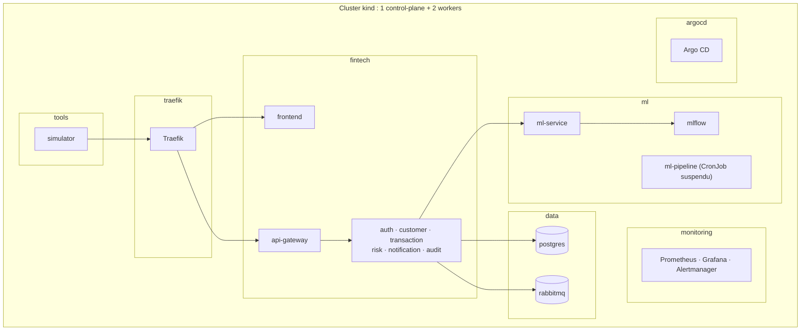
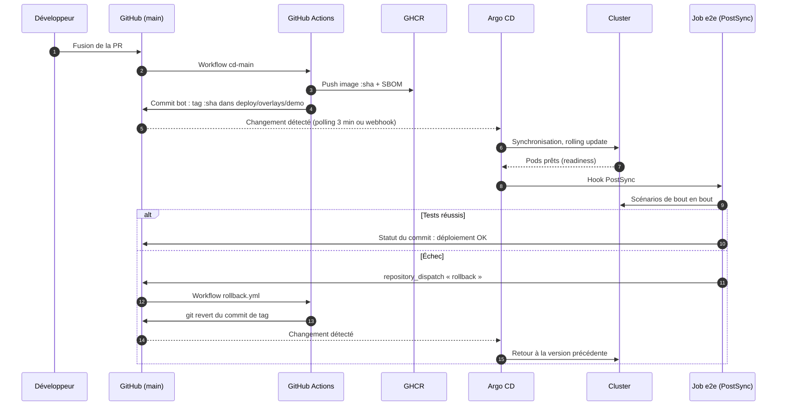
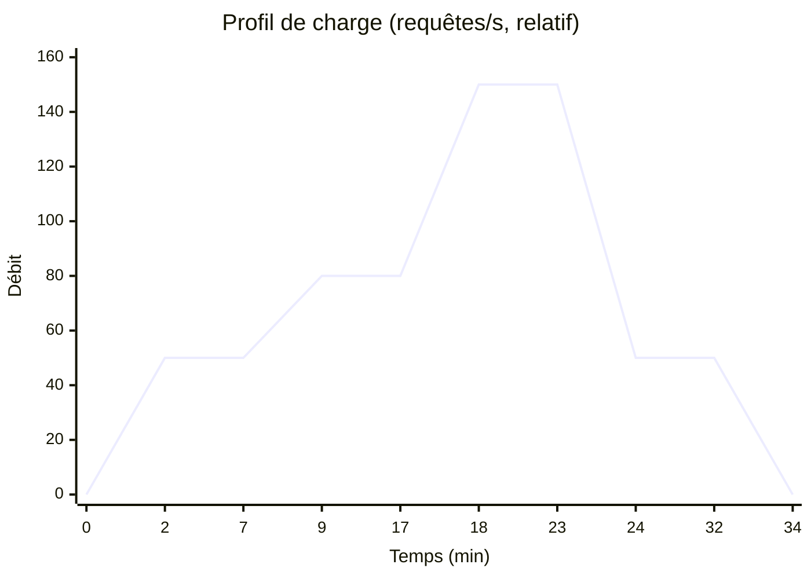
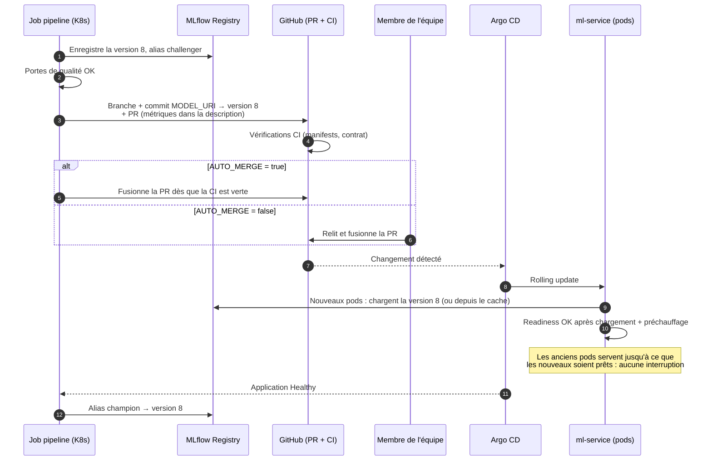
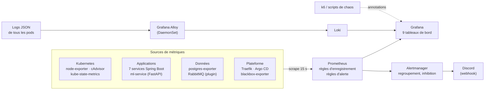

# P4 : Ingénieur DevOps (Docker, Kubernetes, CI/CD, haute disponibilité)

> Extrait du **document d'architecture v1.0** (plateforme FinTech MLOps haute disponibilité).
> Lire d'abord **`00_Commun.md`** (objectifs, vue d'ensemble, décisions D1 à D32, planning global).
> Les numéros de section renvoient au document d'architecture complet (PDF).

## Mission

- **Tâches du sujet :** T8, T9, T11
- **Périmètre :** Images Docker, cluster kind, manifests, Argo CD, Sealed Secrets, CI/CD et DevSecOps, tests de charge et de panne

## Points de vigilance

1. **À valider dès S2** : l'écriture du bot CI sur `main` protégée (7.6) et l'application des NetworkPolicies par kindnet (6.2, sinon Calico).
2. **Contrôles de sécurité en CI dès S4–S6** (SonarCloud, Trivy, gitleaks), pas en fin de projet.
3. **Budget mémoire mesuré en S8** : réduire les maximums HPA du ml-service si nécessaire.
4. `tolerationSeconds: 30` sur les Deployments sans état, sinon la panne de nœud prend 5 min à être traitée (9.6).
5. Middleware `retry` de Traefik (2 tentatives), sûr grâce à l'idempotence des transactions.
6. Rollback **uniquement par Git** : Argo CD `selfHeal` annule un `kubectl rollout undo`.
7. k6 : **charge ouverte** (`ramping-arrival-rate`), exécuté depuis **un second portable** (D28), 3 exécutions par expérience (D29).
8. **Filmer** le premier passage réussi de chaque expérience clé pour la démo.

## Planning personnel

| Tâche | Semaines | Début |
|---|---|---|
| Compose, kind, squelette CI | S1–S3 | 28/09/2026 |
| SonarCloud, Trivy, gitleaks | S4–S6 | 19/10/2026 |
| Dockerfiles + scans d'images | S4–S6 | 19/10/2026 |
| Manifests K8s de base | S6–S8 | 02/11/2026 |
| Argo CD + Sealed Secrets + CD | S7–S8 | 09/11/2026 |
| HPA, PDB, NetworkPolicies | S8–S9 | 16/11/2026 |
| Rollback auto + scripts k6/chaos | S9–S10 | 23/11/2026 |
| Capacité + scénario principal | S10–S11 | 30/11/2026 |
| Expériences C1 à C9 (x3) | S11–S12 | 07/12/2026 |

## Livrables reçus

| # | Livrable | De | Fin |
|---|---|---|---|
| 1 | Choix du jeu de données (fait : Sparkov, D1) | Équipe | S1 |
| 2 | Contrats OpenAPI, schémas de base, schéma d'architecture | P1 | S2 |
| 7 | Services de base + endpoints REST stables | P1 | S6 |
| 13 | Pipeline complet + ml-service final | P3 | S10 |
| 14 | Tests e2e intégrés au déploiement | P1 | S10 |
| 15 | Tableaux de bord et alertes | P5 | S11 |
| 17 | README consolidé + démo | P1, P5 | S14 |

## Livrables transmis

| # | Livrable | Vers | Fin |
|---|---|---|---|
| 5 | Docker Compose, cluster kind, squelette CI | Tous | S3 |
| 11 | Cluster avec manifests, Argo CD, cibles de supervision | P5 | S8 |
| 16 | Résultats des expériences + vidéos | Tous | S12 |

Règle de passage : un livrable n'est considéré comme transmis que s'il est **documenté, testé et démontré** à l'équipe.

## Jalons de l'équipe

| Jalon | Date | Critère de validation |
|---|---|---|
| J1 | 11/10/2026 | Architecture validée (ce document), dépôt et ruleset en place, contrats OpenAPI v1 |
| J2 | 18/10/2026 | MLflow prêt, données prétraitées, Docker Compose et CI opérationnels |
| J3 | 08/11/2026 | Services de base fonctionnels, benchmark terminé, ml-service mock livré, contrôles de sécurité actifs en CI |
| J4 | 22/11/2026 | Validation statistique terminée, plateforme déployée par Argo CD, **premier vrai modèle en production**, Prometheus installé |
| J5 | 06/12/2026 | Modèle final, pipeline avec portes de qualité, CI/CD complète, tests e2e et rollback automatique fonctionnels |
| J6 | 20/12/2026 | Toutes les expériences réalisées 3 fois, tableaux de bord et alertes validés, vidéos enregistrées |
| J7 | 21/12/2026 | **Gel du code** : plus de nouvelle fonctionnalité, uniquement des corrections |
| J8 | 03/01/2027 | README complet relu par tous, démo enregistrée en première version |
| J9 | 09/01/2027 | **Livraison** : dépôt GitHub, README, démo de 5 min maximum (un jour de marge avant le 10/01) |

---

# Architecture de votre périmètre

## 6. Architecture de déploiement : Docker et Kubernetes

**Responsable :** P4 (DevOps). **Support :** P1 et P3 (images, probes, métriques), P5 (supervision).


### 6.1 Images Docker

| Image | Base | Construction | Taille visée |
|---|---|---|---|
| Services Spring Boot (×7) | `eclipse-temurin:21-jre-alpine` | Multi-étapes : build Maven, puis **couches Spring Boot** extraites (dépendances, puis code) pour un cache Docker efficace | ~200 Mo |
| ml-service | `python:3.12-slim` | Multi-étapes : dépendances installées dans un venv, puis copie dans l'image finale | ~500 Mo |
| ml-pipeline | `python:3.12-slim` | Même base que ml-service, plus les dépendances d'entraînement | ~1 Go |
| frontend | `nginx:alpine` (serveur web statique) | Multi-étapes : build Vite, puis fichiers statiques servis par nginx | ~30 Mo |
| simulator | `python:3.12-slim` | Script de rejeu de Sparkov | ~150 Mo |

**Règles communes :**
- **Exécution non-root.** Utilisateur dédié et système de fichiers en lecture seule lorsque c'est possible.
- **Tag = commit SHA.** Pas de `latest` dans les manifests : chaque déploiement est traçable et reproductible.
- **Analyse Trivy** de chaque image en CI : une vulnérabilité critique bloque la publication (section 7).
- **Docker Compose** reste disponible pour le développement local de chaque membre, avec les mêmes images.

### 6.2 Cluster local

**kind avec 3 nœuds** (décision D23) : 1 control-plane et 2 workers.

- Deux workers permettent de **répartir les replicas** sur des nœuds différents et de **simuler la panne d'un nœud** complet (`docker stop` du nœud), en plus de la suppression de pods.
- Chaque nœud kind est un conteneur Docker, donc le surcoût est faible (quelques centaines de Mo).
- **Attention :** dans kind, chaque nœud annonce la **totalité** de la RAM de la machine hôte. Le scheduler ne peut donc pas empêcher une surconsommation : la vraie limite reste les 16 Go physiques. Les requests et limits (6.5) sont dimensionnées en conséquence.

| Composant du cluster | Choix | Rôle |
|---|---|---|
| CNI | kindnet (par défaut) | Réseau des pods. P4 vérifie en S2 que les NetworkPolicies sont bien appliquées (un pod non autorisé ne doit pas joindre risk-service). Sinon, passage à Calico |
| metrics-server | Option `--kubelet-insecure-tls` (nécessaire dans kind) | Fournit le CPU et la mémoire des pods à l'HPA |
| Contrôleur Ingress | **Traefik** (voir ci-dessous) | Entrée HTTP(S) du cluster |
| Certificats | mkcert : certificat local de confiance pour `*.fintech.local` | HTTPS sans avertissement dans le navigateur |
| Argo CD | Namespace `argocd` | Déploiement GitOps |
| Stockage | `local-path` (fourni par kind) | Volumes persistants |

**Pourquoi pas Ingress NGINX.** Le projet Ingress NGINX de Kubernetes a été **retiré en mars 2026** : il ne reçoit plus aucune mise à jour, y compris de sécurité. Les responsables de Kubernetes recommandent de migrer vers Gateway API ou vers un autre contrôleur Ingress. Pour une plateforme FinTech présentée en 2027, utiliser un composant abandonné serait une faiblesse. **Traefik** (décision D21) est maintenu, léger, et prend en charge la ressource `Ingress` standard demandée par le sujet.

### 6.3 Namespaces



**Séparation par responsabilité.** Chaque namespace peut porter ses propres NetworkPolicies et ses propres quotas, et être lu séparément dans Grafana.

### 6.4 Charges de travail

| Composant | Type Kubernetes | Replicas (min–max) | HPA | Stockage |
|---|---|---|---|---|
| frontend | Deployment | 2 | non | – |
| api-gateway | Deployment | 2–3 | oui | – |
| auth-service | Deployment | 1–2 | oui | – |
| customer-service | Deployment | 1–2 | oui | – |
| **transaction-service** | Deployment | **2–4** | oui | – |
| **risk-service** | Deployment | **2–4** | oui | – |
| notification-service | Deployment | 1–2 | oui | – |
| audit-service | Deployment | 1 | non | – |
| **ml-service** | Deployment | **2–5** | oui | cache `hostPath` |
| mlflow | Deployment | 1 | non | PVC 5 Gi |
| postgres | StatefulSet | 1 | non | PVC 5 Gi |
| rabbitmq | StatefulSet | 1 | non | PVC 1 Gi |
| ml-pipeline | CronJob (suspendu) | – | – | – |
| simulator | Deployment (débit configurable, réductible à 0) | 1 | non | – |

**Principes :**
- **Chemin critique toujours en double.** Gateway, transaction, risk et ml-service ont au moins 2 replicas : la suppression d'un pod n'interrompt jamais le traitement des transactions.
- **Services non critiques à 1 replica.**
  - Une panne d'auth n'empêche pas le traitement des transactions : les JWT restent validés grâce à la clé publique en cache.
  - Une panne d'audit ou de notification n'est pas bloquante non plus : RabbitMQ garde les messages en attente.
- **Maximums HPA volontairement bas**, calculés pour rester dans les 16 Go (6.5).

**Limite documentée : PostgreSQL et RabbitMQ ne sont pas redondants.** Un cluster PostgreSQL (CloudNativePG, Patroni) ou RabbitMQ serait trop lourd pour la machine. Les risques sont atténués ainsi :
- **Données persistantes** sur PVC : un pod supprimé redémarre avec ses données en quelques secondes.
- **L'outbox (section 3.5) protège contre une panne de RabbitMQ.** Les événements s'accumulent dans PostgreSQL et sont publiés au retour du broker. Les expériences du chapitre 9 mesurent ce temps de récupération.
- **Placement fixe.** Les composants avec état sont placés sur `worker-1` (nodeAffinity), car un volume `local-path` est lié à son nœud. La simulation de panne de nœud cible `worker-2`.

### 6.5 Ressources (requests et limits)

| Composant | CPU request | CPU limit | Mémoire request | Mémoire limit |
|---|---|---|---|---|
| Service Spring Boot (chacun) | 200m | 1000m | 384 Mi | 512 Mi |
| ml-service | 250m | 1000m | 384 Mi | 768 Mi |
| frontend | 50m | 200m | 64 Mi | 128 Mi |
| postgres | 250m | 1000m | 512 Mi | 1 Gi |
| rabbitmq | 200m | 500m | 384 Mi | 512 Mi |
| mlflow | 100m | 500m | 384 Mi | 768 Mi |
| simulator | 50m | 200m | 64 Mi | 128 Mi |

**JVM.** On utilise `-XX:MaxRAMPercentage=70` plutôt qu'un `-Xmx` fixe. La taille du tas suit ainsi automatiquement la limite mémoire du conteneur (~360 Mo sur 512 Mi), en laissant de la place au métaspace et aux threads.

**Budget mémoire (requests) :**

| Situation | Pods applicatifs | Mémoire demandée (applicatif + données + ML) | Avec plateforme (K8s, Traefik, Argo CD, monitoring, Loki) |
|---|---|---|---|
| Au repos (minimums) | 15 | ~6 Gi | ~9,5 Gi |
| Au maximum de l'HPA | 26 | ~10 Gi | ~13,5 Gi |

Au maximum de l'HPA, il ne reste qu'environ 2,5 Go pour le système d'exploitation. C'est serré mais faisable : k6 s'exécute sur une autre machine (décision D28), et l'IDE et le navigateur sont fermés pendant les tests de charge. Si la mémoire manque, les maximums de l'HPA seront réduits en priorité sur le ml-service (2–4 au lieu de 2–5). Les requests étant des réservations, la consommation réelle est souvent plus basse ; elle sera mesurée en S8.

### 6.6 Autoscaling (HPA)

| Paramètre | Valeur | Justification |
|---|---|---|
| API | `autoscaling/v2` | Version stable avec contrôle du comportement de mise à l'échelle |
| Métrique | Utilisation CPU, **cible 70 %** | L'HPA agit **avant** l'alerte CPU > 80 % du sujet |
| Montée | Aucune stabilisation, jusqu'à +100 % de pods toutes les 30 s | Réagir vite à un pic |
| Descente | Stabilisation de 300 s, −1 pod par minute | Éviter les oscillations (flapping) |

**Pourquoi pas la mémoire.** Le tas d'une JVM grandit mais ne rend presque jamais la mémoire : un HPA sur la mémoire monterait sans jamais redescendre.

**Démarrage des pods Java.** Les pics CPU au démarrage des pods Java ne déclenchent pas de mise à l'échelle parasite : l'HPA ignore le CPU des pods qui ne sont pas encore prêts.

**Bonus possible.** Un HPA sur le débit de requêtes via Prometheus Adapter. Il n'est pas prévu dans la version de base.

### 6.7 Sondes de santé (probes)

| Composant | startupProbe | livenessProbe | readinessProbe |
|---|---|---|---|
| Spring Boot | `/actuator/health/liveness`, toutes les 5 s, jusqu'à 30 échecs (2 min 30 max) | `/actuator/health/liveness`, toutes les 10 s, 3 échecs | `/actuator/health/readiness`, toutes les 5 s, 3 échecs |
| ml-service | `/health/live`, jusqu'à 2 min (chargement du modèle) | `/health/live` | `/health/ready` (modèle chargé et préchauffé) |
| postgres | – | `pg_isready` | `pg_isready` |
| rabbitmq | – | `rabbitmq-diagnostics ping` | `rabbitmq-diagnostics check_port_connectivity` |

**Règles de conception :**
- **La liveness ne vérifie jamais une dépendance externe.** Si elle vérifiait PostgreSQL, une panne de la base ferait redémarrer en boucle tous les services : une panne en cascade.
- **La readiness vérifie uniquement les dépendances indispensables.**
  - La base de données, oui, pour les services qui en ont besoin.
  - Le ml-service, non, pour risk-service : il dispose d'un repli (REVUE HUMAINE).
  - RabbitMQ, non : l'outbox met les événements en attente.
- **La startupProbe** protège les démarrages lents (JVM, chargement du modèle) sans rendre la liveness trop tolérante ensuite.

### 6.8 Mises à jour progressives et rollback

**Rolling update sans interruption :**

| Paramètre | Valeur | Effet |
|---|---|---|
| `maxSurge` / `maxUnavailable` | 1 / 0 | Un nouveau pod doit être prêt avant qu'un ancien ne soit arrêté |
| `minReadySeconds` | 10 | Le pod doit rester prêt 10 s avant d'être compté comme disponible |
| `progressDeadlineSeconds` | 120 | Au-delà, le déploiement est déclaré en échec : Argo CD passe en `Degraded` et une alerte se déclenche |
| `revisionHistoryLimit` | 5 | Anciennes versions conservées |

**Arrêt propre (graceful shutdown) :**
- Spring Boot est configuré avec `server.shutdown=graceful`, et Uvicorn termine les requêtes en cours.
- Un `preStop` de 5 s laisse à Kubernetes le temps de retirer le pod des Services **avant** l'arrêt du processus. Sans ce délai, quelques requêtes échouent à chaque déploiement.
- `terminationGracePeriodSeconds` est fixé à 30.

**Disponibilité pendant les opérations :**
- **PodDisruptionBudget** `minAvailable: 1` pour chaque composant répliqué. Une opération de maintenance (drain d'un nœud) ne peut pas arrêter tous les replicas à la fois.
- **topologySpreadConstraints** répartissent les replicas sur les 2 workers, de sorte que la panne d'un nœud n'emporte pas tous les replicas d'un service.

**Rollback.**
- Argo CD est configuré en synchronisation automatique avec `selfHeal`. Un `kubectl rollout undo` manuel serait donc **annulé** par Argo CD, qui rétablit l'état décrit dans Git.
- **Le rollback se fait donc par Git** : `git revert`, puis Argo CD redéploie la version précédente par rolling update.
- Pour la démo, on peut aussi utiliser la fonction « History and Rollback » de l'interface Argo CD.

### 6.9 ConfigMaps et Secrets

| ConfigMap | Contenu |
|---|---|
| `<service>-config` (un par service) | URL des services appelés, délais max, réglages des circuit breakers, profil Spring |
| `risk-config` | Paramètres de la politique de décision |
| `ml-service-config` | `MODEL_URI` (version épinglée, D20), `MODEL_MODE` (`real` ou `mock`) |
| `ml-pipeline-config` | Mode du pipeline, `AUTO_MERGE`, seuils des portes de qualité |
| `simulator-config` | Débit (transactions/s), délai des rejets de paiement simulés |

| Secret | Contenu | Utilisé par |
|---|---|---|
| `<service>-db` (un par service) | Utilisateur et mot de passe PostgreSQL du schéma | chaque service |
| `rabbitmq-credentials` | Identifiants RabbitMQ | services producteurs et consommateurs |
| `jwt-private-key` | Clé privée RS256 | auth-service **uniquement** |
| `card-hmac-key` | Clé HMAC du numéro de carte | customer-service **uniquement** |
| `github-token` | Jeton limité aux PR du dépôt | ml-pipeline |
| `fintech-tls` | Certificat mkcert | Traefik |

**Les secrets dans un dépôt Git (GitOps).** Un Secret Kubernetes n'est qu'encodé en base64, pas chiffré : il ne peut pas être committé tel quel. Décision D22 : **Sealed Secrets**.
- Les secrets sont chiffrés avec la clé publique du cluster, et seuls les fichiers chiffrés sont committés.
- Un contrôleur léger les déchiffre dans le cluster.
- Argo CD peut ainsi déployer **tout** depuis Git.

### 6.10 Stockage

| Volume | Type | Taille | Remarque |
|---|---|---|---|
| Données PostgreSQL | PVC `local-path` | 5 Gi | Lié à `worker-1` |
| Données RabbitMQ | PVC `local-path` | 1 Gi | Lié à `worker-1` |
| Artefacts MLflow | PVC `local-path` | 5 Gi | Lié à `worker-1` |
| Cache des modèles | `hostPath` sur chaque worker | – | Un volume `local-path` ne se partage pas entre deux nœuds. Chaque nœud garde donc son propre cache, et un pod ml-service redémarré sur le même nœud recharge sans MLflow |

### 6.11 Ingress et équilibrage de charge

| Hôte | Chemin | Destination |
|---|---|---|
| `fintech.local` | `/` | frontend |
| `fintech.local` | `/api` | api-gateway |
| `mlflow.fintech.local` | `/` | mlflow |
| `grafana.fintech.local` | `/` | grafana |
| `argocd.fintech.local` | `/` | argocd-server |

- **TLS** terminé par Traefik avec le certificat mkcert.
- **Accès depuis la machine hôte.** Les noms d'hôte sont ajoutés au fichier `hosts` de la machine. Les ports 80 et 443 sont exposés par la configuration kind (`extraPortMappings`).
- **SSE (notifications).** Délai d'inactivité long sur la route `/api/v1/notifications/stream`, sans mise en tampon.

**Deux niveaux d'équilibrage de charge :**
1. **Traefik** répartit les requêtes entrantes entre les pods du frontend et de la Gateway.
2. **Les Services Kubernetes** (ClusterIP) répartissent les appels internes entre les pods de chaque service.

**Point technique important pour les tests de charge.** Un Service Kubernetes répartit les **connexions**, pas les requêtes. La Gateway et risk-service réutilisent leurs connexions HTTP (keep-alive). Après une montée en charge, les **nouveaux pods risquent donc de ne presque rien recevoir**, puisque les connexions existantes restent ouvertes vers les anciens pods.

**Correction.** Une **durée de vie maximale de 30 s** est fixée pour les connexions des pools HTTP (Gateway, transaction → risk, risk → ml-service). Les connexions sont renouvelées régulièrement et les nouveaux pods reçoivent du trafic en quelques secondes. Cet effet sera mis en évidence dans Grafana lors des expériences (section 9).

### 6.12 NetworkPolicies

**Par défaut, tout trafic entrant est refusé** dans les namespaces `fintech`, `ml` et `data`. Seuls les flux suivants sont autorisés :

| Source | Destination | Port |
|---|---|---|
| traefik | frontend, api-gateway, mlflow, grafana, argocd-server | HTTP |
| api-gateway | auth, customer, transaction, risk, notification, audit, ml-service (`/api/v1/ml/**`) | HTTP |
| transaction-service | risk-service | HTTP |
| risk-service | customer-service, ml-service | HTTP |
| Services Spring Boot, mlflow | postgres | 5432 |
| Services Spring Boot | rabbitmq | 5672 |
| ml-service, ml-pipeline | mlflow | HTTP |
| monitoring (Prometheus) | tous les pods | port des métriques |

**Conséquence.** Même si un attaquant obtenait un pod dans le cluster, il ne pourrait pas appeler directement `/predict` ou `/internal/risk/assess` depuis un pod non autorisé.

### 6.13 Organisation des manifests

- **Nos services : Kustomize**, natif dans `kubectl` et Argo CD. Une base commune par service et une surcouche (`overlay`) `demo`.
- **Composants tiers : charts Helm officiels** de Traefik, kube-prometheus-stack, Argo CD et Sealed Secrets, pilotés comme applications Argo CD.
- **PostgreSQL et RabbitMQ :** simples StatefulSets écrits par l'équipe, avec les **images officielles**. C'est plus lisible et sans dépendance à des charts tiers.
- **Argo CD « app of apps » :** une application racine déclare toutes les autres. L'installation complète se fait en une commande.

```
deploy/
├── bootstrap/            # config kind, installation d'Argo CD, script make cluster
├── argocd/               # application racine + une Application par composant
├── base/
│   ├── api-gateway/      # deployment, service, hpa, pdb, configmap, networkpolicy
│   ├── risk-service/
│   └── ...
├── overlays/demo/        # tags d'images, replicas, paramètres de la démo
├── platform/             # valeurs Helm : traefik, monitoring, sealed-secrets
└── secrets/              # SealedSecrets chiffrés uniquement
```

**Mise en route.** Une nouvelle machine peut recréer tout l'environnement en deux commandes : `make cluster` crée kind et installe Argo CD, puis Argo CD installe tout le reste.

### 6.14 Livrables et calendrier

| Livrable | Semaine |
|---|---|
| Docker Compose de développement + cluster kind + squelette CI | S1–S3 |
| Dockerfiles des 10 images, analyse Trivy | S4–S6 |
| Manifests de base (Deployments, Services, Ingress, probes, ressources, ConfigMaps, Secrets) | S6–S8 |
| Argo CD + app of apps + Sealed Secrets | S7–S8 |
| HPA, PDB, répartition sur les nœuds, NetworkPolicies | S8–S9 |
| Démonstration du rolling update et du rollback | S9–S10 |

## 7. CI/CD et DevSecOps

**Responsable :** P4 (DevOps). **Support :** P1 (tests d'intégration et de bout en bout), P3 (CI du code ML), tous (qualité du code).

Le sujet impose la chaîne **Git → Build → Tests → SonarQube → Security Scan → Docker → Kubernetes → Integration Tests**, avec déploiement et rollback automatiques. Elle est répartie entre **GitHub Actions** (intégration continue) et **Argo CD** (déploiement continu, décision D8).


### 7.1 Organisation du dépôt (monorepo)

```
fintech-mlops/
├── services/              # 7 services Spring Boot (P1)
│   ├── api-gateway/
│   ├── auth-service/
│   └── ...
├── ml/                    # code ML : prétraitement, benchmark, stats, pipeline (P2, P3)
├── ml-service/            # FastAPI (P3)
├── frontend/              # React (P5)
├── simulator/             # rejeu Sparkov + rejets de paiement simulés
├── deploy/                # Kustomize, Argo CD, Helm values, SealedSecrets (P4)
├── monitoring/            # dashboards Grafana (JSON), règles d'alerte (P5)
├── load-tests/            # scénarios k6 et chaos (P4)
├── e2e-tests/             # tests de bout en bout post-déploiement (P1)
├── contracts/             # OpenAPI de tous les services + ml-service
├── docs/                  # architecture, figures, captures
├── .github/workflows/     # pipelines CI/CD
├── CODEOWNERS
└── README.md
```

**CODEOWNERS.** Chaque dossier a un responsable : une PR qui touche `ml-service/` demande automatiquement la revue de P3, par exemple.

### 7.2 Workflow Git

| Règle | Mise en œuvre |
|---|---|
| Branches | **Trunk-based** : `main` + branches courtes `feat/...`, `fix/...` (quelques jours au plus) |
| Protection de `main` | Ruleset GitHub : PR obligatoire, **1 approbation**, vérifications CI obligatoires, historique linéaire |
| Commits | Convention *Conventional Commits* (`feat:`, `fix:`, `ci:`...) pour un historique lisible |
| Taille des PR | Petites et ciblées : une PR = un changement cohérent |
| Exception | Seul le bot de la CI peut écrire directement sur `main`, et uniquement dans le **fichier des tags d'images** (7.6). Le pipeline ML, lui, passe par une PR soumise aux mêmes vérifications (section 5.5) |

### 7.3 Vue d'ensemble de la chaîne

```mermaid
flowchart LR
  subgraph PR["Sur chaque PR (GitHub Actions)"]
    A["Lint + Build"] --> B["Tests unitaires<br/>+ intégration<br/>(Testcontainers)"]
    B --> C["SonarCloud<br/>quality gate"]
    C --> D["Scan sécurité<br/>dépendances, secrets,<br/>Dockerfiles, manifests"]
    D --> E["Build Docker<br/>+ scan Trivy image"]
    E --> F["Validation manifests<br/>+ contrats OpenAPI"]
  end
  subgraph MAIN["Après fusion sur main"]
    G["Rebuild + push GHCR<br/>tag = SHA + SBOM"] --> H["Mise à jour du tag<br/>dans deploy/"]
  end
  subgraph CD["Dans le cluster"]
    I["Argo CD<br/>synchronisation"] --> J["Rolling update"]
    J --> K["Tests de bout en bout<br/>(hook PostSync)"]
    K -->|"échec"| L["Rollback automatique"]
  end
  F -->|"fusion"| G
  H --> I
```



**Correspondance avec le sujet :**

| Étape du sujet | Où | Outil |
|---|---|---|
| Git | GitHub, ruleset sur `main` | GitHub |
| Build | PR et `main` | Maven, pip, npm (Vite) |
| Tests | PR | JUnit + Testcontainers, pytest, Vitest |
| SonarQube | PR | **SonarCloud** (décision D10) |
| Security Scan | PR et `main` | Trivy (dépendances, images, configuration), gitleaks, Dependabot |
| Docker | `main` | Docker Buildx, GHCR |
| Kubernetes | Cluster | Argo CD, Kustomize |
| Integration Tests | CI (Testcontainers) **et** cluster (bout en bout, PostSync) | JUnit, pytest |
| Rollback automatique | Cluster puis GitHub | Hook PostSync + workflow `rollback.yml` |

### 7.4 Pipeline d'une PR

**Exécution sélective.** Des filtres de chemins déclenchent uniquement les jobs concernés : une PR qui ne modifie que `frontend/` ne reconstruit pas les 7 services Java. Les 7 services partagent un **workflow réutilisable** lancé en matrice.

| Job | Composants | Contenu | Bloquant |
|---|---|---|---|
| `java-ci` | Services Spring Boot | Compilation, tests unitaires, tests d'intégration Testcontainers (PostgreSQL, RabbitMQ), couverture JaCoCo | oui |
| `python-ci` | ml, ml-service, simulator | Ruff (lint), pytest, couverture | oui |
| `ml-smoke` | ml | Pipeline complet sur 1 % des données avec un MLflow local au runner (section 5.6) | oui |
| `frontend-ci` | frontend | ESLint, Vitest, build Vite | oui |
| `sonar` | tous les composants modifiés | Analyse SonarCloud + attente du **quality gate** | oui |
| `security` | tout le dépôt | gitleaks (secrets), Trivy `fs` (vulnérabilités des dépendances), Trivy `config` (Dockerfiles, manifests) | oui (critique / élevé) |
| `docker` | images modifiées | Build (sans publication) + scan Trivy de l'image | oui (critique corrigeable) |
| `manifests` | deploy/ | `kustomize build` + **kubeconform** (validation des schémas Kubernetes) | oui |
| `contracts` | contracts/ | Comparaison du contrat OpenAPI généré par le code avec le contrat versionné | oui |

**Cibles de temps :**
- une PR ordinaire (un seul composant) doit s'exécuter en **moins de 10 min** ;
- une PR qui touche tout le dépôt, en **moins de 20 min**.

Les caches Maven, pip, npm et des couches Docker (cache GitHub Actions) sont activés.

### 7.5 Contrôles DevSecOps

| Contrôle | Outil | Seuil | Moment |
|---|---|---|---|
| **Analyse statique du code (SAST)** | SonarCloud | Quality gate : 0 nouveau bug, 0 nouvelle vulnérabilité, hotspots de sécurité revus, couverture du nouveau code ≥ 60 %, duplication < 3 % | Chaque PR |
| **Vulnérabilités des dépendances (SCA)** | Trivy `fs` + Dependabot | Échec si CVE critique ou élevée **corrigeable** | Chaque PR + mises à jour Dependabot hebdomadaires |
| **Secrets dans le code** | gitleaks + protection push GitHub | Échec au moindre secret détecté | Chaque PR + chaque push |
| **Vulnérabilités des images** | Trivy `image` | Échec si CVE critique corrigeable | Chaque build d'image |
| **Mauvaises configurations** | Trivy `config` | Échec si élevée : conteneur root, absence de limits, privilèges, etc. | Chaque PR touchant `deploy/` ou un Dockerfile |
| **Inventaire logiciel (SBOM)** | Trivy (format CycloneDX) | – | Chaque image publiée, jointe au run |
| **Moindre privilège de la CI** | Permissions GitHub Actions | `GITHUB_TOKEN` en lecture seule par défaut, écriture accordée job par job | Toujours |
| **Rescan nocturne** | Trivy sur les images en production | Nouvelle CVE publiée → issue GitHub créée automatiquement | Chaque nuit |

**Seulement les vulnérabilités « corrigeables ».** Bloquer sur une vulnérabilité sans correctif disponible arrêterait l'équipe sans action possible. Ces cas sont listés dans un fichier `.trivyignore` commenté et daté, relu chaque semaine.

**Bonus possibles (décision D25 : ajoutés seulement s'il reste du temps après S12) :**
- signature des images avec cosign ;
- scan dynamique (DAST) avec OWASP ZAP en mode baseline sur l'application déployée.

### 7.6 Déploiement continu



**Mise à jour des tags d'images.**
- Le workflow `cd-main` modifie **uniquement** `deploy/overlays/demo/kustomization.yaml`. Une vérification refuse le commit si un autre fichier est touché.
- Ce commit utilise une identité de CI autorisée à contourner la protection de `main`, uniquement pour ce fichier. **P4 valide ce mécanisme dès S2.**
- Le commit porte `[skip ci]` pour ne pas relancer la CI en boucle.

**Accès d'Argo CD à Git.** Argo CD interroge GitHub toutes les 3 minutes. C'est le cluster qui sort vers GitHub : aucune ouverture du cluster vers Internet n'est nécessaire. Pour la démo, un « Refresh » manuel dans l'interface accélère la synchronisation.

### 7.7 Tests de bout en bout et rollback automatique

**Tests exécutés après chaque déploiement** par un Job Kubernetes (hook PostSync d'Argo CD, image `e2e-tests:sha`) :

| # | Scénario | Vérification |
|---|---|---|
| 1 | Santé | Tous les Deployments sont disponibles, et `/actuator/health` et `/health/ready` sont OK |
| 2 | Authentification | Connexion ANALYSTE → JWT valide. Un accès sans jeton est refusé (`401`) |
| 3 | Transaction complète | `POST /api/v1/transactions` → réponse avec une décision parmi `APPROUVEE`, `EN_REVUE`, `BLOQUEE` et la version du modèle |
| 4 | Version du modèle | `/api/v1/ml/model` renvoie **la version attendue** (celle de la ConfigMap) |
| 5 | Chaîne asynchrone | L'événement de la transaction du scénario 3 apparaît dans l'audit en moins de 15 s (outbox → RabbitMQ → audit) |
| 6 | Revue humaine | Une transaction mise en revue peut être traitée par l'analyste, et son statut final est mis à jour |
| 7 | Sécurité réseau | `/predict` n'est **pas** accessible via l'Ingress (`404`) |

**Mode mock pour les tests.** Le scénario 6 a besoin d'une transaction qui part à coup sûr en revue. Le ml-service mock rend cela déterministe dans la CI. Dans le cluster, le Job choisit une transaction de référence connue pour être incertaine, identifiée lors de l'évaluation du modèle.

**Rollback automatique.**
1. En cas d'échec, le Job e2e envoie un événement `repository_dispatch` à GitHub, avec le jeton limité déjà utilisé par le pipeline ML.
2. Le workflow `rollback.yml` fait un `git revert` du dernier commit de tag.
3. Argo CD redéploie automatiquement la version précédente.
4. Une issue GitHub est créée avec les logs du test en échec.

Tout se fait **par Git**, ce qui est cohérent avec la décision D20 et avec le fonctionnement de `selfHeal` (section 6.8).

**Rollback manuel.** Un `git revert` de n'importe quel commit de déploiement, ou « History and Rollback » dans l'interface Argo CD.

### 7.8 Workflows GitHub Actions

| Fichier | Déclencheur | Rôle |
|---|---|---|
| `ci-java.yml` | PR (réutilisable, matrice de services) | Build, tests, couverture |
| `ci-python.yml` | PR | ml, ml-service, simulator |
| `ci-frontend.yml` | PR | React |
| `ml-smoke.yml` | PR touchant `ml/` | Pipeline de fumée |
| `quality-security.yml` | PR | SonarCloud, Trivy, gitleaks |
| `manifests.yml` | PR touchant `deploy/` | Kustomize + kubeconform |
| `cd-main.yml` | Push sur `main` | Build, push, SBOM, mise à jour des tags |
| `ml-pipeline-image.yml` | Push sur `main` touchant `ml/` | Image du Job de pipeline ML |
| `rollback.yml` | `repository_dispatch` | Revert automatique |
| `nightly.yml` | Planifié (chaque nuit) | Rescan Trivy des images en production |

### 7.9 Limite documentée : un seul environnement

Il n'y a pas d'environnement de préproduction séparé : un second cluster ne tiendrait pas dans 16 Go. Trois mécanismes compensent :
- les **tests d'intégration** Testcontainers en CI, avant toute fusion ;
- le **rolling update** protégé par les readiness probes, qui bloque une version incapable de démarrer ;
- les **tests de bout en bout après déploiement**, avec rollback automatique.

### 7.10 Livrables et calendrier

| Livrable | Responsable | Semaine |
|---|---|---|
| Dépôt, ruleset, CODEOWNERS, squelette CI (build + tests) | P4 (avec P1) | S1–S3 |
| SonarCloud + Trivy + gitleaks **dès les premiers services** (correctif 3 de la revue) | P4 | S4–S6 |
| Build et publication des images, validation des manifests | P4 | S6–S7 |
| CD avec Argo CD, mise à jour automatique des tags | P4 | S7–S8 |
| Tests de bout en bout (Job PostSync) | P1 (tests), P4 (intégration) | S9–S10 |
| Rollback automatique + démonstration | P4 | S10 |

## 9. Stratégie de tests de charge et de haute disponibilité

**Responsable :** P4 (DevOps). **Support :** P5 (observation dans Grafana, captures), P1 (comportement des services).

**Principe.** Les expériences sont conduites **comme des expériences scientifiques**, dans le même esprit que la partie ML :
- des **hypothèses** sont formulées à l'avance, avec des critères de réussite chiffrés (section 1.4) ;
- chaque expérience suit un **protocole** écrit et reproductible ;
- chaque expérience est **répétée 3 fois**, et on rapporte la médiane et l'étendue ;
- les résultats, favorables ou non, sont tous publiés dans le README.


### 9.1 Hypothèses à vérifier

| # | Hypothèse | Critère de réussite |
|---|---|---|
| H1 | En charge normale, la plateforme respecte ses objectifs sans autoscaling | p95 < 500 ms, erreurs < 1 %, replicas au minimum |
| H2 | En charge élevée, l'HPA ajoute des replicas et la latence reste acceptable | Mise à l'échelle < 2 min, p95 < 2 s, erreurs < 1 % |
| H3 | En surcharge, la plateforme se dégrade **de façon contrôlée** : elle refuse vite au lieu de s'effondrer | Aucun pod tué par manque de mémoire (OOMKilled), aucune transaction approuvée sans décision, alertes déclenchées |
| H4 | Après la surcharge, la plateforme revient à la normale **sans intervention humaine** | Retour à p95 < 500 ms et erreurs < 1 % en moins de 3 min |
| H5 | La perte d'un pod sur le chemin critique est invisible pour l'utilisateur | Erreurs < 0,5 % pendant l'incident, pod remplacé en moins de 60 s |
| H6 | La perte d'un nœud complet n'interrompt pas le service | Service disponible pendant toute la panne, pods replacés en moins de 2 min |
| H7 | Une panne de RabbitMQ ne bloque pas les paiements et ne perd aucun événement | Transactions traitées normalement, **0 événement perdu** après le retour du broker |
| H8 | Une panne totale du ml-service ne conduit jamais à une approbation automatique | 100 % des transactions en REVUE pendant la panne, circuit breaker ouvert, retour automatique ensuite |
| H9 | Une panne de PostgreSQL provoque une interruption courte, sans perte de données | Temps de récupération mesuré, 0 transaction perdue |
| H10 | Un déploiement défectueux n'affecte pas le service | 0 erreur utilisateur, rolling update bloqué, rollback automatique (section 7.7) |

### 9.2 Outils

| Outil | Rôle |
|---|---|
| **k6** | Génération de charge. Scripts en JavaScript, seuils de réussite intégrés, envoi de ses métriques directement dans Prometheus (remote write). Les courbes côté client et côté serveur apparaissent donc dans les mêmes tableaux de bord Grafana |
| **Scripts de chaos** (bash + kubectl + docker) | Injection de pannes : suppression de pods, mise à 0 d'un Deployment, arrêt d'un nœud kind |
| **`make experiment`** | Orchestration d'une expérience complète : annotation de début dans Grafana, charge k6, injection de panne à un instant précis, annotation de fin, export des résultats |
| Grafana | Observation, captures, enregistrement vidéo pour la démo |

**Machine de génération de charge (décision D28).** k6 s'exécute sur le **portable d'un autre membre**, connecté au même réseau local que la machine du cluster. Si k6 tournait sur la même machine, il se partagerait le processeur avec la plateforme et fausserait les mesures en surcharge.

Mise en place :
- **Accès à l'Ingress.** Le fichier `hosts` du portable de charge fait pointer `fintech.local` vers l'adresse IP locale de la machine du cluster. Les ports 80 et 443 de kind écoutent sur toutes les interfaces, et le pare-feu de la machine du cluster autorise ces ports depuis le réseau local.
- **Métriques de k6.** Le récepteur *remote write* de Prometheus est exposé via Traefik (`prometheus.fintech.local`), protégé par mot de passe et **activé uniquement pendant les expériences**.
- **Qualité du réseau.** Un **câble Ethernet** est préférable au Wi-Fi. La latence réseau de base (ping) est mesurée au début de chaque session et rapportée dans les résultats, pour distinguer la latence du réseau de celle de la plateforme.

**Pourquoi des scripts plutôt que Chaos Mesh.** Les pannes à simuler sont simples (supprimer, arrêter). Des scripts suffisent, sont lisibles, et ne consomment pas de RAM dans le cluster.

### 9.3 Modèle de charge

**Charge « ouverte ».** k6 utilise l'exécuteur `ramping-arrival-rate` : il envoie **un nombre fixe de requêtes par seconde**, quelle que soit la vitesse des réponses.

L'autre approche serait un nombre fixe d'utilisateurs virtuels : chacun attend sa réponse avant d'envoyer la suivante. Quand le système ralentit, les utilisateurs envoient donc moins de requêtes, et la surcharge **se cache d'elle-même** (biais appelé *coordinated omission*). La charge ouverte reproduit la réalité : les paiements continuent d'arriver même si le système ralentit.

**Données envoyées :**
- Chaque requête est une vraie transaction du jeu de test Sparkov, chargée une seule fois en mémoire par k6.
- Chaque requête reçoit un **`trans_num` unique**. Sinon, l'idempotence de transaction-service (section 3.4) renverrait la réponse déjà enregistrée sans rien recalculer, et le test mesurerait un cache au lieu de la plateforme.
- Le jeton JWT (rôle SIMULATEUR) est obtenu une seule fois au démarrage du test.

**Trajet des requêtes.** Toutes les requêtes passent par le trajet réel : Traefik → Gateway → transaction → risk → customer / ml-service → PostgreSQL → RabbitMQ.

### 9.4 Calibration : test de capacité

Les niveaux de charge ne sont pas choisis au hasard. On mesure d'abord la **capacité réelle** de la plateforme sur la machine de démo :

1. **Capacité minimale (C_min).** HPA désactivé, replicas au minimum, débit augmenté par paliers de 10 req/s toutes les 2 minutes. C_min est le débit maximal pour lequel p95 < 500 ms et erreurs < 1 %.
2. **Capacité maximale (C_max).** Même mesure avec les replicas au **maximum** de l'HPA.

Les niveaux du scénario principal sont ensuite définis **par rapport à ces capacités** :

| Niveau | Débit visé | Effet attendu |
|---|---|---|
| Normal | ~50 % de C_min | Aucune mise à l'échelle |
| Élevé | ~80 % de C_max | L'HPA ajoute des replicas |
| Surcharge | ~150 % de C_max | Au-delà de ce que la plateforme peut absorber |

Ainsi, le protocole reste valable quelle que soit la puissance de la machine, et les résultats sont interprétables.

### 9.5 Scénario principal : Normal → High → Overload → Recovery



| Phase | Durée | Débit | Ce qu'on observe |
|---|---|---|---|
| Montée | 2 min | 0 → normal | Préchauffage (JVM, caches, connexions) |
| **Normal** | 5 min | normal | Référence : latence, erreurs, CPU (H1) |
| Rampe | 2 min | normal → élevé | Dépassement de la cible CPU de 70 % |
| **High** | 8 min | élevé | Réaction de l'HPA, arrivée des nouveaux pods, répartition du trafic (H2) |
| Rampe | 1 min | élevé → surcharge | – |
| **Overload** | 5 min | surcharge | HPA au maximum, alertes CPU / latence / erreurs, dégradation contrôlée (H3) |
| **Recovery** | 8 min | retour au niveau normal | Retour aux objectifs, puis réduction progressive des replicas (H4) |
| Descente | 2 min | → 0 | – |

**Comportement attendu en surcharge (dégradation contrôlée) :**
- **Files d'attente bornées.** Le nombre de threads et la file d'attente de chaque service Spring Boot sont limités. Au-delà, le service répond immédiatement `503` au lieu d'accumuler des requêtes jusqu'à manquer de mémoire.
- **Délais maximums** (section 3.6) : aucune requête n'attend indéfiniment.
- **Circuit breakers** : si le ml-service sature, risk-service arrête de l'appeler temporairement, et les transactions partent en REVUE. Elles ne sont jamais approuvées sans modèle.
- **Résultat attendu :** le taux d'erreur **dépasse** 5 % pendant la surcharge. L'alerte doit se déclencher, c'est le but. Mais aucun pod ne plante, et tout revient à la normale seul (H4).

### 9.6 Expériences de panne (chaos)

Chaque expérience se déroule sous **charge normale constante**, pour mesurer l'impact sur un trafic réel.

| # | Panne injectée | Commande | Hypothèse | Mesures clés |
|---|---|---|---|---|
| C1 | Suppression d'un pod risk-service | `kubectl delete pod` | H5 | Erreurs pendant l'incident, délai jusqu'au nouveau pod prêt |
| C2 | Suppression d'un pod ml-service | `kubectl delete pod` | H5 | Idem, et chargement du modèle depuis le cache |
| C3 | Suppression d'un pod api-gateway | `kubectl delete pod` | H5 | Erreurs vues par k6 (Traefik relance la requête sur l'autre pod) |
| C4 | **Panne totale du ml-service** | `kubectl scale --replicas=0` puis retour | H8 | Part des transactions en REVUE, état du circuit breaker, **0 approbation**, délai de retour à la normale |
| C5 | **Arrêt d'un nœud** (worker-2) | `docker stop fintech-worker2` | H6 | Disponibilité externe, délai de détection, délai de replacement des pods |
| C6 | Suppression du pod RabbitMQ | `kubectl delete pod` | H7 | `outbox_pending` qui monte puis redescend, **nombre d'événements d'audit = nombre de transactions** |
| C7 | Suppression du pod PostgreSQL | `kubectl delete pod` | H9 | Durée d'interruption, erreurs, nombre de transactions avant / après |
| C8 | Panne de MLflow | `kubectl scale --replicas=0` | – | Aucun impact attendu sur les prédictions (cache du modèle) |
| C9 | **Déploiement défectueux** | Image qui échoue sa readiness probe | H10 | 0 erreur utilisateur, rolling update bloqué, rollback automatique |

**Deux réglages indispensables, issus de ces expériences :**

1. **Détection rapide d'un nœud en panne (C5).** Par défaut, Kubernetes attend **5 minutes** avant de déplacer les pods d'un nœud injoignable. Pour les Deployments sans état, cette tolérance est réduite à **30 s** (`tolerationSeconds` sur `node.kubernetes.io/unreachable` et `not-ready`). Sans ce réglage, H6 échouerait.
2. **Relance par Traefik (C3).** Un middleware `retry` (2 tentatives) relance une requête qui échoue parce que son pod vient de disparaître. C'est sans risque ici : `POST /api/v1/transactions` est **idempotent** grâce au `trans_num` (section 3.4), donc une requête relancée ne crée jamais de doublon.

### 9.7 Définitions des mesures

Des définitions précises et fixées à l'avance, pour que les chiffres soient comparables et défendables :

| Mesure | Définition | Source |
|---|---|---|
| Débit | Requêtes **réussies** par seconde (moyenne de la phase) | k6 |
| Latence | p50, p95 et p99 de bout en bout, vues par le client | k6 (et p95 serveur pour comparaison) |
| Taux d'erreur | Réponses `5xx` + délais dépassés / total des requêtes | k6 |
| CPU / mémoire | Utilisation moyenne et maximale par service, par rapport aux limites | cAdvisor |
| Replicas | Nombre de pods prêts par service au cours du temps | kube-state-metrics |
| **Délai de réaction de l'HPA** | Du premier dépassement de 70 % de CPU jusqu'à l'augmentation des replicas souhaités | kube-state-metrics + événements Kubernetes |
| **Délai de démarrage d'un pod** | De la création du pod jusqu'à l'état prêt (readiness) | Événements Kubernetes |
| **Temps de mise à l'échelle** | Somme des deux précédents : du dépassement du seuil jusqu'aux nouveaux pods prêts | Calcul |
| **Temps de récupération (charge)** | Du retour au débit normal jusqu'à p95 < 500 ms **et** erreurs < 1 % pendant 1 min | k6 |
| **Temps de récupération (panne)** | De l'injection de la panne jusqu'au retour à l'état nominal (replicas prêts, erreurs < 1 %) | Script de chaos + Prometheus |
| Impact utilisateur | Nombre et part des requêtes en erreur pendant la fenêtre de l'incident | k6 |
| Perte de données | Nombre de transactions et d'événements d'audit avant et après, comparés à ce que k6 a envoyé | Requêtes SQL + k6 |

**Précision des mesures.** Pour les délais, les **horodatages des événements Kubernetes** (à la seconde) sont préférés aux métriques Prometheus, qui dépendent de l'intervalle de collecte.

### 9.8 Protocole d'exécution

**Avant chaque expérience :**
- cluster stable depuis au moins 10 min, avec tous les replicas au minimum ;
- simulateur arrêté : seul k6 génère du trafic ;
- aucun Job du pipeline ML en cours ;
- IDE et navigateur fermés, sauf Grafana pour l'observation ;
- version de chaque service et du modèle notée.

**Déroulement automatisé** (`make experiment NAME=C4 RUN=2`) :
1. Annotation « début » dans Grafana.
2. Lancement de k6, avec le profil de l'expérience.
3. Injection de la panne à l'instant prévu (par exemple T + 3 min).
4. Rétablissement si nécessaire (par exemple `scale` de retour).
5. Fin de k6 et annotation « fin ».
6. Export des résultats dans `load-tests/results/<date>-<expérience>-<run>/` : résumé JSON de k6, événements Kubernetes, requêtes de comptage SQL, métriques clés extraites de Prometheus.

**Répétitions (décision D29).** Chaque expérience est **exécutée 3 fois**. Le README rapporte la **médiane** et l'**étendue** (min–max) de chaque mesure. Une seule exécution pourrait être un hasard favorable.

**Enregistrement.** Le premier passage réussi de chaque expérience clé est **filmé** (écran Grafana + terminal) pour la démo. On évite ainsi de rejouer des expériences en direct le jour de la présentation (correctif de la revue).

### 9.9 Présentation des résultats

Pour chaque expérience, le README contient :
- l'**hypothèse** et le critère de réussite ;
- un **tableau des mesures** (médiane et étendue sur 3 exécutions) ;
- la **capture Grafana annotée** : phases et panne visibles ;
- un **verdict** : hypothèse validée ou non ;
- une **explication**, surtout en cas d'échec, avec la correction apportée si possible.

**Exemple de tableau (C4, panne du ml-service) :**

| Mesure | Médiane | Min–Max | Critère | Verdict |
|---|---|---|---|---|
| Transactions approuvées sans modèle | … | … | 0 | … |
| Part des transactions en REVUE pendant la panne | … | … | 100 % | … |
| Délai d'ouverture du circuit breaker | … | … | – | … |
| Délai de retour à la normale après rétablissement | … | … | < 60 s | … |

### 9.10 Limites documentées

- **Réseau simulé.** kind ne reproduit pas la latence ni les pannes d'un vrai réseau entre les nœuds du cluster.
- **Réseau local entre k6 et le cluster.** Le Wi-Fi ajoute une variabilité de latence. Elle est limitée par un câble Ethernet et mesurée à chaque session.
- **Composants avec état non redondants.** PostgreSQL et RabbitMQ (section 6.4) : C6 et C7 mesurent le temps de récupération, mais ne peuvent pas démontrer une continuité totale.
- **Pas d'autoscaling des nœuds.** Un cluster local a un nombre fixe de nœuds : la mise à l'échelle se limite aux pods.

### 9.11 Livrables et calendrier

| Livrable | Responsable | Semaine |
|---|---|---|
| Scripts k6, scripts de chaos, `make experiment`, annotations Grafana | P4 | S9–S10 |
| Test de capacité (C_min, C_max) et calibration des niveaux | P4 | S10 |
| Réglages : files bornées, tolérance des nœuds, relance Traefik | P1, P4 | S10 |
| Scénario principal × 3 | P4, P5 | S11 |
| Expériences C1 à C9 × 3 | P4, P5 | S11–S12 |
| Analyse, tableaux, captures, vidéos pour la démo | P4, P5 | S12 |

---

# Extraits utiles d'autres sections

Ces parties appartiennent au périmètre d'un autre membre, mais votre travail en dépend ou les alimente.

### 3.6 Communication synchrone et résilience

| Appel | Délai max | Retry | Circuit breaker | Comportement en cas d'échec |
|---|---|---|---|---|
| Gateway → services | 3 s | non | non | `503` au format Problem Details |
| transaction → risk | 2 s | non | oui | Transaction laissée `EN_ATTENTE` et réponse `202 Accepted`. Un job planifié la réévalue toutes les 30 s |
| risk → customer | 500 ms | 1 (GET) | oui | Utilise le cache. Sans cache, `REVUE HUMAINE` |
| risk → ml-service | 800 ms | 1 (erreur de connexion) | oui | **REVUE HUMAINE**, raison `ML_INDISPONIBLE` (fail-safe) |

**Principe.** Aucune panne ne conduit à approuver automatiquement une transaction. Au pire, elle attend ou elle part en revue humaine.

**Réglage des circuit breakers.** Le circuit s'ouvre à 50 % d'échecs sur les 20 derniers appels et reste ouvert 30 s. Son état est exposé à Prometheus et visible dans Grafana.

### 5.5 Déploiement d'une nouvelle version du modèle (décision D20)

**Principe : la version du modèle en production est écrite dans Git.** La ConfigMap du ml-service contient `MODEL_URI=models:/fraud-detector/<version>`, une version **exacte** et non un alias. Argo CD déploie donc le modèle exactement comme il déploie le code.

**Promotion par PR, fusionnée automatiquement si tout est vert.**
- Le pipeline ouvre une PR qui change la version.
- Les vérifications de la CI s'exécutent sur cette PR.
- Selon le paramètre `AUTO_MERGE`, le pipeline fusionne lui-même la PR, ou un membre de l'équipe la valide.



| `AUTO_MERGE` | Usage | Argument |
|---|---|---|
| `true` | Développement et démo | Déploiement entièrement automatique, conforme à l'exigence « automated deployment » du sujet |
| `false` | Mode « production » documenté | Validation à quatre yeux, une bonne pratique en finance |

**Avantages :**
- **Un seul mécanisme de déploiement** (Argo CD) pour le code, la configuration et le modèle, et une seule source de vérité : Git.
- **Rollback du modèle = `git revert`** de la PR. Argo CD redéploie l'ancienne version par rolling update.
- **Historique complet.** Chaque déploiement de modèle est un commit daté, avec ses métriques et, en mode manuel, son approbateur.
- **Sécurité du rolling update.** Si le nouveau modèle ne se charge pas, la readiness probe échoue et le rolling update se bloque. Les anciens pods continuent de servir, Argo CD passe l'application en `Degraded`, et le Job **ne déplace pas** l'alias `champion`.

**Automatisation.** Le Job utilise l'API GitHub avec un jeton stocké dans un Secret Kubernetes, limité à ce dépôt et aux droits de PR.

### 8.1 Architecture de supervision

La pile est installée avec le chart Helm **kube-prometheus-stack** (namespace `monitoring`). Il regroupe Prometheus Operator, Prometheus, Alertmanager, Grafana, node-exporter et kube-state-metrics. **Loki** et **Grafana Alloy** complètent la pile pour les logs (section 8.6).



**Découverte automatique des cibles.** Chaque composant déclare un **ServiceMonitor** (ressource du Prometheus Operator), versionné avec ses manifests. Un nouveau service est supervisé dès son déploiement, sans toucher à la configuration de Prometheus.

**Réglages :**

| Paramètre | Valeur | Justification |
|---|---|---|
| Intervalle de collecte | 15 s (5 s pour kube-state-metrics et la Gateway pendant les expériences) | Compromis charge / précision. Les temps de mise à l'échelle sont mesurés plus finement pendant les expériences |
| Rétention | 7 jours, 5 Gi | Suffisant pour couvrir les expériences et la démo |
| Ressources | Prometheus : 512 Mi à 1 Gi ; Grafana : 128 Mi ; Alertmanager : 64 Mi ; Loki + Alloy : ~0,6 Gi | Dans le budget de la section 6.5 |
