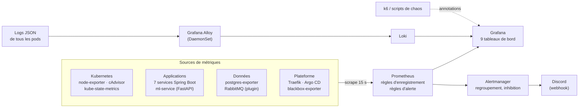
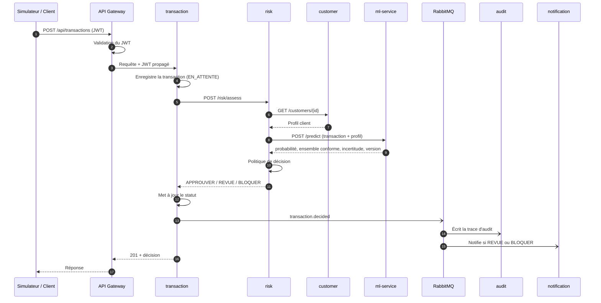
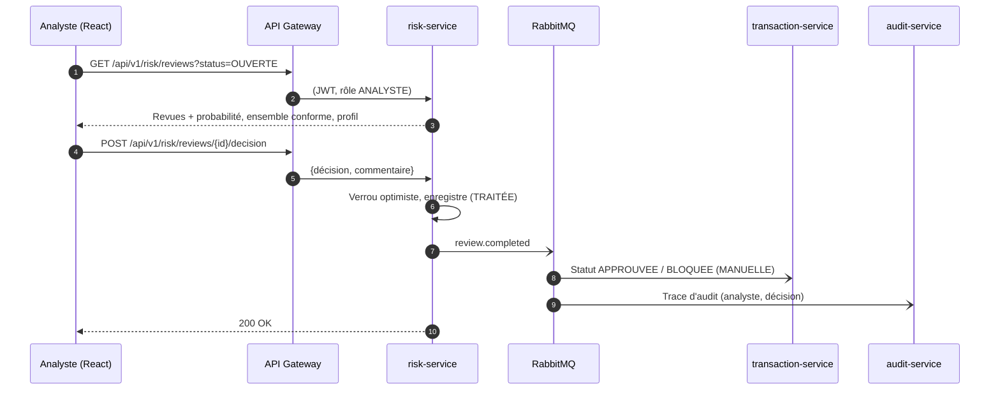

# P5 : Développeur frontend et observabilité

> Extrait du **document d'architecture v1.0** (plateforme FinTech MLOps haute disponibilité).
> Lire d'abord **`00_Commun.md`** (objectifs, vue d'ensemble, décisions D1 à D32, planning global).
> Les numéros de section renvoient au document d'architecture complet (PDF).

## Mission

- **Tâches du sujet :** Intégration T7, T10, interface T4
- **Périmètre :** Application React, Prometheus, Grafana, Loki, alertes Discord, runbooks, script et enregistrement de la démo

## Points de vigilance

1. **Prometheus + Grafana dans Docker Compose dès S4**, sans attendre Kubernetes (S8).
2. Tableaux de bord **versionnés en JSON** et chargés automatiquement (dashboards as code).
3. Chaque tableau de bord répond à **une question** précise (8.4). Les **annotations** de déploiement et d'expérience rendent la cause et l'effet visibles.
4. Chaque alerte du sujet doit être **déclenchée au moins une fois** pendant les expériences et capturée (S12).
5. Webhook Discord et mot de passe Grafana dans des **SealedSecrets**. Étiquettes Loki limitées ; le `correlationId` n'est **pas** indexé.
6. React : pages métier (clients, transactions, file de revue, notifications SSE) et pages ML (visualisations, performance, incertitude). **Grafana n'est pas intégré dans React.**
7. Afficher dans React l'**avertissement t-SNE / UMAP** : seules les proximités locales sont interprétables (4.11).
8. **Démo de 5 min maximum** : script minuté, séquences vidéo des expériences enregistrées en S12, répétition complète en S14.

## Planning personnel

| Tâche | Semaines | Début |
|---|---|---|
| Maquettes + squelette React | S1–S3 | 28/09/2026 |
| Pages métier React | S4–S8 | 19/10/2026 |
| Prometheus + Grafana (Compose) | S4–S6 | 19/10/2026 |
| Monitoring K8s + Loki | S8–S9 | 16/11/2026 |
| Pages ML React (viz, perf, incert.) | S8–S10 | 16/11/2026 |
| Tableaux de bord + alertes Discord | S9–S11 | 23/11/2026 |
| Observation des expériences | S11–S12 | 07/12/2026 |

## Livrables reçus

| # | Livrable | De | Fin |
|---|---|---|---|
| 1 | Choix du jeu de données (fait : Sparkov, D1) | Équipe | S1 |
| 2 | Contrats OpenAPI, schémas de base, schéma d'architecture | P1 | S2 |
| 5 | Docker Compose, cluster kind, squelette CI | P4 | S3 |
| 7 | Services de base + endpoints REST stables | P1 | S6 |
| 10 | Premier vrai modèle en production + visualisations | P3 | S8 |
| 11 | Cluster avec manifests, Argo CD, cibles de supervision | P4 | S8 |

## Livrables transmis

| # | Livrable | Vers | Fin |
|---|---|---|---|
| 15 | Tableaux de bord et alertes | P4 | S11 |
| 16 | Résultats des expériences + vidéos | Tous | S12 |
| 17 | README consolidé + démo | Tous (relecture) | S14 |

Règle de passage : un livrable n'est considéré comme transmis que s'il est **documenté, testé et démontré** à l'équipe.

## Jalons de l'équipe

| Jalon | Date | Critère de validation |
|---|---|---|
| J1 | 11/10/2026 | Architecture validée (ce document), dépôt et ruleset en place, contrats OpenAPI v1 |
| J2 | 18/10/2026 | MLflow prêt, données prétraitées, Docker Compose et CI opérationnels |
| J3 | 08/11/2026 | Services de base fonctionnels, benchmark terminé, ml-service mock livré, contrôles de sécurité actifs en CI |
| J4 | 22/11/2026 | Validation statistique terminée, plateforme déployée par Argo CD, **premier vrai modèle en production**, Prometheus installé |
| J5 | 06/12/2026 | Modèle final, pipeline avec portes de qualité, CI/CD complète, tests e2e et rollback automatique fonctionnels |
| J6 | 20/12/2026 | Toutes les expériences réalisées 3 fois, tableaux de bord et alertes validés, vidéos enregistrées |
| J7 | 21/12/2026 | **Gel du code** : plus de nouvelle fonctionnalité, uniquement des corrections |
| J8 | 03/01/2027 | README complet relu par tous, démo enregistrée en première version |
| J9 | 09/01/2027 | **Livraison** : dépôt GitHub, README, démo de 5 min maximum (un jour de marge avant le 10/01) |

---

# Architecture de votre périmètre

## 8. Observabilité : supervision, tableaux de bord et alertes

**Responsable :** P5 (Frontend et observabilité). **Support :** P1 et P3 (métriques exposées), P4 (installation dans le cluster).

**Objectif.** Démontrer une **supervision continue** : à tout moment, on sait si la plateforme est en bonne santé, pourquoi elle ralentit, si elle passe à l'échelle et si le modèle se comporte bien. Un problème déclenche une alerte **avant** qu'un utilisateur ne le remarque.


### 8.1 Architecture de supervision

La pile est installée avec le chart Helm **kube-prometheus-stack** (namespace `monitoring`). Il regroupe Prometheus Operator, Prometheus, Alertmanager, Grafana, node-exporter et kube-state-metrics. **Loki** et **Grafana Alloy** complètent la pile pour les logs (section 8.6).



**Découverte automatique des cibles.** Chaque composant déclare un **ServiceMonitor** (ressource du Prometheus Operator), versionné avec ses manifests. Un nouveau service est supervisé dès son déploiement, sans toucher à la configuration de Prometheus.

**Réglages :**

| Paramètre | Valeur | Justification |
|---|---|---|
| Intervalle de collecte | 15 s (5 s pour kube-state-metrics et la Gateway pendant les expériences) | Compromis charge / précision. Les temps de mise à l'échelle sont mesurés plus finement pendant les expériences |
| Rétention | 7 jours, 5 Gi | Suffisant pour couvrir les expériences et la démo |
| Ressources | Prometheus : 512 Mi à 1 Gi ; Grafana : 128 Mi ; Alertmanager : 64 Mi ; Loki + Alloy : ~0,6 Gi | Dans le budget de la section 6.5 |

### 8.2 Couverture des sources demandées par le sujet

| Exigence du sujet | Source | Exemples de métriques |
|---|---|---|
| Nœuds et pods Kubernetes | node-exporter, cAdvisor, kube-state-metrics | `node_cpu_seconds_total`, `kube_pod_status_ready`, `kube_pod_container_status_restarts_total` |
| Microservices Spring Boot | Micrometer | `http_server_requests_seconds_*`, `jvm_memory_used_bytes`, `hikaricp_connections_active`, `resilience4j_circuitbreaker_state` |
| FastAPI | prometheus-fastapi-instrumentator + métriques ML (section 5.8) | `http_request_duration_seconds_*`, `ml_inference_duration_seconds_*` |
| Bases de données | postgres-exporter | Connexions, transactions/s, taille des schémas, requêtes lentes |
| CPU, mémoire, réseau | cAdvisor, node-exporter | `container_cpu_usage_seconds_total`, `container_memory_working_set_bytes`, `container_network_*` |
| Débit des requêtes | Micrometer, Traefik | `rate(http_server_requests_seconds_count[1m])` |
| Latence des réponses | Histogrammes Micrometer et FastAPI | p50, p95, p99 via `histogram_quantile` |
| Erreurs HTTP | Micrometer, Traefik | Proportion de réponses `5xx` et `4xx` |
| Nombre de replicas | kube-state-metrics | `kube_deployment_status_replicas_available` |
| Activité de l'HPA | kube-state-metrics | `kube_horizontalpodautoscaler_status_current_replicas`, `..._desired_replicas` |
| Temps d'inférence ML | ml-service | `ml_inference_duration_seconds` |

**Métriques supplémentaires de la plateforme :**
- RabbitMQ : profondeur des queues, messages en DLQ, débit de consommation ;
- outbox : `outbox_pending` ;
- état des circuit breakers ;
- performance du modèle en production : rejets de paiement simulés, D19 ;
- état des applications Argo CD ;
- disponibilité vue de l'extérieur (sondes blackbox).

**Conventions de métriques :**
- **Étiquettes communes.** Tous les services Spring Boot ajoutent l'étiquette `application=<nom-du-service>`.
- **Histogrammes de latence.** Les **histogrammes de latence** sont activés avec des bornes alignées sur les objectifs : 0,05 · 0,1 · 0,25 · 0,5 · 1 · 2 · 5 s. Le p95 est calculable et le seuil de 2 s du sujet correspond exactement à une borne.

### 8.3 Règles d'enregistrement

Des **recording rules** précalculent les expressions coûteuses ou utilisées partout, pour des tableaux de bord rapides et des alertes lisibles :

| Règle | Expression (résumée) |
|---|---|
| `app:http_requests:rate1m` | Débit par service |
| `app:http_errors:ratio1m` | Part des réponses `5xx` par service |
| `app:http_latency:p95_1m` | p95 de latence par service |
| `ml:review_rate:10m` | Part des ensembles conformes `{0,1}` ou vides |
| `ml:inference_latency:p95_1m` | p95 du temps d'inférence |
| `risk:conformal_coverage:30m` | Couverture réelle mesurée grâce aux rejets de paiement simulés, par classe |
| `risk:precision:30m`, `risk:recall:30m` | Performance réelle du modèle en production |

### 8.4 Tableaux de bord Grafana

**Dashboards as code.** Les 9 tableaux de bord demandés sont versionnés en JSON dans `monitoring/dashboards/`. Ils sont chargés automatiquement dans Grafana via des ConfigMaps (mécanisme de provisioning de kube-prometheus-stack) et donc déployés par Argo CD comme le reste.

| # | Tableau de bord | Question à laquelle il répond | Panneaux principaux |
|---|---|---|---|
| 1 | **Santé du système** | La plateforme fonctionne-t-elle ? | Feu tricolore par service (up, prêt, erreurs), disponibilité externe (blackbox), alertes actives, version déployée de chaque service et du modèle |
| 2 | **Performance des microservices** | Quel service est lent ou en erreur ? | Méthode RED par service : débit, erreurs, latence p50/p95/p99. JVM, pool de connexions, circuit breakers |
| 3 | **Cluster Kubernetes** | Les ressources suffisent-elles ? | CPU et mémoire par nœud et par namespace, pods par état, redémarrages, utilisation par rapport aux requests et limits |
| 4 | **Charge et scalabilité** | La plateforme suit-elle la charge ? | Débit entrant, latence p95, replicas actuels et souhaités par l'HPA, CPU par rapport à la cible de 70 %, répartition du trafic entre pods |
| 5 | **Haute disponibilité** | Que se passe-t-il pendant une panne ? | Pods prêts par service, redémarrages, disponibilité externe, erreurs pendant l'incident, **temps de récupération**, file outbox et queues RabbitMQ |
| 6 | **Inférence ML** | Le modèle répond-il assez vite ? | Temps d'inférence p50/p95, débit de prédictions, erreurs de validation, version en production, état du circuit breaker risk → ml |
| 7 | **Performance du modèle** | Le modèle est-il toujours bon ? | Précision, rappel et taux de faux positifs **en production**, matrice de confusion glissante, comparaison avec les valeurs du test final (lignes de référence), distribution des probabilités |
| 8 | **Incertitude des prédictions** | Les incertitudes sont-elles sous contrôle ? | Taux d'automatisation et de revue, **couverture conforme réelle par rapport à 1 − α**, distribution de l'incertitude, file de revue humaine (taille, ancienneté), accord entre analystes et vérité |
| 9 | **Erreurs et alertes** | Qu'est-ce qui ne va pas, et depuis quand ? | Alertes actives et historique, top des erreurs par service et par route, DLQ, échecs de déploiement (Argo CD), **logs d'erreur récents (Loki)** |

**Annotations.** Les événements marquants apparaissent comme des lignes verticales sur tous les graphiques :
- **déploiements** (Argo CD) ;
- **début et fin de chaque phase d'expérience** : charge normale, élevée, surcharge, récupération ;
- **injections de pannes** (suppression de pod, arrêt d'un nœud).

Les scripts k6 et de chaos créent ces annotations via l'API Grafana. On voit ainsi immédiatement la cause et l'effet dans les captures du README et dans la démo.

**Répartition avec React.** Grafana sert la **supervision technique** (équipe d'exploitation). Le tableau de bord React sert le **métier** (analystes) : il affiche la performance et l'incertitude du modèle à partir des API du ml-service et de risk-service. Grafana n'est pas intégré dans React : cela exigerait un accès anonyme à Grafana, ce qui affaiblirait la sécurité.

### 8.5 Alertes

**Alertes exigées par le sujet :**

| Alerte du sujet | Règle (PromQL simplifiée) | Durée | Gravité |
|---|---|---|---|
| **CPU > 80 %** | CPU utilisé / limite CPU du conteneur > 0,8 | 2 min | warning |
| **Temps de réponse > 2 s** | `app:http_latency:p95_1m{application="api-gateway"} > 2` | 2 min | warning |
| **Taux d'erreur > 5 %** | `app:http_errors:ratio1m{application="api-gateway"} > 0.05` | 2 min | critical |
| **Incertitude ML élevée → revue humaine** | `ml:review_rate:10m > 0.05` (normal ≤ 2 %) | 10 min | warning |
| **Panne de pod** | Redémarrage d'un conteneur sur les 5 dernières min, ou pod non prêt | 1 min | warning |
| **Service indisponible** | `kube_deployment_status_replicas_available == 0` ou sonde blackbox en échec | 1 min | **critical** |

**Pourquoi 80 % alors que l'HPA vise 70 %.** L'HPA agit à partir de 70 %. L'alerte à 80 % ne se déclenche donc que si l'autoscaling **ne suffit pas** : maximum atteint ou nouveaux pods trop lents à démarrer. C'est exactement la situation qui mérite l'attention d'un humain.

**« Incertitude élevée → revue humaine » fonctionne à deux niveaux :**
1. **Par transaction, automatiquement.** risk-service envoie chaque transaction incertaine en revue humaine (section 2.5). Aucune alerte n'est nécessaire, c'est le fonctionnement normal.
2. **Globalement, par une alerte.** Si la **part** des transactions incertaines dépasse 5 %, alors que 2 % sont attendus, le modèle rencontre des données inhabituelles (dérive probable) et la file des analystes va déborder. L'alerte prévient l'équipe.

**Alertes supplémentaires de la plateforme :**

| Alerte | Condition | Gravité |
|---|---|---|
| HPA au maximum | Replicas actuels = maximum, pendant 5 min | warning |
| Circuit breaker ouvert | risk → ml ou transaction → risk ouvert | warning |
| Outbox en retard | `outbox_pending > 100` pendant 2 min (RabbitMQ en difficulté) | warning |
| Messages en DLQ | Au moins 1 message dans une DLQ | warning |
| **Couverture conforme en baisse** | `risk:conformal_coverage:30m` < (1 − α) − 0,05 | critical |
| Modèle non chargé | Aucun pod ml-service prêt | critical |
| Latence d'inférence | p95 d'inférence > 50 ms pendant 5 min | warning |
| Déploiement en échec | Application Argo CD `Degraded` | critical |
| Nœud indisponible | Nœud `NotReady` pendant 1 min | critical |
| Disque | PVC utilisé à plus de 80 % | warning |

**Réduction du bruit (Alertmanager) :**
- **Regroupement** par service et par gravité, pour recevoir une seule notification par incident.
- **Inhibition.** Quand « Service indisponible » est active pour un service, ses alertes de latence et d'erreurs sont masquées : la cause est déjà connue.
- **Répétition.** Toutes les 4 h pour une alerte `warning` non résolue, toutes les 30 min pour une `critical`. Une notification est envoyée à la **résolution**.

**Canal de notification : Discord (décision D26).**
- Alertmanager envoie les alertes vers un **salon Discord** de l'équipe grâce à son récepteur Discord intégré.
- L'URL du webhook est stockée dans un SealedSecret.
- Deux salons distincts, `#alertes-critiques` et `#alertes-warning`, pour que les alertes critiques ne soient pas noyées.
- Chaque message contient : nom de l'alerte, service, valeur mesurée, lien vers le tableau de bord Grafana et vers le runbook.
- **Pendant la démo,** les alertes arrivent en direct sur les téléphones de l'équipe.

**Chaque alerte a une fiche d'intervention (runbook).** Il s'agit d'un court fichier Markdown dans `monitoring/runbooks/`, lié depuis l'alerte : signification, tableau de bord à ouvrir, premières actions.

### 8.6 Logs centralisés (Loki, décision D27)

**Collecte.**
- Les services écrivent des **logs JSON** sur la sortie standard, avec `correlationId`, nom du service et niveau (section 3.10).
- **Grafana Alloy**, déployé en DaemonSet (un pod par nœud), lit les logs de tous les conteneurs et les envoie à **Loki**. Alloy est l'agent recommandé par Grafana, qui remplace Promtail, désormais obsolète.
- Loki fonctionne en **mode monolithique** (un seul binaire), avec stockage sur disque (PVC 5 Gi) et **rétention de 3 jours**. C'est le mode le plus léger, suffisant pour un cluster local.

**Usages :**

| Usage | Mise en œuvre |
|---|---|
| **Suivre une transaction de bout en bout** | Recherche par `correlationId` dans Grafana Explore : on voit les logs de la Gateway, de transaction, de risk, du ml-service et de l'audit pour une même transaction |
| **Passer d'une métrique aux logs** | Depuis un pic d'erreurs sur un graphique, on ouvre les logs du même service sur la même période en un clic (Explore, vue partagée) |
| **Logs dans les tableaux de bord** | Panneau « erreurs récentes » dans les tableaux de bord 2 (microservices), 5 (haute disponibilité) et 9 (erreurs et alertes) |
| **Alertes sur les logs** | Règle Loki : apparition de `OutOfMemoryError` ou d'une erreur de chargement du modèle → alerte `critical` |

**Étiquettes Loki.** Uniquement `namespace`, `app`, `pod` et `level`, pour garder un index petit. Le `correlationId` est lu **dans** le contenu JSON au moment de la recherche, et non indexé : un index par transaction exploserait la mémoire de Loki.

**Ressources.** Loki : 256 à 512 Mi. Alloy : ~100 Mi par nœud. Environ **0,6 Go** au total, intégrés au budget de la section 6.5.

**Hors périmètre.** Traçage distribué (Tempo, OpenTelemetry). Le `correlationId` dans les logs couvre l'essentiel du besoin pour ce projet.

### 8.7 Accès et sécurité

- **Accès.** Grafana est accessible via `https://grafana.fintech.local` (Traefik, TLS).
- **Secrets.** Le mot de passe administrateur est stocké dans un SealedSecret (D22).
- **Rôles.** Deux comptes : `admin` (P5, P4) et un compte **lecture seule** pour la démo et le reste de l'équipe.
- **Prometheus et Alertmanager ne sont pas exposés** à l'extérieur du cluster. On y accède par `kubectl port-forward` si nécessaire.
- **Seule exception : le récepteur *remote write* de Prometheus.** Pendant les expériences, il est exposé avec mot de passe pour recevoir les métriques de k6 depuis le portable de charge (section 9.2).

### 8.8 Livrables et calendrier

| Livrable | Semaine |
|---|---|
| Prometheus + Grafana dans Docker Compose, branchés sur les premiers services (correctif du partenaire : ne pas attendre Kubernetes) | S4–S6 |
| kube-prometheus-stack dans le cluster, ServiceMonitors, exporters, sondes blackbox | S8 |
| Règles d'enregistrement + tableaux de bord 1 à 6 | S9–S10 |
| Tableaux de bord 7 et 8 (après la mise en place des rejets de paiement simulés) | S10–S11 |
| Loki + Alloy, recherche par `correlationId`, panneaux de logs | S9–S10 |
| Règles d'alerte, Alertmanager + Discord, runbooks | S10–S11 |
| Validation pendant les expériences : chaque alerte déclenchée au moins une fois et capturée | S12 |

---

# Extraits utiles d'autres sections

Ces parties appartiennent au périmètre d'un autre membre, mais votre travail en dépend ou les alimente.

### 2.5 Flux principal : évaluation d'une transaction



**Politique de décision.** Elle repose sur la prédiction conforme (MAPIE) appliquée à un modèle calibré. Pour chaque transaction, le modèle renvoie un **ensemble de prédiction** qui contient la vraie classe avec une probabilité garantie de 1 − α.

| Ensemble conforme | Interprétation | Décision |
|---|---|---|
| {légitime} | Confiant : transaction légitime | **APPROUVER** |
| {fraude} | Confiant : transaction frauduleuse | **BLOQUER** |
| {légitime, fraude} ou ensemble vide | Incertain | **REVUE HUMAINE** |

La valeur de α est fixée par P2 à partir des résultats expérimentaux (section 4).

**Dégradation contrôlée.** Si le ml-service est indisponible ou dépasse son délai, le circuit breaker (Resilience4j) s'ouvre. La transaction part alors en **REVUE HUMAINE**. Elle n'est jamais approuvée automatiquement sans avis du modèle. Ce choix « fail-safe » est adapté à la finance.

**Synchrone ou asynchrone.** La décision est **synchrone**, car le client attend une réponse. La notification et l'audit sont **asynchrones** via RabbitMQ : une panne de ces services ne bloque pas les paiements, et les messages sont traités à leur redémarrage.

**Fiabilité des événements (outbox transactionnel).** Un service n'envoie pas directement ses événements à RabbitMQ. Il les écrit dans une table `outbox_events` **dans la même transaction** que ses données métier. Un relais les publie ensuite. Même si un pod est tué entre l'enregistrement et la publication, aucun événement n'est perdu (détail en section 3.5).

### 3.4 Détail des services

#### api-gateway
- **Routage.** Préfixe `/api/v1/{domaine}/**` vers le service correspondant. Les chemins `/internal/**` ne sont **jamais** routés : ils restent accessibles uniquement à l'intérieur du cluster.
- **Sécurité.** Validation de la signature et de l'expiration du JWT à partir des clés publiques d'auth-service (JWKS). Le jeton est ensuite propagé au service cible.
- **Corrélation.** Génère un en-tête `X-Correlation-Id` s'il est absent. Cet identifiant est propagé dans tous les appels, les logs et les événements, ce qui permet de suivre une transaction de bout en bout.
- **Limitation de débit.** Uniquement sur `/api/v1/auth/login` (protection contre la force brute), en mémoire, sans Redis. Elle n'est **pas appliquée** aux transactions, pour ne pas fausser les tests de charge.
- **Routage WebSocket/SSE** vers notification-service pour le flux temps réel.

#### auth-service
- **Endpoints :**
  - `POST /api/v1/auth/login`
  - `POST /api/v1/auth/refresh`
  - `GET /api/v1/auth/me`
  - CRUD des utilisateurs (ADMIN)
  - `GET /.well-known/jwks.json`
- **Jetons.** JWT signés en **RS256** : seul auth-service détient la clé privée, et les autres services vérifient avec la clé publique, sans secret partagé. Jeton d'accès de 15 min, jeton de rafraîchissement de 7 jours.
- **Rôles :**
  - `ADMIN`,
  - `ANALYSTE`,
  - `SIMULATEUR` : compte technique utilisé par le simulateur de transactions et par les tests de charge.
- **Données.** Mots de passe hachés avec **BCrypt**. Tables `users` et `refresh_tokens`.
- **Événements.** Publie `auth.login.succeeded` et `auth.login.failed` pour l'audit.

#### customer-service
- **Endpoints :**
  - `GET /api/v1/customers` (paginé, avec filtres)
  - `GET /api/v1/customers/{id}`
  - `POST /api/v1/customers`
  - `PUT /api/v1/customers/{id}`
- **Données.** Champs issus de Sparkov : nom, genre, date de naissance, profession, adresse, ville, population de la ville, latitude et longitude.
- **Numéro de carte.** Il n'est **jamais stocké en clair**. On conserve une empreinte HMAC-SHA256, qui sert d'identifiant de carte, et les 4 derniers chiffres pour l'affichage. C'est une bonne pratique inspirée de PCI-DSS.
- **Initialisation.** Les clients uniques du jeu Sparkov sont chargés par une migration de données au démarrage.

#### transaction-service
- **Endpoints :**
  - `POST /api/v1/transactions`
  - `GET /api/v1/transactions` (filtres : statut, client, période, montant)
  - `GET /api/v1/transactions/{id}`
- **Idempotence.** Le `trans_num` de Sparkov sert de clé d'idempotence. Si une transaction est renvoyée (par exemple lors d'un retry), elle n'est pas créée deux fois : la réponse initiale est renvoyée.
- **Données.** Client, marchand, catégorie, montant, date et heure, localisation du marchand, statut, source de la décision, dates de création et de mise à jour.
- **Événements publiés.** Après chaque décision, `transaction.decided.approved`, `transaction.decided.review` ou `transaction.decided.blocked`.
- **Événements consommés.** `review.completed`, qui fait passer la transaction de `EN_REVUE` à `APPROUVEE` ou `BLOQUEE` (source `MANUELLE`).

#### risk-service
- **Endpoints :**
  - `POST /internal/risk/assess` (interne uniquement)
  - `GET /api/v1/risk/assessments/{transactionId}`
  - `GET /api/v1/risk/reviews?status=OUVERTE` (ANALYSTE)
  - `POST /api/v1/risk/reviews/{id}/decision` (ANALYSTE)
  - `GET /api/v1/risk/stats` (taux d'approbation, de revue et de blocage)
  - `POST /api/v1/risk/feedback` (SIMULATEUR) : vraie étiquette reçue en différé (rejet de paiement simulé)
  - `GET /internal/risk/labels`
- **Table `assessments`.** Probabilité, ensemble conforme, score d'incertitude, nom et version du modèle, décision, latence de l'appel ML, raison.
- **Table `reviews`.** Statut, analyste, décision finale, commentaire, dates d'ouverture et de clôture.
- **Concurrence.** Un **verrou optimiste** (`@Version`) empêche deux analystes de traiter la même revue en même temps. Le second reçoit une erreur `409 Conflict`.
- **Cache.** Le profil client est mis en cache localement (Caffeine, 10 min), ce qui évite un appel à customer-service pour chaque transaction.
- **Boucle de retour.** Deux sources de vraies étiquettes en production :
  - les **décisions des analystes**, sur les transactions revues ;
  - les **rejets de paiement simulés** envoyés par le simulateur, sur **toutes** les transactions, y compris les décisions automatiques.

  risk-service rapproche chaque étiquette de la décision prise. Il expose des compteurs Prometheus (matrice de confusion, couverture conforme) et `/internal/risk/labels` pour le pipeline ML (section 5.9).

#### notification-service
- **Endpoints :**
  - `GET /api/v1/notifications`
  - `PATCH /api/v1/notifications/{id}/read`
  - `GET /api/v1/notifications/stream` (flux **SSE**, temps réel)
- **Types de notification.** `BLOCAGE` et `REVUE`, chacune liée à sa transaction.
- **Plusieurs replicas.** Le navigateur est connecté en SSE à **un seul** replica. Pour que chaque navigateur reçoive toutes les notifications :
  1. La queue durable `notification.alerts` est partagée entre les replicas : chaque message est enregistré une seule fois.
  2. Après l'enregistrement, le service publie sur un exchange `fanout` `notifications.live`.
  3. Chaque replica y possède sa propre queue temporaire et pousse le message à ses clients SSE.

#### audit-service
- **Endpoints :** `GET /api/v1/audit` (ADMIN), avec filtres par type, acteur, identifiant et période.
- **Table `audit_events`.** Identifiant de l'événement (unique), type, entité concernée, acteur, version du modèle, charge utile (JSONB), date de l'événement, date de réception.
- **Ajout seul, garanti par la base.** L'utilisateur PostgreSQL `audit_user` n'a que les droits `INSERT` et `SELECT`. Même un bug applicatif ne peut pas modifier ni supprimer une trace.

### 3.7 Flux de revue humaine



### 3.8 Sécurité

**Matrice des droits :**

| Ressource | ADMIN | ANALYSTE | SIMULATEUR |
|---|---|---|---|
| Utilisateurs (CRUD) | ✔ | – | – |
| Clients (lecture) | ✔ | ✔ | – |
| Clients (écriture) | ✔ | – | – |
| Transactions (création) | – | – | ✔ |
| Retour d'étiquettes (feedback) | – | – | ✔ |
| Transactions (lecture) | ✔ | ✔ | – |
| File de revue et décision | – | ✔ | – |
| Notifications | ✔ | ✔ | – |
| Journal d'audit | ✔ | – | – |
| Visualisations ML, infos modèle | ✔ | ✔ | – |

**Mesures :**
- **Défense en profondeur.** La Gateway valide le JWT, et chaque service le **revalide** en tant que resource server Spring Security.
- **Endpoints internes.** Les chemins `/internal/**` ne sont pas routés par la Gateway. Ils seront aussi protégés par des **NetworkPolicies** Kubernetes (section 6).
- **HTTPS.** TLS est terminé à l'Ingress avec un certificat local (mkcert).
- **Secrets.** Mots de passe de base de données, clé privée JWT et identifiants RabbitMQ sont stockés dans des Secrets Kubernetes, jamais dans le dépôt.
- **Données personnelles.** Le numéro de carte n'est jamais stocké en clair, et les données personnelles sont masquées dans les logs.

### 4.10 Calibration et quantification de l'incertitude

**Étape 1 : calibration des probabilités.** Le modèle final est entraîné sur la zone de développement, puis calibré sur la zone de calibration des probabilités. On compare **isotonique** et **sigmoïde (Platt)**, et on retient la méthode au meilleur Brier score. Les diagrammes de fiabilité avant et après calibration sont journalisés dans MLflow.

**Étape 2 : prédiction conforme (MAPIE).** Elle est calculée sur la zone de calibration conforme.

- La prédiction conforme renvoie un **ensemble de prédiction** qui contient la vraie classe avec une probabilité garantie d'au moins 1 − α, à condition que les données futures ressemblent aux données de calibration.
- **Conforme conditionnel à la classe (Mondrian).** Avec 99 % de transactions légitimes, une garantie globale pourrait être respectée tout en couvrant mal la classe fraude. On calibre donc **un seuil par classe**, pour garantir la couverture **aussi sur les fraudes**. Si la version de MAPIE utilisée ne le propose pas directement, le calcul se fait en quelques lignes (quantile des scores de non-conformité par classe).

**Étape 3 : choix de α.** On évalue α ∈ {0,01 ; 0,05 ; 0,10}. Pour chaque valeur, on mesure :

| Mesure | Signification |
|---|---|
| Couverture par classe | Vérifie la garantie 1 − α, pour les légitimes et pour les fraudes |
| **Taux de revue** | Part des transactions envoyées à un analyste (ensemble {0,1} ou vide) |
| Taux d'automatisation | Part des décisions prises sans humain |
| **Taux d'erreur des décisions automatiques** | Erreurs parmi les transactions approuvées ou bloquées automatiquement |

Le α retenu est **le plus petit qui maintient le taux de revue sous une capacité d'analyse réaliste**, par exemple ≤ 2 % des transactions. Le compromis est présenté sous forme de courbe dans le README.

**Preuve attendue.** Sur le test final, montrer que les erreurs du modèle se **concentrent dans les transactions envoyées en revue**, et que les décisions automatiques sont nettement plus fiables. C'est la démonstration que la revue humaine sert réellement à quelque chose.

**Ce que le modèle renvoie** (contrat détaillé en section 5) :

| Champ | Contenu |
|---|---|
| `fraud_probability` | Probabilité calibrée de fraude |
| `prediction_set` | `[0]`, `[1]`, `[0, 1]` ou `[]` |
| `uncertainty` | Score continu entre 0 et 1 (entropie binaire normalisée de la probabilité calibrée), affiché dans le tableau de bord |
| `uncertainty_level` | `FAIBLE` (ensemble à un élément) ou `ELEVEE` (sinon), qui pilote la décision |
| `alpha` | Niveau de risque utilisé |
| `model_version` | Nom et version dans le Model Registry |

**Suivi en production.** La garantie conforme suppose que les données ne dérivent pas. La couverture réelle est donc surveillée à partir des étiquettes fournies par les analystes (section 3.4). Une baisse de couverture déclenche une alerte (section 8).

### 4.11 Visualisation des données (PCA, t-SNE, UMAP)

| Élément | Choix |
|---|---|
| Échantillon | ~20 000 transactions de la zone de test : **toutes les fraudes** et un échantillon aléatoire de légitimes, avec des poids pour ne pas fausser la lecture |
| Entrée | Features après prétraitement (sortie du `Pipeline`) |
| Méthodes | **PCA** (linéaire, variance expliquée), **t-SNE** (structure locale), **UMAP** (structure locale et globale, plus rapide) |
| Vues produites | Coloration par classe, par clusters (k-means ou HDBSCAN), par score d'anomalie (Isolation Forest), par **type d'erreur** du modèle (vrai positif, faux positif, faux négatif), par **niveau d'incertitude** |
| Format de sortie | JSON (coordonnées et attributs de chaque point) + PNG, servis par le ml-service et affichés dans React |
| Régénération | Étape du pipeline ML : les vues sont recalculées **à chaque nouvelle version du modèle** |

**Avertissement affiché dans le tableau de bord.** Avec t-SNE et UMAP, les distances entre les groupes et la taille des groupes n'ont pas de signification quantitative. Seule la proximité locale est interprétable.

### 5.7 Service FastAPI (ml-service)

#### Endpoints

| Endpoint | Accès | Rôle |
|---|---|---|
| `POST /predict` | **Interne** (risk-service), non routé par la Gateway | Prédiction d'une transaction |
| `GET /health/live` | Kubernetes | Le processus répond |
| `GET /health/ready` | Kubernetes | Le modèle est chargé et le test de préchauffage a réussi |
| `GET /metrics` | Prometheus | Métriques techniques et ML |
| `GET /api/v1/ml/model` | Gateway (ADMIN, ANALYSTE) | Nom, version, date d'entraînement, α, algorithme, commit Git |
| `GET /api/v1/ml/performance` | Gateway | Métriques hors ligne : benchmark, résultats statistiques, test final avec IC, audit d'équité |
| `GET /api/v1/ml/viz/{method}?view=` | Gateway | Visualisations. `method` : `pca`, `tsne` ou `umap`. `view` : `class`, `cluster`, `outlier`, `error` ou `uncertainty` |

#### Contrat de `/predict`

**Requête :**

```json
{
  "transaction_id": "7f3c9a1e-2b4d-4c8e-9f1a-0d5e6b7c8a9f",
  "trans_datetime": "2020-07-14T02:13:45",
  "amount": 842.17,
  "category": "shopping_net",
  "merch_lat": 40.71,
  "merch_long": -74.01,
  "customer": {
    "dob": "1962-05-18",
    "gender": "F",
    "city_pop": 1577385,
    "lat": 40.65,
    "long": -73.95,
    "state": "NY"
  }
}
```

**Réponse :**

```json
{
  "transaction_id": "7f3c9a1e-2b4d-4c8e-9f1a-0d5e6b7c8a9f",
  "prediction": 1,
  "fraud_probability": 0.87,
  "prediction_set": [1],
  "uncertainty": 0.56,
  "uncertainty_level": "FAIBLE",
  "alpha": 0.05,
  "model": { "name": "fraud-detector", "version": "8" },
  "inference_ms": 4.2
}
```

**Validation des entrées.** Le modèle Pydantic vérifie :
- montant strictement positif ;
- catégorie parmi les 14 connues ;
- latitude et longitude dans leurs bornes ;
- dates cohérentes.

Une entrée invalide renvoie `422`, et un compteur Prometheus est incrémenté.

**Séparation des responsabilités.** Le ml-service **ne décide pas**. Il fournit la prédiction et son incertitude, et risk-service applique la politique de décision (section 2.5). La politique peut donc évoluer sans redéployer le modèle, et inversement.

**Mode mock (livré en S6).** La même image, lancée avec `MODEL_MODE=mock`, renvoie des réponses déterministes qui respectent exactement le contrat. Par exemple, montant > 500 donne `[1]`, montant entre 200 et 500 donne `[0,1]`. P1 développe et teste risk-service sans attendre le vrai modèle, et peut provoquer volontairement les trois décisions.

#### Choix d'implémentation

- **Un processus Uvicorn par pod.** La mise à l'échelle se fait par le nombre de pods (HPA), et non par des workers dans un pod. Kubernetes mesure ainsi correctement le CPU de chaque instance.
- **Endpoint `/predict` synchrone** (`def` et non `async def`). La prédiction sollicite le CPU : FastAPI l'exécute dans son pool de threads, ce qui ne bloque pas la boucle d'événements.
- **XGBoost limité à `n_jobs=1`**, pour respecter la limite CPU du pod et éviter la sur-souscription.
- **Chargement au démarrage.** Le modèle est chargé dans le `lifespan` de FastAPI, puis une prédiction de préchauffage est exécutée. La readiness ne passe à OK qu'après ces deux étapes.
- **Cache local du modèle.** Le modèle téléchargé est stocké sur le disque du nœud (volume `hostPath`, un cache par nœud), indexé par version. Un volume persistant classique ne peut pas être partagé entre des pods placés sur des nœuds différents (section 6.10). Un pod qui redémarre recharge depuis le cache sans dépendre de MLflow. Une panne de MLflow **n'empêche donc pas** les pods de redémarrer, tant que la version est en cache.

### 5.8 Métriques exposées par le ml-service

| Métrique Prometheus | Type | Usage |
|---|---|---|
| `http_requests_total`, `http_request_duration_seconds` | Compteur, histogramme | Débit, latence, erreurs HTTP |
| `ml_inference_duration_seconds{model_version}` | Histogramme | Temps d'inférence p50 et p95 |
| `ml_predictions_total{model_version, prediction_set}` | Compteur | Répartition `0`, `1`, `01`, `vide`, soit les taux d'automatisation et de revue |
| `ml_fraud_probability` | Histogramme | Distribution des scores : un changement signale une **dérive** |
| `ml_uncertainty` | Histogramme | Distribution de l'incertitude |
| `ml_input_validation_errors_total` | Compteur | Entrées invalides |
| `ml_model_info{name, version}` | Jauge (= 1) | Version en production, visible dans Grafana |
| `ml_model_loaded_timestamp_seconds` | Jauge | Date du dernier chargement |

### 5.9 Suivi de la performance en production (décision D19)

**Problème.** Pour mesurer la performance réelle du modèle, il faut connaître la vérité sur chaque transaction. Or, en production, on ne la connaît que pour les transactions **revues par un analyste**, qui sont justement les cas incertains. On n'a aucune vérité sur les décisions automatiques.

**Solution proposée : les rejets de paiement simulés.** Dans la réalité, une fraude non détectée finit par être signalée par le client, plusieurs jours plus tard : c'est un *chargeback*. Le simulateur connaît la vraie étiquette `is_fraud` de chaque transaction Sparkov. Il l'envoie donc **avec un délai** (par exemple 2 minutes en accéléré), via `POST /api/v1/risk/feedback` (rôle SIMULATEUR).

risk-service rapproche chaque étiquette de la décision prise et expose des compteurs :

| Métrique | Ce qu'elle permet de calculer dans Grafana |
|---|---|
| `risk_feedback_total{decision, truth}` | Matrice de confusion **en production**, puis précision, rappel et taux de faux positifs par fenêtre de temps |
| `risk_conformal_covered_total{truth}` et `risk_feedback_total{truth}` | **Couverture conforme réelle** par classe. Une chute signale une dérive et déclenche une alerte |
| `risk_review_agreement_total{analyst_decision, truth}` | Qualité des décisions humaines |

Ce mécanisme alimente directement les tableaux de bord « Performance du modèle » et « Incertitude » demandés par le sujet. Il ne demande que quelques lignes dans le simulateur et un endpoint dans risk-service.

### 9.2 Outils

| Outil | Rôle |
|---|---|
| **k6** | Génération de charge. Scripts en JavaScript, seuils de réussite intégrés, envoi de ses métriques directement dans Prometheus (remote write). Les courbes côté client et côté serveur apparaissent donc dans les mêmes tableaux de bord Grafana |
| **Scripts de chaos** (bash + kubectl + docker) | Injection de pannes : suppression de pods, mise à 0 d'un Deployment, arrêt d'un nœud kind |
| **`make experiment`** | Orchestration d'une expérience complète : annotation de début dans Grafana, charge k6, injection de panne à un instant précis, annotation de fin, export des résultats |
| Grafana | Observation, captures, enregistrement vidéo pour la démo |

**Machine de génération de charge (décision D28).** k6 s'exécute sur le **portable d'un autre membre**, connecté au même réseau local que la machine du cluster. Si k6 tournait sur la même machine, il se partagerait le processeur avec la plateforme et fausserait les mesures en surcharge.

Mise en place :
- **Accès à l'Ingress.** Le fichier `hosts` du portable de charge fait pointer `fintech.local` vers l'adresse IP locale de la machine du cluster. Les ports 80 et 443 de kind écoutent sur toutes les interfaces, et le pare-feu de la machine du cluster autorise ces ports depuis le réseau local.
- **Métriques de k6.** Le récepteur *remote write* de Prometheus est exposé via Traefik (`prometheus.fintech.local`), protégé par mot de passe et **activé uniquement pendant les expériences**.
- **Qualité du réseau.** Un **câble Ethernet** est préférable au Wi-Fi. La latence réseau de base (ping) est mesurée au début de chaque session et rapportée dans les résultats, pour distinguer la latence du réseau de celle de la plateforme.

**Pourquoi des scripts plutôt que Chaos Mesh.** Les pannes à simuler sont simples (supprimer, arrêter). Des scripts suffisent, sont lisibles, et ne consomment pas de RAM dans le cluster.

### 9.7 Définitions des mesures

Des définitions précises et fixées à l'avance, pour que les chiffres soient comparables et défendables :

| Mesure | Définition | Source |
|---|---|---|
| Débit | Requêtes **réussies** par seconde (moyenne de la phase) | k6 |
| Latence | p50, p95 et p99 de bout en bout, vues par le client | k6 (et p95 serveur pour comparaison) |
| Taux d'erreur | Réponses `5xx` + délais dépassés / total des requêtes | k6 |
| CPU / mémoire | Utilisation moyenne et maximale par service, par rapport aux limites | cAdvisor |
| Replicas | Nombre de pods prêts par service au cours du temps | kube-state-metrics |
| **Délai de réaction de l'HPA** | Du premier dépassement de 70 % de CPU jusqu'à l'augmentation des replicas souhaités | kube-state-metrics + événements Kubernetes |
| **Délai de démarrage d'un pod** | De la création du pod jusqu'à l'état prêt (readiness) | Événements Kubernetes |
| **Temps de mise à l'échelle** | Somme des deux précédents : du dépassement du seuil jusqu'aux nouveaux pods prêts | Calcul |
| **Temps de récupération (charge)** | Du retour au débit normal jusqu'à p95 < 500 ms **et** erreurs < 1 % pendant 1 min | k6 |
| **Temps de récupération (panne)** | De l'injection de la panne jusqu'au retour à l'état nominal (replicas prêts, erreurs < 1 %) | Script de chaos + Prometheus |
| Impact utilisateur | Nombre et part des requêtes en erreur pendant la fenêtre de l'incident | k6 |
| Perte de données | Nombre de transactions et d'événements d'audit avant et après, comparés à ce que k6 a envoyé | Requêtes SQL + k6 |

**Précision des mesures.** Pour les délais, les **horodatages des événements Kubernetes** (à la seconde) sont préférés aux métriques Prometheus, qui dépendent de l'intervalle de collecte.

### 9.8 Protocole d'exécution

**Avant chaque expérience :**
- cluster stable depuis au moins 10 min, avec tous les replicas au minimum ;
- simulateur arrêté : seul k6 génère du trafic ;
- aucun Job du pipeline ML en cours ;
- IDE et navigateur fermés, sauf Grafana pour l'observation ;
- version de chaque service et du modèle notée.

**Déroulement automatisé** (`make experiment NAME=C4 RUN=2`) :
1. Annotation « début » dans Grafana.
2. Lancement de k6, avec le profil de l'expérience.
3. Injection de la panne à l'instant prévu (par exemple T + 3 min).
4. Rétablissement si nécessaire (par exemple `scale` de retour).
5. Fin de k6 et annotation « fin ».
6. Export des résultats dans `load-tests/results/<date>-<expérience>-<run>/` : résumé JSON de k6, événements Kubernetes, requêtes de comptage SQL, métriques clés extraites de Prometheus.

**Répétitions (décision D29).** Chaque expérience est **exécutée 3 fois**. Le README rapporte la **médiane** et l'**étendue** (min–max) de chaque mesure. Une seule exécution pourrait être un hasard favorable.

**Enregistrement.** Le premier passage réussi de chaque expérience clé est **filmé** (écran Grafana + terminal) pour la démo. On évite ainsi de rejouer des expériences en direct le jour de la présentation (correctif de la revue).
